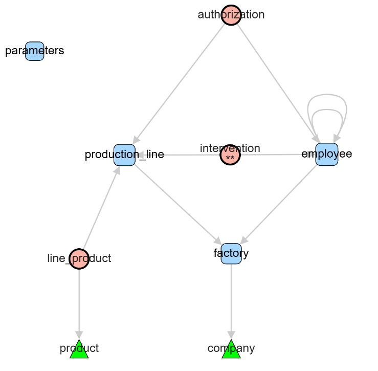

# cytoGraphDB
CytographDB is a graphical browser designed for intuitive visual exploration of physical data models stored in any PostgreSQL instance.

The name is derived from our use of the [Cytoscape JavaScript library](http://js.cytoscape.org/), which we thank for its open availability.

The simple graph below is taken from the test database used in this documentation and can be easily reproduced.

After installing the application, you can access the documentation in the application or browse it directly here: 
[CytographDB main documentation](https://github.com/pirelaurent/cytographDB/blob/main/public/docs/main.md)

## License

This project is licensed under the GNU General Public License v3.0 – see the [LICENSE](./LICENSE) file for details.
