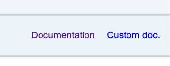

# 🎨 Customization

You can enhance your graph for a specific database by 
- adding in a module : 
  - Custom styles for selected tables
  - Custom tags to enable element filtering
- Linking the module to the db names you want to enhance

---

## 🔌 Extension Points: `customModules`

When a graph is loaded, the app calls two methods for custom enhancements:

```js
  createCustomCategories(current_db);
  getCustomStyles(current_db);
```
with the name of `current_db' 
- the app retrieve an associated module in a collection. 
- the app use the corresponding methods defined inside the module.

You can re-define these methods in a custom module.

### Creation of the democytodb custom Module

```js
import {
  getCy,
} from "../js/graph/cytoscapeCore.js"
import {   registerCustomModule, getCustomNodesCategories } from "../js/filters/categories.js";

console.log("[DEBUG] democytodb.js chargé");

const democytodbModule = {
  getCustomStyles() {
    // Return an array of styling rules  - see source code
  },
  createCustomCategories() {
    // Add custom classes and tags to nodes - see source code
  }
};

// Register the module with DB names it applies to
registerCustomModule("democytodb", democytodbModule);
registerCustomModule("democytodbV2", democytodbModule);
```

---

## 🧱 Create Your Own Custom Module

1. **Create a `myModule.js` file**  
   Use `democytodb.js` as a reference template.

2. **Place the file in**:  
   `public/custom`

> 📁 Remember : this folder is excluded from version control to protect user-specific code.

####  `.gitignore` Rule

```bash
# Optional: exclude custom modules except for democytodb.js
/public/custom/*
!/public/custom/democytodb.js
```

---

## 🧵 Weave Your Module with the App

To activate your module:

1. **Add your import directives in `public/js/customModulesIndex.js`**  

```js
/*
    set here import to let modules visible into the application
    set them into public/custom  directory as this is out of the git upload 
    as a js module app, path must be relative : 
*/

// ---- keep demo in optional modules 
import '../custom/democytodb.js';

// ----- Add your other optional module below -----
import '../custom/myModule.js';
```

1. **Restart the application**

✅ From now on, whenever you open a DB named `myDBtest` or `myDBstaging`,  
the `myModule` customization will be applied automatically.


3. **optionaly add your custom documentation**

Default *.gitignore* ignore all files (except democytodb.js ).  

You can set your owwn documentation under ***custom/docs***.

If any ***index.md*** is found by cytographdb at startup in this directory,  it will add a secondary link on the right of *documentation* :  



This can help to give custom details and custom examples. 

---


- ⚪️ [Main](./main.md)
