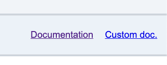

# Customization

## Customization Options

You can customize **CytographDB** for your databases in the following ways:

- **Define custom categories** for your tables
  - Extends filtering options in CytographDB
  - **Apply custom styles** to categories (colors, shapes, etc.)
- **Define alias names** for labeling tables
- **Define alias names** for labeling relations

---

## Principles

CytographDB **scans** the *custom* directory for JavaScript files and loads them as extensions **if they meet these requirements**:

The source code must:
- Declare an internal module: `const democytodbModule = { ... }`
- Register it with a pattern to match database names:
  - Exact name: `registerCustomModule("democytodb", democytodbModule);`
  - Regex: `registerCustomModule(/demo.*/, democytodbModule);`

Optionally, expose any of the three services recognized by CytographDB:

```js
createCustomCategories(){...}; // Adds classes to nodes
getCustomStyles(){...}; // Returns a style
setLabelAlias(){...}; // Adds aliases to nodes and/or edges
```

---

## **democytodb** Custom Module Example

*public/custom/democytodb.js*
```js
import {
  getCy,
} from "../js/graph/cytoscapeCore.js"

import { registerCustomModule, getCustomNodesCategories } from "../js/filters/categories.js";

/*----------------------------------------------
  Module name
*/
const democytodbModule = {
  /*
    Define specific properties for this DB nodes
  */
  createCustomCategories() {
    // Categories for nodes
    getCy().nodes().forEach((node) => {
      /*
        Adds a custom category (Cytoscape class) that enables filtering
        For visual effects, set a style in getCustomStyles
      */
      if (node.data("label").includes("product")) node.addClass("product");
    });
    // Register the category
    getCustomNodesCategories().add("product");
  },

  /*----------------------------------------------
  UI Aspects
  Returns a JSON object defining styles for classes set in createCustomCategories
  */

  getCustomStyles() {
    return [
      {
        selector: "node.product",
        style: {
          "color": "#b82641",
          "font-size": "30px",
          "font-style": "italic"
        },
      },
    ];
  },

  setLabelAlias() {
    // Demo example: English-to-French aliasing
    const EN_FR = {
      authorization: "autorisation",
      company: "entreprise",
      employee: "employé",
      factory: "usine",
      intervention: "intervention",
      line_product: "gamme de produits",
      parameters: "paramètres",
      product: "produit",
      production_line: "ligne de production",
      skills: "compétences",
    };

    // Acts on the whole graph
    const cy = getCy();

    // Demonstrates EN→FR table aliasing
    cy.nodes().forEach((node) => {
      const current = node.id();
      let fr = EN_FR[current];
      if (fr) {
        node.data("alias", fr); // Set new label
      }
    });
  },

  /*
   Auto-register the module:
   - By exact name: registerCustomModule("democytodb", democytodbModule);
   - By regex: to match multiple database names with the same module
  */

  registerCustomModule(/democyto.*/, democytodbModule);
};
```

---

## Steps to Create Your Own Custom Module

1. **Create a `myModule.js` file**
   Use `democytodb.js` as a reference template.
   **Remember to link the module to your database names.**

    ```js
    registerCustomModule("myExactlyNamedDBtest", myModule);
    // or regex
    registerCustomModule(/myDB.*/, myModule);
    ```

2. **Place the file in** `public/custom`

To verify:
At startup, the browser console logs loaded custom modules: `[custom] loaded: /custom/democytodb.js`

#### Note:

The *custom* folder is **excluded from Git** (via `.gitignore`) to protect user-specific code.
**You must organize and back up your own modules** in this folder.

`.gitignore` Rule:

```bash
# Optionally exclude custom modules except for democytodb.js
/public/custom/*
!/public/custom/democytodb.js
```

---

## Add Your Custom Documentation

You can set **your own documentation** under *custom/docs*.

If CytographDB finds an ***index.md*** file in this directory at startup, it adds a **secondary link** to the right of *Documentation*:



You can provide custom details and examples.

Currently, this custom documentation is **not tied to a specific database name**.
It depends **only** on the files in `custom/docs` (which is excluded by CytographDB's `.gitignore`).

---

- ⚪️ [Return to Main](./main.md)
