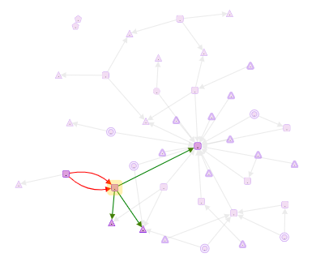

#  CytographDB

## Overview

**CytographDB** transforms a PostgreSQL schema into an interactive, directed graph using schema introspection:

- Each **table** is represented as a **node**
- Each **foreign key** is rendered as a **directed edge** between nodes

This graph-based representation supports large and complex schemas, with color-coded links that enhance the visibility of table relationships.

With powerful selection, filtering, and path traversal features—spanning both visible and hidden graph layers—CytographDB helps users to:

- Visualize and explore table dependencies  
- Identify logical and functional consistency domains  
- Detect and document business aggregates  
- Save and reload business-relevant subsets to communicate the model effectively

---

## Documentation

- 🟩 [Quick Tour](./quickTour.md)  
- 🟨 [Main Menu Bar](./menuBar.md)  
- 🟦 [Node Menu](./menuNodesSelectHide.md)  
- 🟥 [Edge Menu](./menuEdgesSelectHide.md)  

---

## Configuration

- 🎨 [Customization Options](./customization.md)  
- ⚙️ [Installation Guide](./install.md)  
