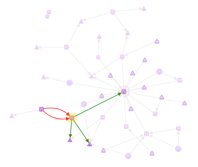

<!--======================================================================================
                IF YOU SEE THIS MESSAGE :

You must use a Markdown Viewer plug-in in your navigator to browse this documentation. 

 ***Markdown Viewer 5.3*** was used for development.*

See install.md file 
========================================================================================-->

#  CytographDB

## Overview

CytographDB helps you **explore, analyze, and enhance** your PostgreSQL physical schema using an **interactive directed graph**.

After performing an automatic database introspection:

- Each **table** becomes a **node** (labeled with the table name).
- Each **foreign key** is a **directed edge** from the source table (FK owner) to the referenced table (labeled with the FK name).

This graph-based representation supports large and complex schemas, with **color-coded edges** that improve the visibility of **table relationships** (incoming/outgoing).

With **powerful selection, filtering, and path traversal** features—across visible and hidden graph layers—CytographDB enables you to:

- **Navigate the model graphically**
  - Organize domain subsets and dependency graphs
- **Browse schema details** (columns, indexes, foreign keys)
  - Export on demand as Markdown for your documentation
- **Browse trigger code** and identify impacts
  - Add visual links for impacts between tables
- **Identify logical and functional consistency domains**
- **Save/load JSON subgraphs** to work with subsets and preserve your progress

---

## Documentation
- ⚪️ [*Main*](./main.md)
- 🟩 [Quick Tour](./quickTour.md#quick-tour)
- 🟨 [Main Menu Bar](./menuBar.md#menu-bar)
- 🟨 [Display Menu](./menuDisplay.md#menu-display)
- 🟨 [Table Menu](./menuNodesSelectHide.md#menu-tables)
- 🟨 [Relation Menu](./menuEdgesSelectHide.md#menu-relations)
- 🟨 [Model Menu](./menuModelDoc.md#menu-model)

---

## Configuration Information

- ⚙️ [Installation Guide](./install.md)
- 🎨 [Customization Options](./customization.md)

