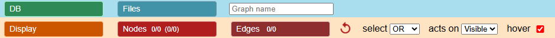
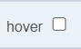
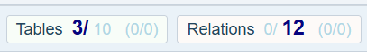
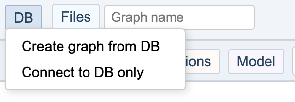
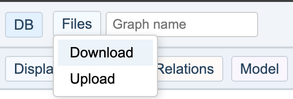
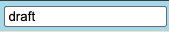
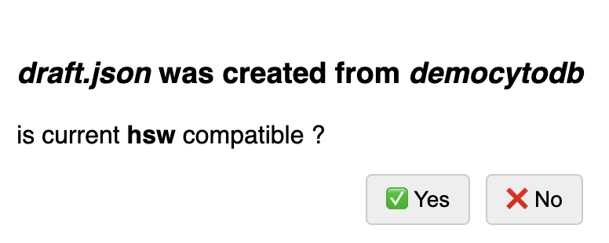
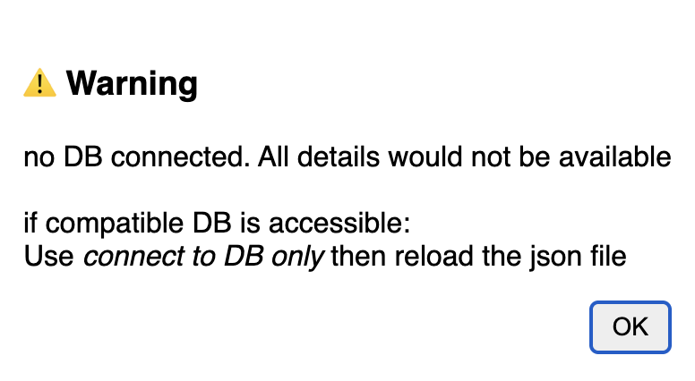
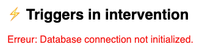
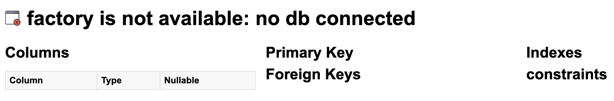

# Menu Bar

Menus and submenus appear on hover and disappear when the cursor leaves.

💡 **Tip:** Click a menu entry to keep it temporarily open.

---

##  Undo

The **counterclockwise arrow** restores the previous state of the graph after an action.
You can also use the keyboard shortcut **Ctrl Z**.
Note: **Ctrl Y** can redo the last undone action.

---

##  PNG Snapshot

This button captures the current view and prompts you to download it as a PNG image.
The edges are temporarily enhanced in the graph image to make them more visible when printing.
You can also use the keyboard shortcut **Ctrl G** — useful for taking a snapshot without moving the mouse outside the graph.

---

##     Clip Report

These icons indicate whether clipped data is empty or filled, showing the results of previous actions.
Click to display the last clipped content in a new tab for quick browsing.

---

## 🔎 Select Mode: OR / AND

* **OR (default):** Adds new elements to the current selection.
* **AND:** Applies the selection **only to already selected elements**, resulting in an AND operation.

💡 **Tip:** Switch back to **OR** after using **AND**, otherwise later selections may return no results.

---

## Hover Toggle

Displays element details when hovering over nodes or edges.

---

### Perimeter of Actions

The status bar shows the current scope with highlighted numbers:

Tables – visible: selected elements 3 / all elements 10 (hidden: selected 0 / total hidden 0)
Relations – visible: selected elements 0 / all elements 12 (hidden: selected 0 / total hidden 0)

Actions apply to the current perimeter:

* If some visible elements are **selected**, actions apply only to them.
* If no elements are selected, actions apply to the entire visible graph.

In this example:

* A command on tables applies to the 3 visible selected tables.
* A command on relations applies to the 12 visible relations.

---

# Database Access

## 

The main purpose of **CytographDB** is to create a graph from a PostgreSQL database.

#### Create graph from DB

* A dropdown lists all available databases.
* Choose one and click **OK** to generate the graph.

#### Connect to DB only 

* Establish a DB connection in order to have details when reloading a saved JSON.

---

# File Access

## 

### Download

You can save the current graph at any time as a JSON file.
It will be saved to your ***local disk*** using the browser.

#### Graph Name in Main Bar

### Upload

By default, an upload will try to automatically reconnect to the original database used when the file was downloaded.

#### Compatible Database

If that database is no longer available, you can first connect to a compatible one:

If another database is in place from previous work or after a 'connect to DB only' , you will be prompted for confirmation:  

 

**No database connection:** 
If no database is connected, some actions will produce errors or have no effect:

### Default Behavior Without a Database

***Trigger list and code details are not available***   

***Table whole details can be empty*** 

---

⚪️ [Main](./main.md)
