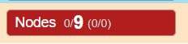
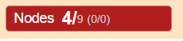
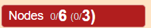

# Menu Bar

Menus and submenus appear on hover and disappear when the cursor leaves.  
💡 **Tip:** Click on a menu entry to keep it temporarily open.

---

##  Undo

The **counterclockwise symbol** in the menu restores the previous state.  
You can also use the keyboard shortcut **Ctrl + Z**.

---

##  PNG Snapshot

This button captures the current view of the graph and prompts you to download it as a PNG image.   
The edges are temporarily enhanced in the graph to be more visible when printing.   

---
## Hover toggle 

Displays element details when the cursor hovers over them.

## 🔎 Select Mode: OR / AND

- **OR (default):** Adds new selections to the current selection.
- **AND:** Applies the selection criteria **only to already selected elements**.

💡 **Advice:** Switch back to **OR** after using **AND**—further selections may otherwise return no results.

---

## 🎯 Action Scope

### Visible / All

- **Visible:** Applies only to elements currently visible (default).
- **All:** Includes hidden elements—useful for operations like *follow links* to restore hidden nodes.

### Automatic Scoping

- If nodes are **selected**, actions apply only to them.
- If **no selection**, actions apply to the entire graph (based on Visible/All toggle).

### 🔍 Scope Visualization

The current scope is displayed in the status bar, with emphasized numbers:

- **No selection** → action applies to all nodes (e.g., 9 in `democytodb`):  
  

- **Selection of 4 nodes** → action applies only to those:  
  

- **ALL mode with 6 visible and 3 hidden nodes** → action applies to all 9:  
  

---

## 🗃️ DB Menu

### Create Graph from DB

- Select a database from the dropdown.
- Click **OK** to generate the graph.

### Connect to DB Only

Graphs loaded from a saved JSON file are disconnected from the database.  
To access **table details**, reconnect to the **original database** used when the graph was created.

⚠️ Ensure you're connecting to the same DB used to generate the graph.

---

## 📁 Files

Used to save and load graph data in JSON format.

### Upload / Download

- Use the browser's file dialog.

### Graph Name Input

- Assign a name to your downloaded graph.
- 💡 Avoid renaming via your file navigator—use this field instead.

---

## 🖥️ Display Options

### Fit Screen

- **All:** Zooms to fit the entire graph.
- **Selected:** Zooms to fit only selected nodes.

### Layout >

Applies layout algorithms to reorganize the current scope.

- A variety of algorithms are available.
- Some layouts may spread nodes very far—use **fit screen**, **zoom**, or try a different layout.
- Layout results can vary with each execution.

🔁 **Undo** is supported.

### Move >

- Drag a single node manually.
- Drag a selected node to move the entire selection.

### Resize >

Expand or shrink the scoped graph in both directions.

### Align & Distribute >

- **Align:** Arrange nodes along a common axis.
- **Distribute:** Evenly space nodes between boundary elements.

### Rotate >

- Rotates selected nodes by **15°** increments.
- Node labels remain **horizontally aligned**.
- Helps reduce label overlap.

---
