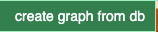

# Menu Bar

Menus and submenus appear on hover and disappear when the cursor leaves.  
💡 **Tip:** Click on a menu entry to keep it temporarily open.

---

##  Undo

The **counterclockwise symbol** in the menu restores the previous state.  
You can also use the keyboard shortcut **Ctrl + Z**.

---

##  PNG Snapshot

This button captures the current view of the graph and prompts you to download it as a PNG image.   
The edges are temporarily enhanced in the graph to be more visible when printing.   
You can also use the keyboard shortcut **Ctrl + g**. Useful to keep snapshot without moving mouse out of graph. 

---

## 🔎 Select Mode: OR / AND

- **OR (default):** Adds new selection to the current selection.
- **AND:** Applies the selection criteria **only to already selected elements** resulting in an AND operation.

💡 **Advice:** Switch back to **OR** after using **AND** further selections may otherwise return no results.

--- 

## Hover toggle 

Displays element details when the cursor hovers over them.

---

## 🎯 Action Scope

### Automatic Scoping

- If some visible nodes are **selected**, actions apply only to them.
- If none, actions apply to the entire visible graph.

### 🔍 Scope Visualization

The current scope is displayed in the status bar, with emphasized numbers:

 **No selection** → action applies to all nodes (e.g., 9 in `democytodb`):  
  

  **Selection of 4 nodes** → action applies only to those:  
  

  **ALL mode with 6 visible and 3 hidden nodes** → action applies to all 9:  
    

---

## 

### 

- Select a database from the dropdown.
- Click **OK** to generate the graph.

####   

Used when a json stored graph is reloaded from disk and come not from DB. 
To access **table details**, must reconnect to the **original or compatible database** used when the graph was created.
Without reconnection, you can have warning like : 
- `no connection to database. Connect first to the original DB`
- 

---

##  

Used to save and load graph data in JSON format.

### Download / Upload

- Use the browser's file dialog to save/load graph from local disk. 

### Graph Name Input
 

You can assign a name to your graph before downloading ( can change also in navigator)

---

## 

### Fit Screen

- **All:** Zoom to fit the entire graph.
- **Selected:** Zoom to fit only selected nodes.

### Layout ...

Applies layout algorithms to reorganize the current scope.

- A variety of algorithms are available.
- Some layouts may spread nodes very far—use **fit screen**, **zoom**, or try a different layout.
- Layout results can vary with each execution.

 **Undo** is supported.

### Move ...

- Drag a single node manually.
- Drag a selected node to move the entire current selection.

### Resize ...

Expand or shrink the scoped graph in both directions.

### Align & Distribute ...

- **Align:** Arrange nodes along a common axis.
- **Distribute:** Evenly space nodes between boundary elements.

### Rotate ...

- Rotates selected nodes by **15°** increments.
- Node labels remain **horizontally aligned**.
- Helps reduce label overlap.

---

- ⚪️ [Main](./main.md)
- 🟩 [Quick Tour](./quickTour.md)  
- 🟨 [*Main Menu Bar*](./menuBar.md)  
- 🟦 [Node Menu](./menuNodesSelectHide.md)  
- 🟥 [Edge Menu](./menuEdgesSelectHide.md)   