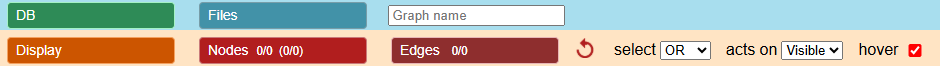
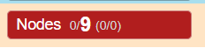
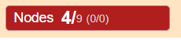
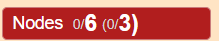

# Menu Bar

Menus and submenus appear on hover and disappear when cursor leaves their positions.
***Better to click on each entry to fix them temporarily.***

### Undo symbol

the ***counterclockwise symbol*** in menu restore a previous state. 
***Ctrl-z*** do the same with keyboard rtcut.

#### Select: OR / AND

By default (OR) a new selection is added to the currently selected elements.

The **AND** option will apply the selection criteria ***only on selected elements***.

**Advice:** Don't forget to return to **OR** once done otherwise further select can have no results.   

---
## Scope of actions 

#### acts on *Visible/All*

 ***Visible*** target only visible elements , main case. 

 ***All*** In some cases, it's useful to include hidden elements in the action.  
 
 As main case : ***follow menus*** can be allowed to search into hidden elements to  bring back linked ones to visible plan. 

 #### automatic scoping 

- if *selected nodes* actions apply to the selection 
- if no selection, actions target whole graph (according to *Visible or ALL* )

#### Visualize the current scope 

In the status, current scope is using highlighted and bigger numbers :
No selection: action will apply to all nodes ( 9 in democytodb)

action only on the 4 selected 

actson ALL (not restrict to Visible) action will apply to 9 nodes

---
### DB

#### create graph from DB
  - Choose a  DB in select box 
  - OK will construct its graphic representation. 

#### connect to DB only 

When you upload a json graph saved by dowload , it is autonomous and has no more link to any database.  
To access to the tables'details , you must connect to the DB to be used with this saved graph. 

***be aware of connecting to the DB used when graph was created***

--- 

### Files 

Used to save graph as a json document

#### Upload /  Download

- through Navigator 

#### Input box '*Graph Name*' 

You can give here a name for the download file ( avoid to modified within navigator )

--- 

### Display 

#### fit screen

 Works out of scope as one can fit a graph with both kind of nodes. 
 **All** : whole graph is resized to fit in screen
 **Selected**: zoom enough to have all selected nodes in the screen. 

#### layout >
Apply to current scope : can reorganize parts by selecction. 
Collection of algorithms to self organize nodes and edges.  
Successive calls can give different results.
Some can use huge place :nodes are so far that quite invisible.  Try fit screen,  zoom, resize  or change layout.  
Better to try.
Undo wil work. 

#### move >

  You can drag a single node with the mouse.
  You can drag the set of selected nodes by moving an element.

##### resize >

Allow to expand or contract the scoped graph in the two directions. 

##### align and Distribute >

organize nodes on a same axis.
distribute equally the space betwween extremes 

##### rotate >
Apply to current scope.  
Rotates the selection  by 15°.
Labels allways remain horizontally oriented.
Useful when modes label overlap horizontally.   

---

