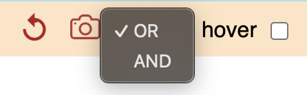
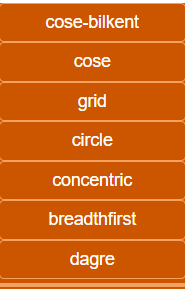

# Menu Bar

Menus and submenus appear on hover and disappear when the cursor leaves.  
💡 **Tip:** Click on a menu entry to keep it temporarily open.

---

##  Undo

The **counterclockwise arrow** restores the previous state of the graph after an action.  
You can also use the keyboard shortcut **Ctrl Z**.
Notice shortcut **Ctrl Y** can restore backward. 

---

##  PNG Snapshot

This button captures the current view and prompts you to download it as a PNG image.      
The edges are temporarily enhanced in the graph image so they are more visible when printing.      
You can also use the keyboard shortcut **Ctrl G** — useful for taking a snapshot without moving the mouse outside the graph.   

---
##   &nbsp; Clip Report

These icons show empty and filled in clipped data that echoes results of actions.    
A click will diplay the last clipped content in a new tab to quickly browse results.    .  

---

## 🔎 Select Mode: OR / AND  

- **OR (default):** Adds new elements to the current selection.
- **AND:** Applies the selection **only to already selected elements**, resulting in an AND operation.

💡 **Tip:** Switch back to **OR** after using **AND**, otherwise further selections may return no results.

--- 

## Hover Toggle 

Displays element details when the cursor hovers over nodes or edges.

---

### Perimeter of Actions

- If some visible nodes are **selected**, actions apply only to them.
- If none are selected, actions apply to the entire visible graph.

The status bar shows the current scope with highlighted numbers:

 **No selection** → the action applies to all nodes (e.g., 9 in `democytodb`):  
  

  **Selection of 4 nodes** → the action applies only to those 4:  
  

---  

# Database Access 

## 

The main purpose of **CytographDB** is to create a graph from an available PostgreSQL database.  
### 

- A dropdown with all available databases is displayed.
- Choose one and click **OK** to generate the graph.

####   

---

# File Access 

##  

 

### Download 

At any time, a graph can be saved (download) in its current state as a JSON file. 

It save the graph to your ***local disk*** using the browser. 

#### Graph Name in main bar

 

### Upload 

By default an upload will try to find and connect automatically the original DB used when dowloaded. 

#### compatible DB 

If this very DB is no more available, you can connect  a compatible one first:    
####   

Reloading your json, you will be prompted for a confirmation: 
       

**no database connection at all**:   
  
  

### Default if no Database 

If no DB connected, somme actions will have errors or no effects: 

***Triggers list and code details***  

***Table details***  

--- 

# Graphical Options 

You can use the mouse wheel to zoom in and out.  
💡 **Tip:** Zoom out is centered on the mouse position.  

You can move the graph by holding the left mouse button and dragging the cursor.

### Menu Display

   
  

- **All:** fit the graph to show all nodes on one screen.
- **Selected:** fit only the selected nodes.

💡 **Tip:** If the screen is empty, try ***Fit Screen → All*** as your nodes may be far away. 

###  

Apply a layout algorithm to reorganize ***the current scope***:  
- the whole graph if no nodes are selected  
- only the selected nodes if there is a selection  

Several common algorithms are available at redaction time: 
 

Some may spread nodes outside the screen: use **Fit Screen** or try a different layout.  
Note: some layout calculations include a random component and may vary with each execution.

If you apply a layout on a subset of nodes, the result will be at unexpected place into the graph. Drag this part using one of selected node.

💡 **Tip:** Use **Undo (Ctrl Z)** to restore the previous layout.

### Move Elements 

Native Cytoscape actions are available to move nodes:  
- Left-click and drag a single node manually.  
- Dragging one of the selected nodes moves the entire selection.  

#### Move... Options

 

#### Resize...

Expand or shrink the perimeter in different directions: horizontally, vertically, or both.

#### Align...

Arrange nodes within the perimeter along a common axis, horizontal or vertical. 

#### Distribute...

Distribute nodes within the perimeter along a common axis:  
- **Horizontal:** nodes are equally spaced between the leftmost and rightmost.  
- **Vertical:** nodes are equally spaced between the topmost and bottommost.  

💡 **Tip:** If the spacing is too tight, move one end and try again.

#### Rotate...

Rotate the nodes in the current perimeter in **15°** increments, either left (counterclockwise) or right (clockwise).  
Node labels remain **horizontally aligned**.

💡 **Tip:** Mainly used to avoid overlapping labels. 

--- 
## keyboard shortcuts   

- ctrl a: select All 
- ctrl g: capture graph in a .png file
- ctrl h: hide not selected
- ctrl y: redo 
- ctrl z: undo

---

⚪️ [Main](./main.md)  

