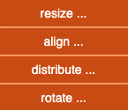

# Menu Bar

Menus and submenus appear on hover and disappear when the cursor leaves.  
💡 **Tip:** Click on a menu entry to keep it temporarily open.

---

##  Undo

The **counterclockwise arrow** restores the previous state of the graph after an action.  
You can also use the keyboard shortcut **Ctrl + Z**.

---

##  PNG Snapshot

This button captures the current view and prompts you to download it as a PNG image.   
The edges are temporarily enhanced in the graph image so they are more visible when printing.   
You can also use the keyboard shortcut **Ctrl + G** — useful for taking a snapshot without moving the mouse outside the graph. 

---

## 🔎 Select Mode: OR / AND  

- **OR (default):** Adds new elements to the current selection.
- **AND:** Applies the selection **only to already selected elements**, resulting in an AND operation.

💡 **Tip:** Switch back to **OR** after using **AND**, otherwise further selections may return no results.

--- 

## Hover Toggle 

Displays element details when the cursor hovers over nodes or edges.

---

### Perimeter of Actions

- If some visible nodes are **selected**, actions apply only to them.
- If none are selected, actions apply to the entire visible graph.

The status bar shows the current scope with highlighted numbers:

 **No selection** → the action applies to all nodes (e.g., 9 in `democytodb`):  
  

  **Selection of 4 nodes** → the action applies only to those 4:  
  

---  

# Database Access 

## 

The main purpose of **CytographDB** is to create a graph from an available PostgreSQL database.  
### 

- A dropdown with all available databases is displayed.
- Choose one and click **OK** to generate the graph.

####   

At any time, the full graph or a simplified view can be saved as a JSON file.  
When reloading such a JSON file, CytographDB checks if the currently connected database is the same one used for that extract.   

- **Same database**: the application continues directly.  
- **Different database**: the application asks the user to check compatibility:

     

  ***Yes***: application options will come from the accepted database, under the user's responsibility.    
  ***No***: some application options may not return any results.  
 

- If there is **no database connection at all**:  
  

### Options Requiring a Database 

If no DB connected, somme action will have errors or no effects: 

***Triggers list and code details***  

***Table details***  

💡 **Tip:** Use *Connect to DB only* ***before*** reloading a stored JSON file.
  
---

# File Access 

##  

Used to save and load graph data in JSON format.

### Download 

Save the graph to your local disk using the browser. 

#### Graph Name Input

You can assign a name to your graph before downloading.  
In any case, the browser allows you to change it. 

 

### Upload 

Load a JSON file previously saved via download.  
The database check is performed as explained above in **Database Access**.  

--- 

# Graphical Options 

You can use the mouse wheel to zoom in and out.  
💡 **Tip:** Zoom out is centered on the mouse position.  

You can move the graph by holding the left mouse button and dragging the cursor.

### Menu Display

   
  

- **All:** fit the graph to show all nodes on one screen.
- **Selected:** fit only the selected nodes.

💡 **Tip:** If the screen is empty, try ***Fit Screen → All*** as your nodes may be far away. 

###  

Apply a layout algorithm to reorganize ***the current scope***:  
- the whole graph if no nodes are selected  
- only the selected nodes if there is a selection  

Several algorithms are available.  
Some may spread nodes outside the screen: use **Fit Screen** or try a different layout.  
Layout calculations include a random component and may vary with each execution.

💡 **Tip:** Use **Undo (Ctrl + Z)** to restore the previous layout.

---

### Move Elements 

Native Cytoscape actions are available to move nodes:  
- Left-click and drag a single node manually.  
- Dragging one of the selected nodes moves the entire selection.  

#### Move... Options

 

#### Resize...

Expand or shrink the perimeter in different directions: horizontally, vertically, or both.

#### Align...

Arrange nodes within the perimeter along a common axis, horizontal or vertical. 

#### Distribute...

Distribute nodes within the perimeter along a common axis:  
- **Horizontal:** nodes are equally spaced between the leftmost and rightmost.  
- **Vertical:** nodes are equally spaced between the topmost and bottommost.  

💡 **Tip:** If the spacing is too tight, move one end and try again.

#### Rotate...

Rotate the nodes in the current perimeter in **15°** increments, either left (counterclockwise) or right (clockwise).  
Node labels remain **horizontally aligned**.

💡 **Tip:** Mainly used to avoid overlapping labels. 

---

- ⚪️ [Main](./main.md)  
- 🟩 [Quick Tour](./quickTour.md)  
- 🟨 [*Main Menu Bar*](./menuBar.md)  
- 🟦 [Node Menu](./menuNodesSelectHide.md)  
- 🟥 [Edge Menu](./menuEdgesSelectHide.md)  
