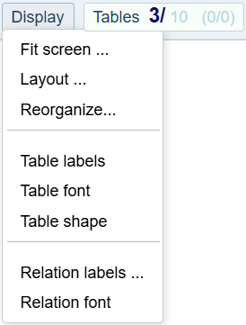
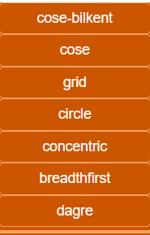
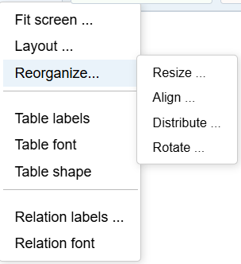
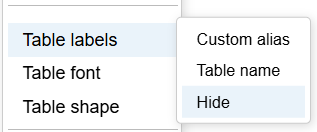

#  Menu Display

### Global Graphical Options 

You can use the mouse wheel to zoom in and out.  
💡 **Tip:** Zoom out is centered on the mouse position.  

You can move the graph by holding the left mouse button and dragging the cursor.
You can select a bunch by drawing a rectangle with the mouse. 

## Menu Display

    

### Fit screen
- **All:** fit the graph to show all nodes on one screen.
- **Selected:** fit only the selected nodes.

💡 **Tip:** If the screen appears empty, try ***Fit Screen → All*** as your nodes may be far away. 

### Layout

Apply a layout algorithm to reorganize ***the current scope***:  
- the whole graph if no nodes are selected  
- only the selected nodes if there is a selection  

Several common algorithms are available at redaction time: 
 

Some may spread nodes outside the screen: use **Fit Screen** or try a different layout.  
Note: some layout calculations include a random component and may vary with each execution.

If you apply a layout only on a subset of nodes:
- the result graph will be positionned depending of involved nodes.
- It should be at an unexpected place into the graph. 
- Drag the reorganized selection where you need to have it.

💡 **Tip:** Use **Undo (Ctrl Z)** to restore the previous layout.

### Reorganize

Native Cytoscape actions are available to move nodes:  
- Left-click and drag a single node manually.  
- Dragging one of the selected nodes moves the entire selection.  

#### Move... Options

 

#### Resize...

Expand or shrink the perimeter in different directions: 
- horizontally
- both directions
- vertically

#### Align...
Align nodes of the current perimeter along a common axis
- horizontally
- vertically

#### Distribute...

Distribute nodes within the perimeter along a common axis:  
- **Horizontally:** nodes are equally spaced between the leftmost and rightmost.  
- **Vertically:** nodes are equally spaced between the topmost and bottommost.  

💡 **Tip:** If the spacing is too tight, move one node further and try again.

#### Rotate...

- left  : rotate 15° counterclockwise
- right : rotate 15° clockwise
- 90°   : clockwise
- 180°  : clockwise 

Labels remain **horizontally aligned**.

💡 **Tip:** Mainly used to avoid overlapping labels. 

--- 

### Table aspect 

These actions apply to the current perimeter (selected tables if any, all visible otherwise)
 

- Custom alias : if exist, replace Table name by a custom label set in Custom module options
- Table name : set the label with the table's name in DB. (default)
- Hide : no label on the graph. 

### Table font 

- Enlarge
- Reduce
- Restore 

### Table shape 

- Standard : tables are round rectangles around the labels
- Proportional ( default) : more degree of relations, more wide is the table on the graph

## Relations aspect

### Relation labels

- Relation name (default)
- Hide 
  
### Relations font

- Reduce
- Restore 

--- 
## keyboard shortcuts   

- ctrl a: select All 
- ctrl g: capture graph in a .png file
- ctrl h: hide not selected
- ctrl y: redo 
- ctrl z: undo

--- 
⚪️ [Main](./main.md)  