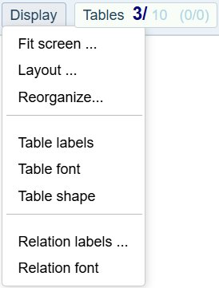
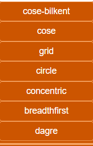
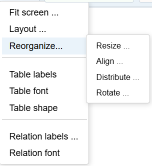
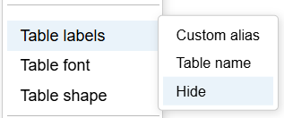
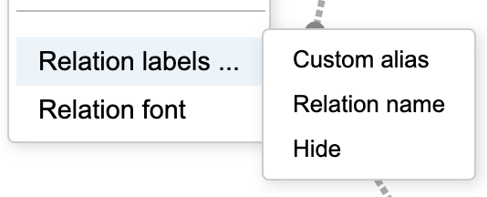

# Menu Display

### Global Graphical Options

You can use the mouse wheel to zoom in and out.
💡 **Tip:** Zoom out is centered on the mouse position.

You can move the graph by holding the left mouse button and dragging the cursor.
You can **select multiple elements** by drawing a rectangle with the mouse.

---

## Menu Display

### Fit Screen
- **All:** Fit the graph to show all nodes on one screen.
- **Selected:** Fit only the selected nodes.

💡 **Tip:** If the screen appears empty, try ***Fit Screen → All*** as your nodes may be far away.

---

### Layout

Apply a layout algorithm to reorganize **the current scope**:
- The **entire graph** if no nodes are selected
- Only the **selected nodes** if a selection exists

Several common algorithms are available **at the time of writing**:

Some may spread nodes outside the screen: use **Fit Screen** or try a different layout.
Note: Some layout calculations include a random component and may vary with each execution.

If you apply a layout to only a **subset of nodes**:
- The resulting graph is positioned **based on the involved nodes**.
- It **may appear in an unexpected location** in the graph.

💡 **Tip:** Use **Undo (Ctrl+Z)** to restore the previous layout.

---

### Reorganize

Native Cytoscape actions are available to move nodes:
- Left-click and drag a single node manually.
- Dragging one of the selected nodes moves the entire selection.

#### Move... Options

#### Resize...

Expand or shrink the perimeter in different directions:
- Horizontally
- Both directions
- Vertically

#### Align...

Align nodes of the current perimeter along a common axis:
- Horizontally
- Vertically

#### Distribute...

Distribute nodes within the perimeter along a common axis:
- **Horizontally:** Nodes are equally spaced between the leftmost and rightmost.
- **Vertically:** Nodes are equally spaced between the topmost and bottommost.

💡 **Tip:** If the spacing is too tight, move one node further and try again.

#### Rotate...

- **Left**: Rotate 15° counterclockwise
- **Right**: Rotate 15° clockwise
- **90°**: Rotate 90° clockwise
- **180°**: Rotate 180° clockwise

Labels remain **horizontally aligned**.

💡 **Tip:** Mainly used to avoid overlapping labels.

---

### Table Visual Aspect

These actions apply to the **current perimeter** (selected tables if any, otherwise all visible tables):

- **Custom alias**: If set, replaces table name with a custom label (defined in **Customization** options)
- **Table name**: Sets the label to the table's name from the database (default)
- **Hide**: Removes the label from the graph

### Table Font

- Enlarge
- Reduce
- Restore

### Table Shape

- **Standard**: Tables are round rectangles around the labels
- **Proportional** (default): The wider the table, the more relations it has in the graph

---

## Relations Visual Aspect

### Relation Labels

Apply to current edge perimeter:

- **Custom Alias**: Uses the alias (if set in **Customization**), otherwise uses the FK name
- **Relation name (default)**: Uses the FK name as defined in the database
- **Hide**: Removes the label from the screen

### Relations Font

Apply to current edge perimeter:
- Enlarge
- Reduce
- Restore

---

## Keyboard Shortcuts

- **Ctrl+A**: Select all
- **Ctrl+G**: Capture graph as PNG
- **Ctrl+H**: Hide unselected
- **Ctrl+Y**: Redo
- **Ctrl+Z**: Undo

---

- ⚪️ [Main](./main.md)
