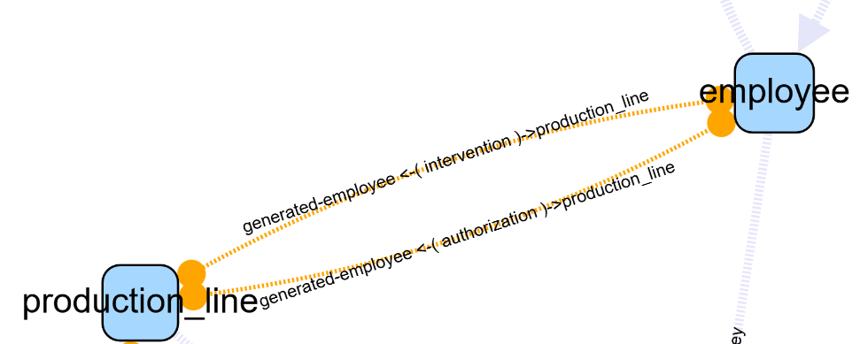

# Edge Menu


---

## 📊 Status

Displays selected and visible edges:  
Example: `(0 / 11)` → **0 selected / 11 total**

---

## 🔍 Select

Edges can be selected directly via:
- Click
- Shift + Click

Menu options:

- **All** → Select all visible edges
- **None** → Deselect all edges
- **Swap Selected** → Invert current selection
- **Edges from Selected Nodes**:
  - **All Edges** → All edges connected to selected nodes
  - **Outgoing Edges** → Only edges going out of selected nodes
  - **Incoming Edges** → Only incoming edges to selected nodes
  - **Edges Between Selected Nodes** → Select edges connecting currently selected nodes

💡 **Comparison:**  
Similar to **Nodes > Follow & Show**, except this selects only the edges—**not** the terminal nodes.

---

## 🙈 Hide

- **None** → Show all edges
- **Not Selected** → Hide all except selected edges
- **Selected** → Hide selected edges
- **Swap** → Invert visible and hidden edges

---

## 🏷️ Label Display

Toggle edge labels and visual emphasis:

- Highlights edge lines
- Displays the foreign key name (if applicable) or the trigger name (if applicable)

- font + / -  : act on selected edges if any, otherwise on visibles


---

## 📋 List Edges

Generates an HTML file listing edge details based on current scope:

Format example:  
```authorization_employee_id_fkey (authorization --> employee)```

---

## 🧩 Data Model Actions

Special functions for advanced structural modifications:

### 🔁 Generate Trigger Impacts

⚠️ Requires connection to the **original database** used to build the graph.

- Analyzes all trigger and function code
- Identifies CRUD operations that imply impact on other tables
- Adds **oriented edges** from the trigger's source table to the impacted table
- Edges are styled distinctly

📖 See the [Quick Tour](./quickTour.md) for visuals.

---

### 🔄 Collapse Associations

For **strict association tables** (2 foreign keys, no extra columns):

- Removes the association node
- Creates a **direct edge** between the linked tables (A → C)
- Edge is visually **non-oriented** (uses circles, not arrows)
- Internally, orientation still exists (for compatibility with Cytograph)

⚠️ **Caution** when using actions based on edge direction—these may not behave as expected with collapsed associations.

- The label retains the original association table name



---

### ♻️ Restore Association

Restores the original association node between tables.  
Note: The exact screen position may be lost during restoration.

---

## 🧼 Filter

Select specific generated edge types:

- **Generated Triggers**
- **Collapsed Associations**
- **Native Categories** (predefined types)

⚠️ Edges do **not** currently support custom categories.

💡 **Tip:** Use **"By Category >"** to load available options before selecting.

---

## 🗑️ Delete Selected

Permanently removes selected edges from the graph.  
Undo is **not mentioned** here—use cautiously.

---
