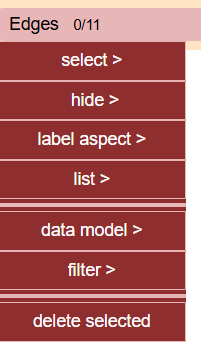
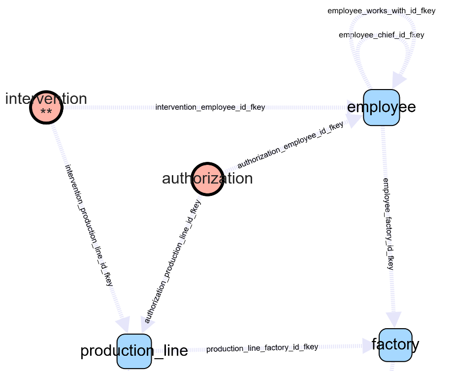
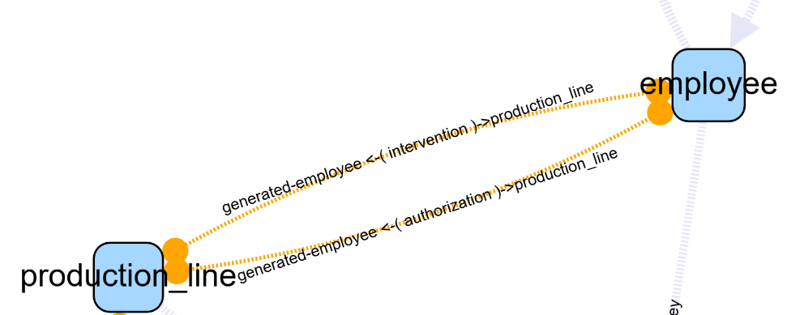

# Menu Edges



#### status 
In the Edges main menu are informations about selected and hidden nodes  
 ( 0 / 11 ) **Edges:  0 Selected / 11 Visibles** 

## Select menu

Can also select edges by click,  shift-click on the screen

- all
- none
- swap selected 
- edges from selected nodes
    - all edges
    - outgoing edges 
    - incoming edges 
    - edges connected nodes : search egdes tha can rely currently selected nodes

 ### comparing with menu : nodes > follow & show

 Quite the same selection except that the node at the extremity of a selected edge is not selected here. Only the edge.    

## Hide 

- none
- not selected
- selected
- swap  (selected)

## Label aspect

Show or hide the edge label on their respective lines. 
edge links are enlarged and name of the fk (if fk link) is written on it. 



## List 
Apply to current scope (all if no selected, selected if any)

List edges informations on a new html page.

```authorization_employee_id_fkey ( authorization --> employee )```

## data model 

Specific actions dealing with a database. 

### generate triggers impacts 

Need to be connected to the original database for this graph. 

Analyse all source code of triggers and associated functions to find operations CrUD on other tables meaning an impact.  
The generated edge is oriented : from owner of the trigger to impacted table. 
These edges have their own color. 

See ***[quick tour ](./quickTour.md)*** for example.

### collapse association 

when a table B is a strict association ( 2 fk, no other property) thie entry : 
- delete the node from the graph 
- create a direct link between A and C, the tables associated through B
- the edge is not oriented graphically using balls instead of arrow
    - internally the edge is oriented as cytograph has no unoriented edge in a general oriented network.
    - be careful using incoming/outgoing actions , not relevant for this kind 
- the generated label remembers the name of the assocation table at origin. 




### restore  association 

Restore the original node B at middle place between A and B as the previous places on screen were lost.

## Filter
A way to select generated edges in the graph 

- generated triggers 
- collapsed associations 


- native category : category set by the application. For edges there is no custom category in this version. ( nodes have)

Select edges with dynamic added category : ***must click on  "by category >"*** to retrieve available categories before a choice. 
## delete selected 

 remove definitively the edges from the graph.

----
