# Menu Relations

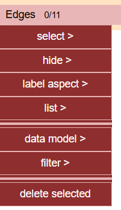

---

## Status Bar

Displays selected relations on visible and hidden layers:

**0 selected / 12 available** in visible layer
(0 selected / 0 available) in hidden layer

The **perimeter of actions** applies to selected relations (if any), **or to all edges** if no selection exists.

---

## 🔍 Selection on Screen

Selections can be made by:
- Click an edge to select it
  - Click **outside any element** to clear the selection
- **Shift+Click**: Multi-select edges
- Edges are also selected with nodes when drawing a rectangle (**Shift + drag**) on the graph

---

## Change Selection...

- **None**: Deselect all edges
- **All**: Select all visible edges
- **Swap**: Invert current edge selection

💡 **Tip:** Selected edges appear as **dashed lines**.

---

## Change Visibility...

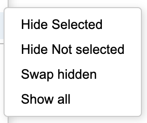

- **Hide Selected**: Hides selected edges
- **Hide Unselected**: Hides all **unselected** edges
- **Swap**: Inverts visible and hidden edges
- **Show All**: Makes **all edges visible**

---

## Filter By

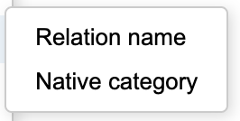

### By Name

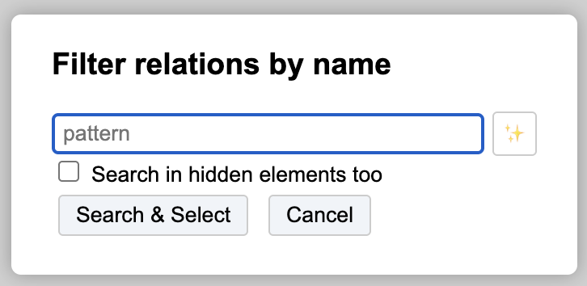

Applies a **regex-based filter** to edge labels (e.g., FK names). Matching edges are **selected**.

⚠️ **Caution:** Browser autofill may **not pass** text to the filter.
**Solution:** Enter manually, copy/paste, or add a space after autofill.

---

### By Native Categories

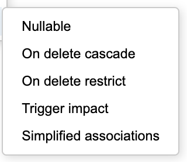

Relations can be tagged with categories (visible on hover).
The filter **searches for a category** and selects matching edges.
**Selections are cumulative** (OR logic with multiple categories).

- **Trigger impacts**: Only works if these edges were generated (see **Modify Relations**)
- **Simplified associations**: Only works if these edges were generated (see **Modify Relations**)

---

## Connected to Table...

### Relations of Selected Nodes

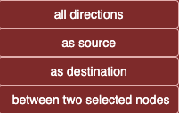

The selection of relations is **guided by the current table selection**.
A **yellow rectangle** indicates a selected table.

The first choice has three options (below incoming edges):
- **Outgoing relations**: This table **references** other tables
- **Both sides**: All connected relations
- **Incoming relations**: This table is **referenced** by other tables

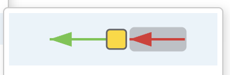

💡 **Tip:** These edge selections **do not affect node selection** — a selected edge may connect to **only one selected node**.

---

### Relations Between Pairs of Selected Tables

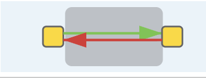

Illustration of *between* below (three nodes were previously selected):
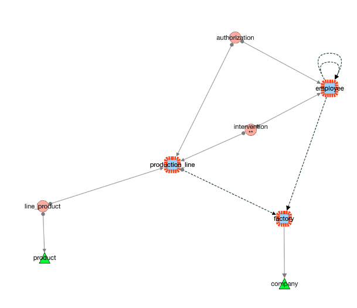

---

## List of Relations

Generates an **HTML file** with details of edges in the **current perimeter**.

The **Source**, **Target**, and **FK** headers allow sorting.

### Mode: *One Edge per FK*

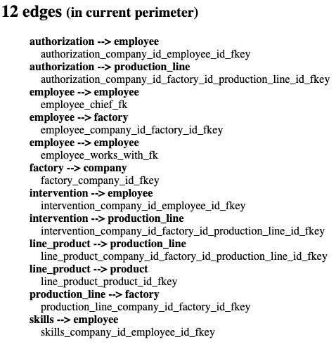

**● Not nullable / ○ Nullable**: Short representation (used for columns and foreign keys)

---

### Mode: *One Edge per Column*

For edges in **1 edge per column** mode, the list **shows** corresponding column names on successive lines.
In a mixed mode, some using individual changes, some edges can stay in 1 per FK as below (partial):

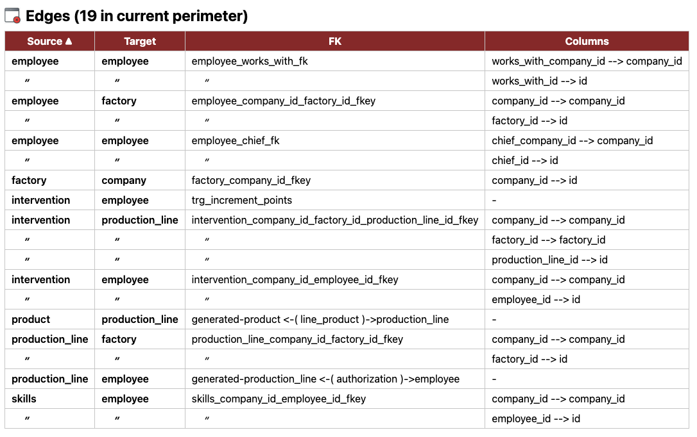

---

## Modify Relations

These options **modify how relations are displayed**.

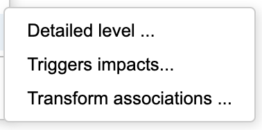

### Detail Level

- **Raw FK** (Default): Standard display (one FK = one edge)
- **Per Column**: One edge **per matching column pair** (source attribute → destination attribute)

---

### Trigger Impacts

**Identifies triggers** and scans function code to detect **CRUD operations** managed by the trigger.

- **Generate**: The code of selected tables with triggers is analyzed to detect actions on other tables.
- **Remove**: Deletes generated trigger impact edges from the graph.

The action adds **directed edges** from the trigger's source table to the **impacted tables**.
Trigger impact edges:
- Have a **special style**
- Are **labeled** with the trigger's name
- Have the native category `trigger_impact`, **allowing** you to filter them later

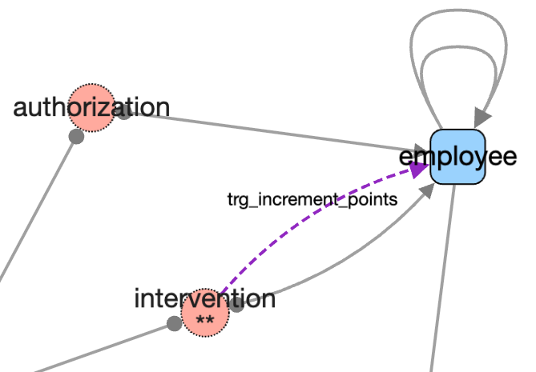

---

### Transform Associations

- **Pass Through**:
  - Removes the **association table**
  - Creates a **double link** (A→B, B→A) between the two associated tables
  - These links **enable dependency propagation** in the graph
- **Restore Associations**: Re-establishes the **original association** with its two foreign keys

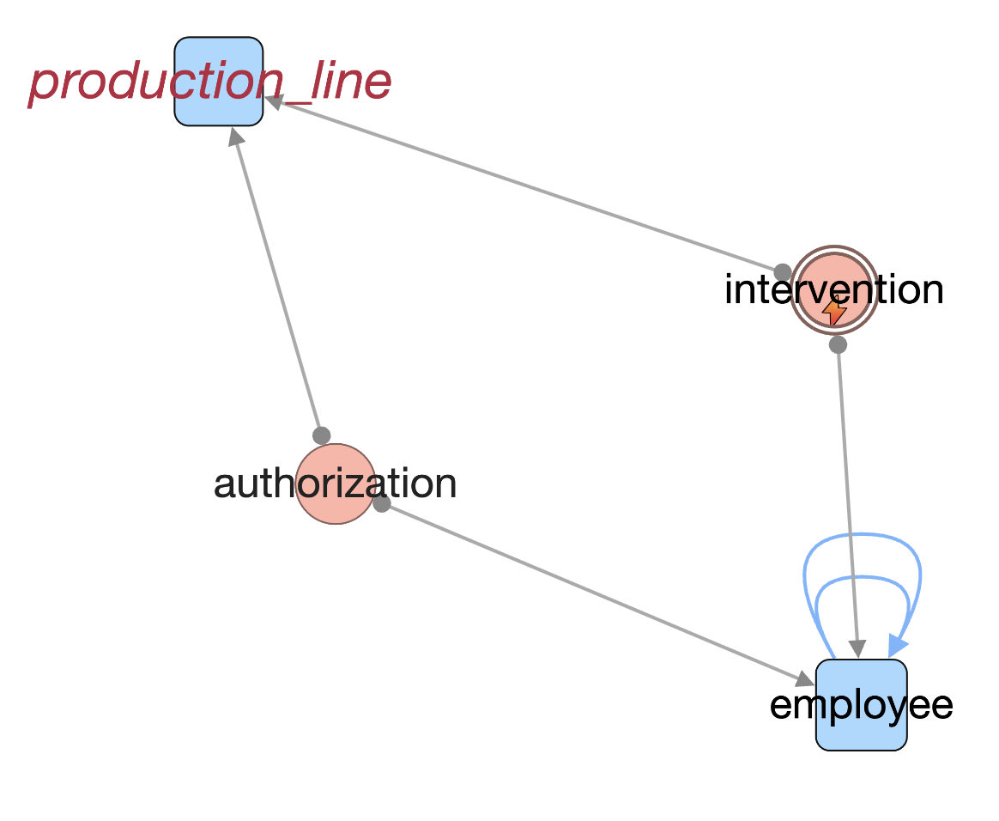
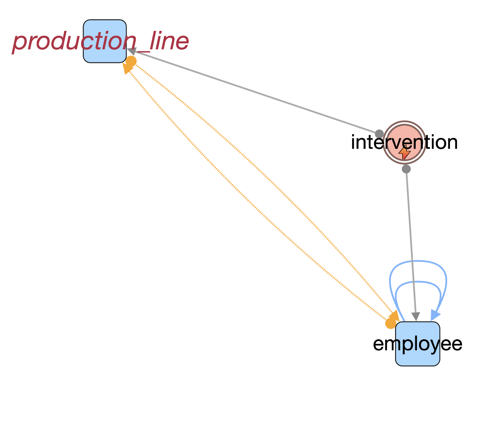

**Note:** Transform associations can be applied:
- Only in **1 FK = 1 Edge** mode for associations
- Only on **simple associations** (no extra columns, only two relations)

---

## Labels

As actions that change the display, **relation labels** can be changed globally in **Menu Display**.

Labels of relations are:
- **Common edges**:
  - **Raw FK mode**: The foreign key name from the database
  - **1 edge per column mode**: `source_attribute → destination_attribute`
- **Trigger impact edges**: The trigger name from the database
- **Simplified association** (A with two links: B and C):
  - **Label first pass-through**: `B ← (A) → C`
  - **Label second pass-through**: `C ← (A) → B`

### Illustration

From top to bottom:
- 3 labels of FK in **1 edge per column** mode
- 2 labels of the **transformed association**
- 1 standard label with the **FK name**
- 1 label with the **trigger name** for generated trigger impacts

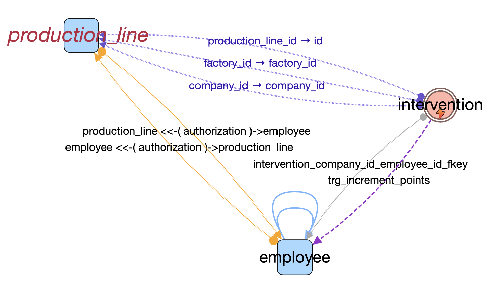

---

### Quick Actions on the Relation Under Cursor

With the previous menu options, **actions apply to the current edge perimeter** (selected edges if any, **all edges otherwise**).

A **context menu** on an edge (**right-click**) allows **individual toggles**:
- To change the **detail level** of this relation
- To show its label or not

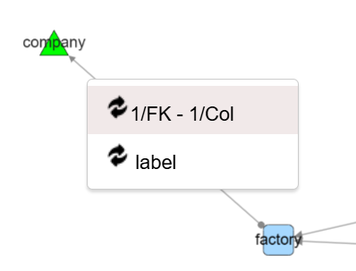

**Note:** To apply **global** label options, see **Menu Display**.

---

### Delete

**Permanently removes** selected edges from the graph.

- If **only one edge** is selected, it is **deleted immediately** (useful for quick cleanup with **Backspace**)
- If **multiple edges** are selected, a **confirmation dialog** appears:

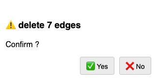

💡 **Tip:** Use **Backspace** as a shortcut.
💡 **Tip:**  **Undo (Ctrl+Z)** restores accidental deletions.

---

- ⚪️ [Main](./main.md)
