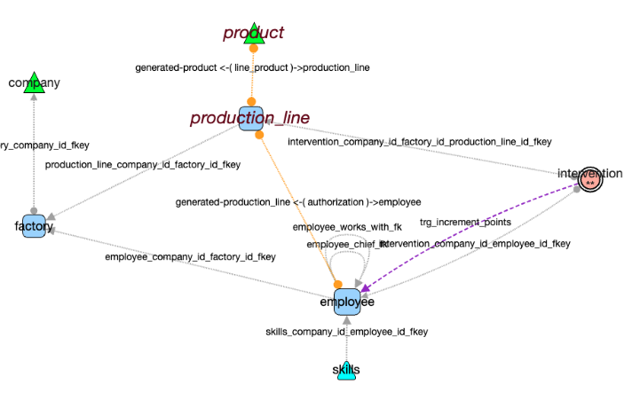
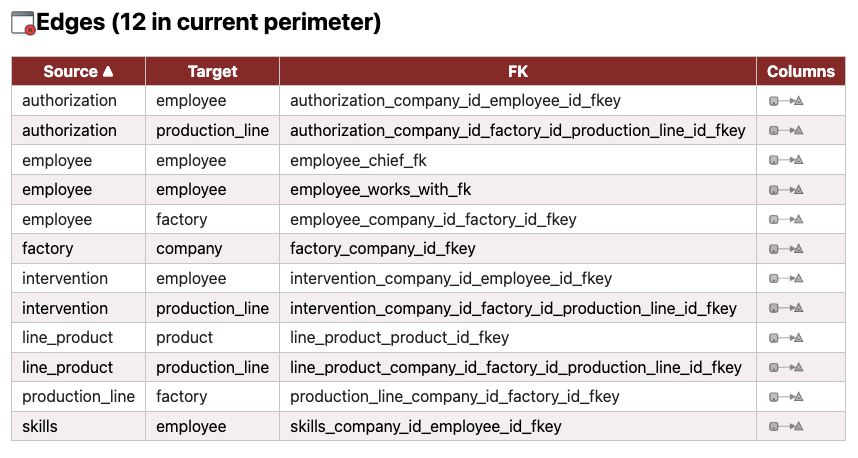

# Edge Menu

---

## status bar

Displays selected and visible edges: 

  **4 selected / 12 total**

Perimeter of actions applies to selection if any, to all edges if no selection.  

---

### hover on edge

when checked, mouse over an edge shows some details
  

## select ...

Edges can be selected
-  individually by:
  - Click 
  - Shift + Click 
- with nodes by drawing a rectangle (shift clic) on the graph 
  

Selected edges have distinct dashed and colored lines to be recognized 
   

- **select ... all** → Select all visible edges
- **select ... none** → Deselect all edges
- **select ... swap Selected** → Invert current edge selection

---

## hide ...

- **hide ... none** → Show all edges
- **hide ... not selected** → Hide all except selected edges
- **hide ...selected** → Hide selected edges
- **hide ...swap** → Invert visible and hidden edges

--- 

## from selected nodes ... 

Take in account currently selected ***nodes*** to pursuit with edge selection :

  - **outgoing Edges** → Select only edges going out of selected nodes
  - **incoming Edges** → Select only incoming edges to selected nodes
  - **boths** → Select all edges connected to selected nodes
    - 💡Similar to ***Nodes > Follow & Show***, except this action selects only the edges—**not** the terminal nodes.

- **connecting two nodes (of the current selection)** 
  
  below three tables were selected, then the link that connect them (including loops)

   

## toggle details N -> 1 

draw an edge **per column of FK**
  

---

## Label

**font + / -**  : act on edges in perimeter (selected edges if any , all otherwise)

**show/hide** 
- Toggle edge labels of current perimeter (selected edges if any , all otherwise)
- Displays the foreign key name (common edges) or the trigger name (trigger impact edges) 

💡  *hover* gives more details 

### label show *in 1->N edges per FK*

In this representation, there is one edge per column involved in FK.   
The *label show* action shows the corresponding columns on the line.  
As the graph could be very dense, you can restrict by selecting some edges before calling *show label*, like below 

.  

💡  *hover* gives more details 

---

## list 

Generates an HTML file with details for edges in current perimeter.   
The **Source** and **Target** tables are directly accessible.

### List *in 1 -> N detailed mode*
( img truncated below )

---

# data model...

Actions that add information to the original model .

## data model ... generate trigger impacts

- Analyzes all triggers and function code
- Identifies C(R)UD operations that imply impacts on other tables
- Adds **oriented edges** from the trigger's source table to the impacted table
- Triggers impact edges 
  - are styled distinctly  
  - have trigger's name as label
  - have native category '***trigger_impact***'

---

### data model ... simplify associations

For **dry association tables** (2 foreign keys, no other link, no extra columns):

- Removes the association node
- Creates a **direct edge** between the linked tables (A → C)
- Edge label remembers tables' name:  source-(association)-destination
- Edge is visually **non-oriented** (uses circles as end points, not arrows)
  - ⚠️ Caution for *follow* walks, orientation still exists (for compatibility with Cytograph)

in upper image, *intervention* node is not simplified due to the trigger impact added recently. It is no more a *strict association*. 

---

### restore association

Restores the original association nodes between tables for the edges in current perimeter.  
Note: The exact previous screen position may be lost during restoration.

---

## filter

Filter edges based on 
-  native FK categories :
  - **nullable** 
  - **on delete cascade**
-  extended categories if added 
  - **triggers_impact**
  - **simplified asssociations**

#### Example 
filter *on delete cascade* 
hide not selected 

---

## delete 

Permanently removes selected edges from the graph.  

- if only one edge selected, delete is immediate 
  - this is to allow quick visual cleaning of a graph using backspace
- if several edges are selected a confirmation is necessary    
     
 .  

❗ **Undo** is available for this action as well

---

- ⚪️ [Main](./main.md)
- 🟩 [Quick Tour](./quickTour.md)  
- 🟨 [Main Menu Bar](./menuBar.md)  
- 🟦 [Node Menu](./menuNodesSelectHide.md)  
- 🟥 [*Edge Menu*](./menuEdgesSelectHide.md)  