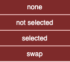

# Edge Menu

  

---

## Status Bar

Displays selected and visible edges. Sample:  
  

**4 selected / 12 total**

The perimeter of actions applies to selected edges if any, or to all edges if no selection.  
Here the perimeter contains the 4 selected edges.

---

## 🔍 Selection on Screen

Selections can be made by:  
- Clicking edges individually  
  - Clicking outside any element removes the current selection  
- **Shift + Click** for multi-selection  
- Edges are also selected with nodes when drawing a rectangle (**Shift + drag**) on the graph  

---

## Select ...

- **All**: select all visible edges  
- **None**: deselect all edges  
- **Swap**: invert current edge selection  

💡 **Tip:** Selected edges have dashed and colored lines (here in green *chartreuse*).  

  

---

## Hide ...

   

- **None** → show all edges  
- **Not selected** → hide all edges except selected  
- **Selected** → hide selected edges  
- **Swap** → invert visible and hidden edges  

---

## From Selected Nodes ... 

   

Takes into account currently selected ***nodes*** to continue with edge selection:  

- **All directions**: all edges of selected nodes are selected  
- **As source**: select edges where a selected node is the source  
- **As destination**: select edges where a selected node is the destination  
- **Between two selected nodes**: select edges where both ends are selected nodes  

💡 **Tip:** These edge selections do not affect node selection — a selected edge may connect to only one selected node.  

Illustration of *between* below (three nodes were previously selected):  
   

---

## Filter By ...

  

#### By Name

Applies a **regex-based filter** on edge labels (e.g., FK names). Matching edges are selected.  

⚠️ **Caution:** Some browsers may display text with autofill but not pass it to the regex.  
Enter manually or copy/paste your filter.  

#### By Native Category 

  

- ***Nullable, On Delete Cascade*** are automatically calculated at FK load time.  
- ***Trigger_impact*** is available only when *Generate trigger impacts* has been applied through the *Data model...* menu.  
- ***Simplified associations*** are available only when *Simplify associations* has been applied through the *Data model...* menu.  

#### Example

*Filter by → Native category → On delete cascade → Hide not selected*  

---

## Edge Details...

  

By default, the graph is displayed with **one edge per FK**:  
- The label is the name of the FK  

### One Edge per Column

Each related column between source and destination is shown as a link.  
- Their labels are the corresponding columns  

---

## Label... 

    

### Show / Hide 

Toggle edge labels in the current perimeter (selected edges if any, all otherwise).  

#### Mode *One edge per FK*

Displays:  
- Common edges: the foreign key name  
- Trigger impact edges: the trigger name  
- Simplified association: *source table – (hidden association table) – destination table*  

#### Mode *One edge per Column*

Displays:  
- Common edges: pairs of corresponding columns  
- Trigger impact edges: no change  
- Simplified association: no change  

  

These actions apply to the current edge perimeter (selected edges if any, all if no selection).  

💡 **Tip:** Hovering edges also shows details.  

#### Font + / -  

Increase or decrease font size of edge labels in the current perimeter (selected edges if any, all otherwise).  

---

## List 

Generates an HTML file with details of edges in the current perimeter.  

The **Source**, **Target**, and **FK** headers allow sorting.  

#### Mode *One edge per FK* 

    
 When an edge is in mode *1 Edge per FK* a straight line symbol  remains this mode 
   

#### Mode *One edge per Column*  

For edges in mode *1 edge per column* the list show corresponding columns names on successive lines.    
Edges in *1 per FK* have the straight line symbol in place of columns.   

  

---

# Data Model...

Actions that add or modify information in the original graph.  

  

### Generate Trigger Impacts

Analyzes all triggers and scans function code to identify C(R)UD operations managed by the trigger.  

Adds **oriented edges** from the trigger’s source table to the impacted tables.  
Trigger impact edges:  
- Are styled distinctly  
- Have the trigger’s name as label  
- Have native category `trigger_impact`  

Example (only one trigger impact in `democytodb`):  
  

### Simplify Associations

For **dry association tables** (2 foreign keys, no other links, no extra columns):  

- Removes the association node  
- Creates a **direct edge** between the linked tables (A → C)  
- Edge label records table names: ***source – (association) – destination***  
- Edge is visually **non-oriented** (two circles as endpoints, not arrows)  

⚠️ **Caution:** Random internal orientation still exists for compatibility with Cytograph. Do not rely on simplified associations for source/destination accuracy.  

In the upper image, *intervention*, an association node, was not simplified: it is no longer a *dry association* because it gained a new edge for a trigger.  

### Restore Association

Restores the original association nodes between tables for the edges in the current perimeter.  

💡 **Tip:** The restored node appears in the middle; previous positions are lost.  

---

## Delete 

Permanently removes selected edges from the graph.  

- If only one edge is selected, deletion is immediate  
  - This allows quick visual cleaning of a graph using **Backspace**  
- If several edges are selected, a confirmation is shown:      

  

💡 **Tip:** Use **Backspace** as a shortcut.  
💡 **Tip:**  **Undo** restores an accidental deletion.  

---

- ⚪️ [Main](./main.md)  
- 🟩 [Quick Tour](./quickTour.md)  
- 🟨 [Main Menu Bar](./menuBar.md)  
- 🟦 [Node Menu](./menuNodesSelectHide.md)  
- 🟥 [*Edge Menu*](./menuEdgesSelectHide.md)  
