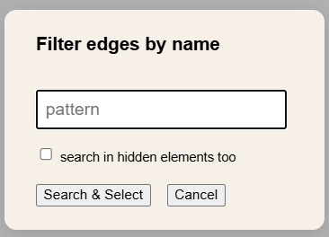
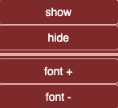
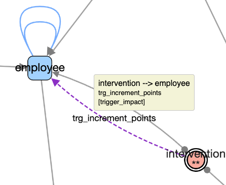

# Edge Menu

  

---

## Status Bar

Displays selected and visible edges. Sample:  
  

**4 selected / 12 total**

The perimeter of actions applies to selected edges if any, or to all edges if no selection.  
Here the perimeter contains the 4 selected edges.

---

## 🔍 Selection on Screen

Selections can be made by:  
- Clicking edges individually  
  - Clicking outside any element removes the current selection  
- **Shift + Click** for multi-selection  
- Edges are also selected with nodes when drawing a rectangle (**Shift + drag**) on the graph  

---

## Select ...

- **All**: select all visible edges  
- **None**: deselect all edges  
- **Swap**: invert current edge selection  

💡 **Tip:** Selected edges have dashed and colored lines (here in green *chartreuse*).  

  

---

## Hide ...

   

- **None** → show all edges  
- **Not selected** → hide all edges except selected  
- **Selected** → hide selected edges  
- **Swap** → invert visible and hidden edges  

---

## From Selected Nodes ... 

   

Takes into account currently selected ***nodes*** to continue with edge selection:  

- **All directions**: all edges of selected nodes are selected  
- **As source**: select edges where a selected node is the source  
- **As destination**: select edges where a selected node is the destination  
- **Between two selected nodes**: select edges where both ends are selected nodes  

💡 **Tip:** These edge selections do not affect node selection — a selected edge may connect to only one selected node.  

Illustration of *between* below (three nodes were previously selected):  
   

---

## Filter By ...

  

#### By Name

Applies a **regex-based filter** on edge labels (e.g., FK names). Matching edges are selected.  

⚠️ **Caution:** Autofill with some browsers may display text with no effect.  
Enter manually or copy/paste your filter or add a space after autofill.

---

## Edge Details...

  

By default, the graph is displayed with **1 edge per FK**.  
**1 edge per column**  split the edge in several parts, one part per involved columns. 

## Label... 

    

### Show / Hide 

Toggle edge labels in the current perimeter (selected edges if any, all otherwise).  

#### Mode *One edge per FK*

Displays:  
- Common edges: the foreign key name  
- Trigger impact edges: the trigger name  
- Simplified association: *source table – (hidden association table) – destination table*  

#### Mode *One edge per Column*

Displays:  
- Common edges: pairs of corresponding columns  
- Trigger impact edges: no change  
- Simplified association: no change  

  

#### individual actions 

With previous menus entries,  actions apply to the current edge perimeter (selected edges if any, all if no selection). 

The contextual menu on an edge by right clic allow individuals switches 

#### label.. Font + / -  

Increase or decrease font size of edge labels in the current perimeter (selected edges if any, all otherwise).  

---

## List 

Generates an HTML file with details of edges in the current perimeter.  

The **Source**, **Target**, and **FK** headers allow sorting.  

#### Mode *One edge per FK* 

  

 When an edge is in mode *1 Edge per FK* a straight line symbol  remains this mode in columns    

#### Mode *One edge per Column*  

For edges in mode *1 edge per column* the list show corresponding columns names on successive lines.    
In a mixed mode some using individual changes, some edges can stay in 1 per FK as below.   

  

---

# Data Model...

***Actions that add or modify information in the original graph.***  

  

### Generate Trigger Impacts

**Goal : Analyzes  triggers and scans function code to identify C(R)UD operations managed by the trigger.**  

Adds **oriented edges** from the trigger’s source table to the **impacted tables**.  
Trigger impact edges:  
- have special style  
- are labbled with the trigger’s name  
- Have native category `trigger_impact` that alloww to filter them later ( native category )  

  

---

## Delete 

Permanently removes selected edges from the graph.  

- If only one edge is selected, deletion is immediate  
  - This allows quick visual cleaning of a graph using **Backspace**  
- If several edges are selected, a confirmation is shown:      

  

💡 **Tip:** Use **Backspace** as a shortcut.  
💡 **Tip:**  **Undo** restores an accidental deletion.  

---

⚪️ [Main](./main.md)  

