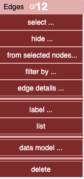
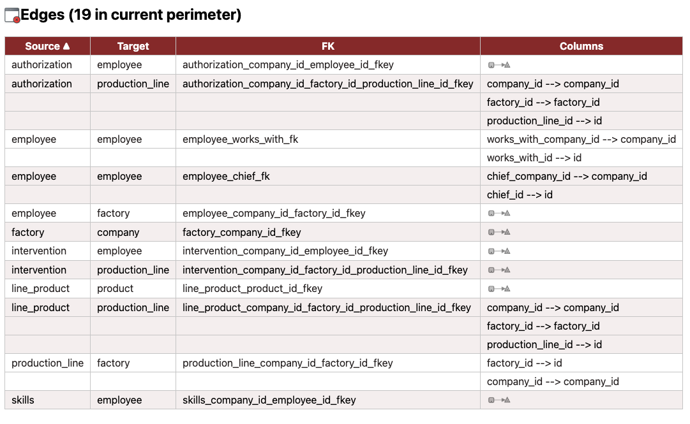

# Menu Relations

  

---
## Status Bar

Displays selected relations on visible and hidden layers:  

**0 selected / 12 available** in visible layer  
(0 selected / 0 available) in hidden layer  

The perimeter of actions applies to selected relations if any, or to all nodes if no selection.  

---

## 🔍 Selection on Screen

Selections can be made by:  
- Clicking edges individually  
  - Clicking outside any element removes the current selection  
- **Shift + Click** for multi-selection  
- Edges are also selected with nodes when drawing a rectangle (**Shift + drag**) on the graph  

---

## Change selection ...

- **None**: deselect all edges  
- **All**: select all visible edges  
- **Swap**: invert current edge selection  

💡 **Tip:** Selected edges have dashed lines. 

---

## Change visibility ...

   

- **Hide Selected** → hide selected edges 
- **Hide Not selected** → hide all edges except selected  
- **Swap** → invert visible and hidden edges  
- **Show all** → no more hidden edges, all visible

---

## Filter by 

  

### By Name

Applies a **regex-based filter** on edge labels (e.g., FK names). Matching edges are selected.  

⚠️ **Caution:** Autofill with some browsers may display text with no effect.  
Enter manually or copy/paste your filter or add a space after autofill.

### By native categories 

Relations can be tagged with categories (one can see with hover on).  
The filter search a category and select the corresponding relations.
As selections are cumulative selection can be made with several categories.(OR) 

- select by Trigger impacts has effect only if these relations have been generated (see Modify relations)
- select by Simplified associations has effect only if these relations have been generated.(see Modifiy relations)

---

## Connected to table ... 

### Relations of selected nodes 

    

The selection of relations is guided by the current tables' selection.  
A yellow rectangle represents a selected table.

The first choice has three choices (below incoming edges): 
- outgoing relations ( this table *references*) 
- both sides
- incoming relations (this table is *referenced*).  
  
    
 

💡 **Tip:** These edge selections do not affect node selection — a selected edge may connect to only one selected node.  

### Relations between pairs of selected tables 

  
  

Illustration of *between* below (three nodes were previously selected):  
   

---

## List of relations 

Generates an HTML file with details of edges in the current perimeter.  

The **Source**, **Target**, and **FK** headers allow sorting.  

#### Mode *One edge per FK* 

  

 ***●  Not nullable   /  ○ nullable*** : short representation (used for columns and foreign keys)  

#### Mode *One edge per Column*  

For edges in mode *1 edge per column* the list show corresponding columns names on successive lines.    
In a mixed mode some using individual changes, some edges can stay in 1 per FK as below (partial)   

  

--- 

## Modify relations 

These entries modify the manner the relations are established.  

  

### Detailed level 

- **raw FK** : standard display one FK = one Edge 
- **perColumn** : one attribute of FK matching one attribute of destination = one Edge 

### Triggers impacts 

**Identify triggers and scan function code to identify C(R)UD operations managed by the trigger.**  

- **generate** : the code of selected tables with trigger is analyzed to detect action on another table. 
- **remove** : generated triggers'impacts are deleted from graph.

The action adds **oriented edges** from the trigger’s source table to the **impacted tables**.  
Trigger impact edges:  
- have special style  
- are labbled with the trigger’s name  
- Have native category `trigger_impact` that alloww to filter them later ( native category )  

  

### Transform associations

- **Pass through** : 
  - Remove the table of association 
  - Create a double link A->B, B->A betwwen the two tables associated. 
  - These links allow the propagation of the *dependencies* in the graph
- **Restore associations** : re-establish the original association with its two FK

  
   

Note: Transform associations can be applied : 
- only in mode one FK = one Edge for associations.
- only on simple association ( no extra columns, only two relations)

--- 

## Labels 

As actions that change the display, Relations'label can be changed globally in *menu display*. 

Labels of relations are :  
- Common edges: 
  - mode raw FK : the foreign key name in the DB
  - mode 1 per column: the source attribute -> destination attribute
- Trigger impact edges: the trigger name in DB
- Simplified association A with two links : B<-(A)->C
  -   Label first pass through : B <– (A) –>> C  
  -   Label second pass through :C <– (A) –>> B  

#### Illustration 

From top to bottom :
- 3 labels of FK in mode 1 per column
- 2 labels of the transformed association
- 1 standard label with the name of the FK
- 1 label with the name of the trigger for the generated trigger impacts

  

#### Quick actions on the relation under cursor

With previous menus entries,  actions apply to the current edge perimeter (selected edges if any, all if no selection). 

A contextual menu on an edge by right clic allow individuals switches 
- to change the detailed level of this relation
- to show its label or not  
- 

Note: to apply globally labels'option see in menu display. 

---

### Delete 

Permanently removes selected edges from the graph.  

- If only one edge is selected, deletion is immediate  
  - This allows quick visual cleaning of a graph using **Backspace**  
- If several edges are selected, a confirmation is shown:      

  

💡 **Tip:** Use **Backspace** as a shortcut.  
💡 **Tip:**  **Undo** restores an accidental deletion. 

--- 

⚪️ [Main](./main.md)  

