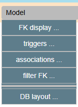
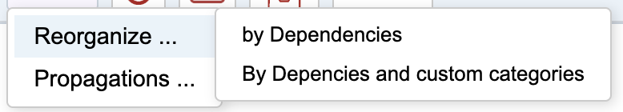
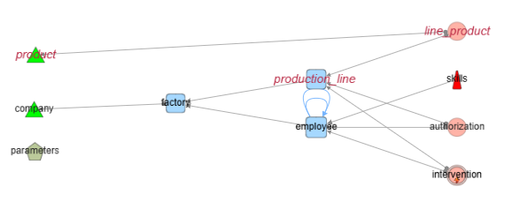
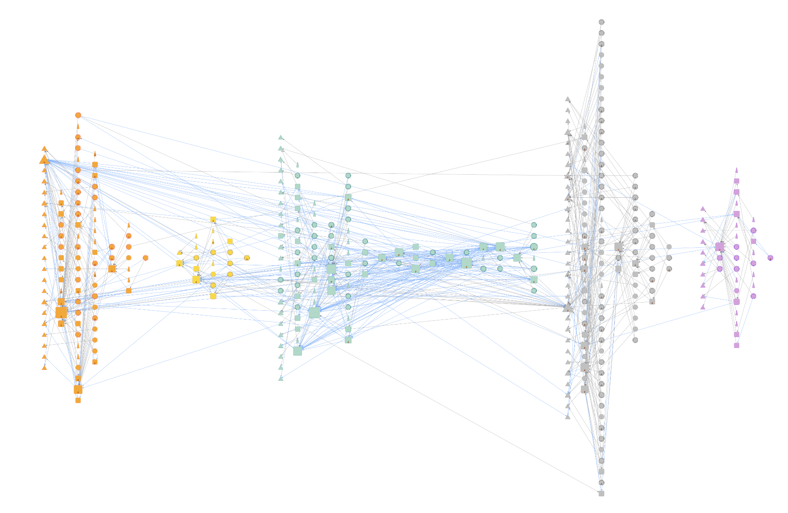
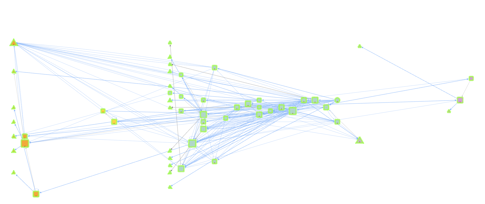
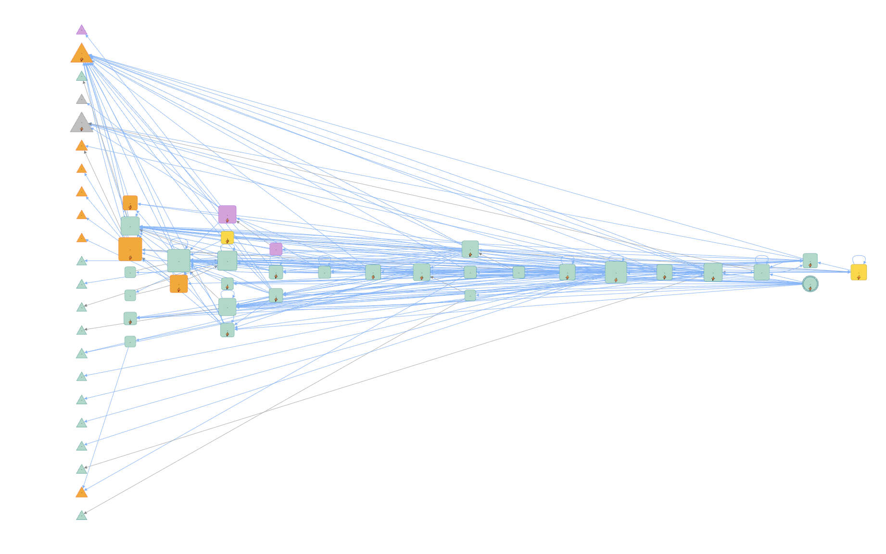
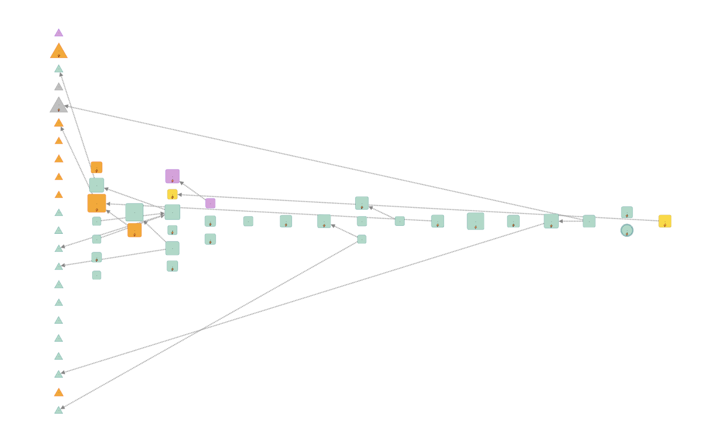
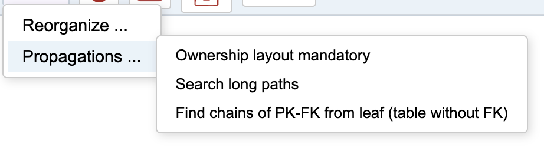
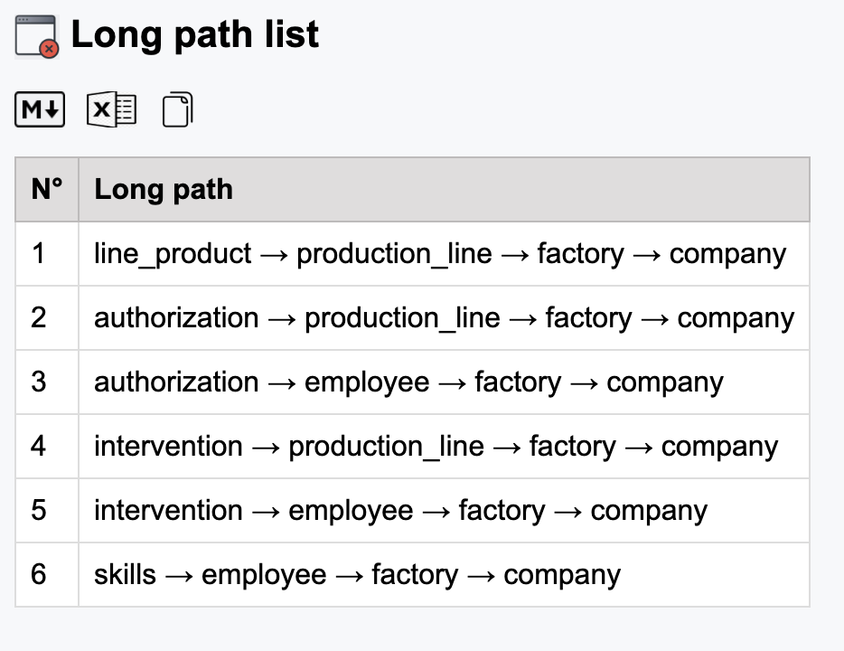
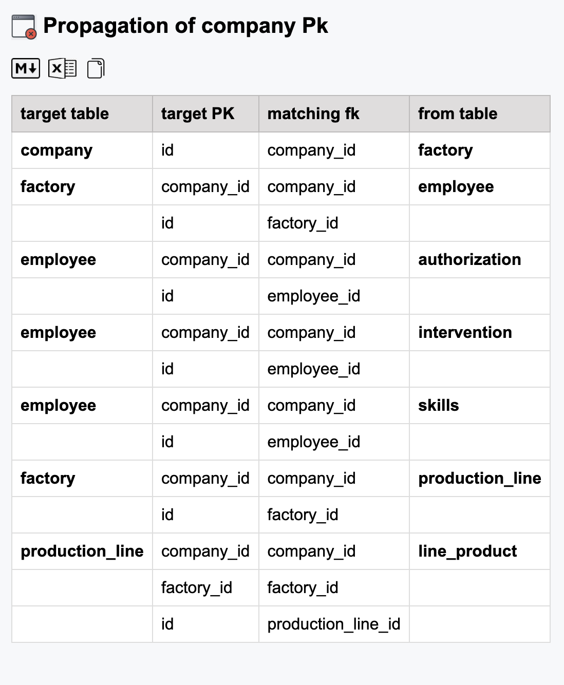

#  Menu Model 

  

This menu groups actions that are more specific to DB analysis. 


## Reorganize
 


## By dependencies 

This organize tables along their dependencies from left to right: 
- Stand alone tables ( orphan, leaves ) on the left. 
- Successive levels of dependencies 
  - Some local intermediary "root" can be found in a column when noone references it on right.
- Up to *roots*. 



### Use in export/import

This give the order of a controlled import of bulk data. 

The list of tables per level is automatically copied 
- to clipboard, ready to paste 
- to clipReport to be visualized or more. 

``` json
[
  {
    "level": 0,
    "nodes": [
      "company",
      "parameters",
      "product"
    ]
  },
  {
    "level": 1,
    "nodes": [
      "factory"
    ]
  },
  {
    "level": 2,
    "nodes": [
      "employee",
      "production_line"
    ]
  },
  {
    "level": 3,
    "nodes": [
      "authorization",
      "intervention",
      "line_product",
      "skills"
    ]
  }
]
```

## by dependencies and custom categories 

The previous graph organize the whole graph in dependency levels. 
If you model has significant custom categories, it could be useful to : 
- split first in groups per category
- organise each category in a dependencies graph 
- show all with all links. 

The democytoDB is too small to illustrate, but here is a sample with a large graph :
- each category has its color
- The subgraph of a category is organized by dependencies **inside its group**
- Edges between groups are displayed. 



### using tree propagation 

To establish a whole dependency of a table crossing the groups, you can select it then use **Follow and Reveal / follow outgoing tree**.
This will select in all groupS. Clean graph with **change visibility- hide not selected**



Apply a **Model/Reorganize/By dependencies** on this subgraph :



And if you want to see strong dependencies, **hide the nullable relations** : 



#### Note: JSON structures are copied in clipboard and available in clipReport after each reorganization. 


---

## Propagations 



### Ownership layout mandatory

This action must start with a unique selected node and follow mandatory FK. 
Quite the same as ***follow & reveal / Outgoing tree*** but only with mandatory relations. 


### search long path 

Starting with current perimeter ( selected tables if any, otherwise all visibles ) if collect long path (>3hop) and generate a result list at screen:



Using icons you can save it as markdown, excel or copy to clipboard and clipReport.  

With a large graph the combinations can be immense : the algorithm as a limit on recursivity and stop. Thinks about reducing the perimeter to try again. 


### Find pk-fk chains from a leaf

Select a leaf (table without incoming relation) as the starting point. 
The algorithm looks at the primary key and check if this pk is used in a FK . If yes, the child table is selected too.  

The process continue, searching for the propagation of the initial PK, even if it has changed of name in a child. 

#### Sample starting from company in democytoDB graph: 

*id* of company is matched by *company_id* in factory resulting in an equivalence. 
Algorithm can continue with company_id, which is found in other tables. 



These downward propagations of identifiers can help validate whether the model complies with the 2NF or 3NF normal forms. That is not the case here.

- The primary key of employee is (company_id, id).
- The column factory_id depends only on company_id, not on id.
  - Indeed, a factory belongs to a company independently of any employee.
- 👉 Therefore, factory_id does not depend on the entire key,but only on a part of it (company_id).
- → ❌ Violation of the Second Normal Form (2NF).

In this case it's a volontary compromise , company_id is a way to make the application multi-tenants. 

--- 

⚪️ [Main](./main.md)  