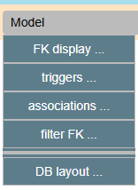
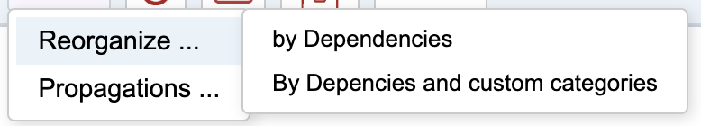
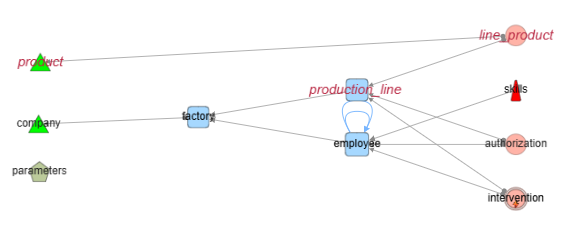
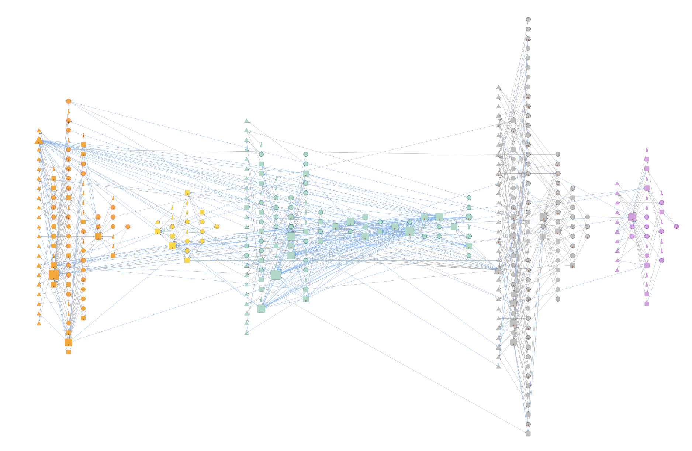
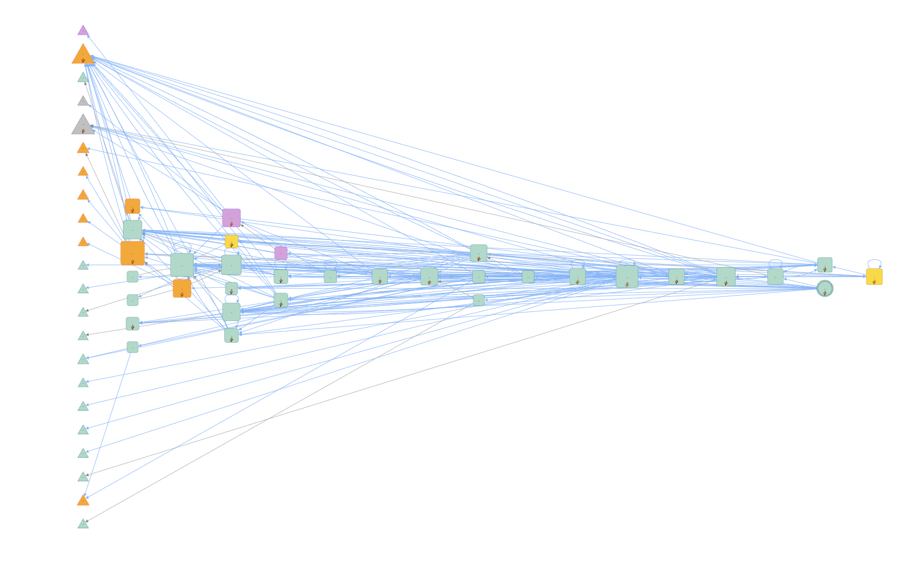
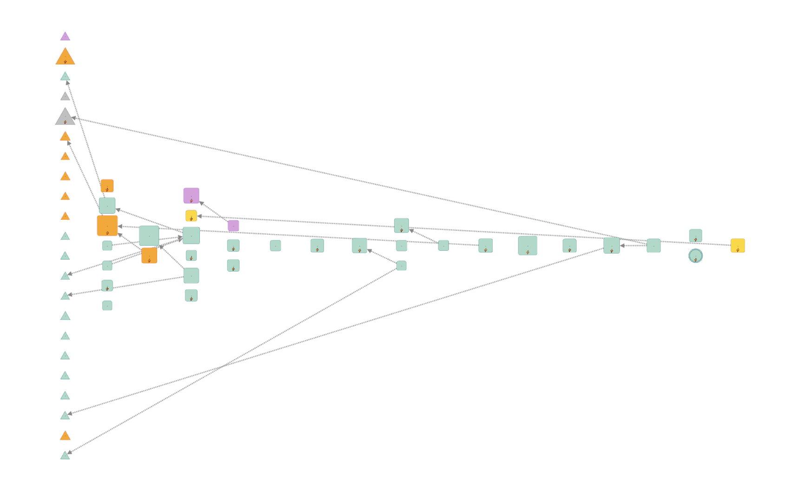
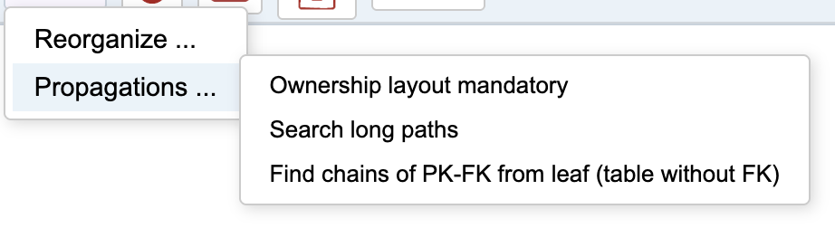
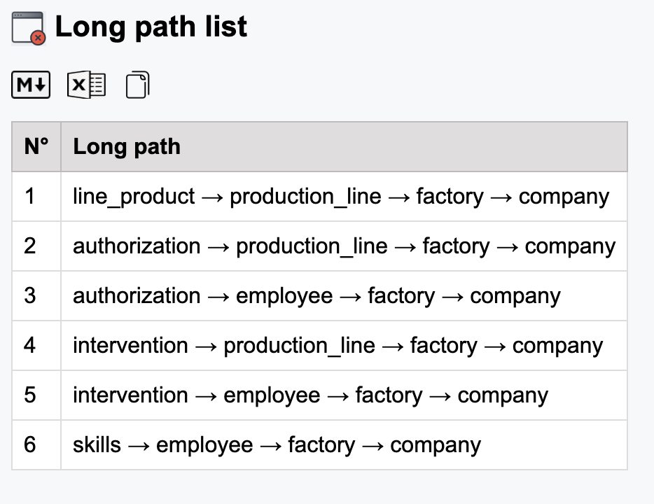
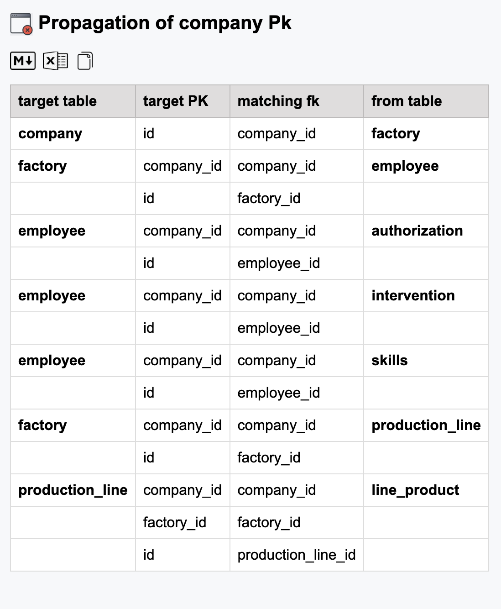

# Menu Model



This menu groups **database-specific analysis** actions.

---

## Reorganize



---

## By Dependencies

This **organizes** tables **by dependency level**, from left to right:
- **Standalone tables** (orphans, leaves) on the left
- **Successive dependency levels**
  - Some local intermediary *"roots"* may appear in a column when **nothing references them** on the right
- Up to **true roots**



### Use in Export/Import

This **provides the order** for a **controlled bulk data import**.

The list of tables per level is automatically copied:
- To clipboard, ready to paste
- To **clipReport** for visualization or further processing

```json
[
  {
    "level": 0,
    "nodes": [
      "company",
      "parameters",
      "product"
    ]
  },
  {
    "level": 1,
    "nodes": [
      "factory"
    ]
  },
  {
    "level": 2,
    "nodes": [
      "employee",
      "production_line"
    ]
  },
  {
    "level": 3,
    "nodes": [
      "authorization",
      "intervention",
      "line_product",
      "skills"
    ]
  }
]
```

---

## By Dependencies and Custom Categories

The previous graph **organizes the whole graph by dependency levels**.
If your model has **significant custom categories**, it may be useful to:
- **First split** into groups by category
- **Organize** each category by dependency graph
- **Show all** with all links

The **democytodb** is too small to illustrate this, but here is a sample with a **larger graph**:
- Each category **has its own color**
- The subgraph for a category is **organized by dependencies within its group**
- Edges **between groups** are displayed



### Using Tree Propagation

To establish the **full dependency chain** for a table **across groups**, select it, then use:
**Follow and Reveal > Follow Outgoing Tree**.
This will select **across all groups**. Clean the graph using:
**Change Visibility > Hide Unselected**

Apply **Model > Reorganize > By Dependencies** to this subgraph:



If you want to see **strong dependencies only**, **hide nullable relations**:



**Note:** JSON structures are **copied to the clipboard** and available in **clipReport** after each reorganization.

---

## Propagations



---

### Ownership Layout Mandatory

This action **requires** a **single selected node** and follows **mandatory foreign keys**.
Similar to **Follow & Reveal > Outgoing Tree**, but **only follows mandatory relations**.

---

### Search Long Path

Starting with the **current perimeter** (selected tables if any, **otherwise all visible tables**), it:
- Collects **long paths** (>3 hops)
- **Generates a result list** on screen:



Using the icons, you can **save it as**:
- Markdown
- Excel
- Or **copy to clipboard** and **clipReport**

With a **large graph**, the combinations can be **huge**.
The algorithm **has a recursion limit** and will stop.
**Reduce the perimeter** and try again.

---

### Find PK-FK Chains from a Leaf

Select a **leaf** (a table with **no incoming relations**) as the starting point.
The algorithm **checks if the primary key** is used in a **foreign key**.
If so, the **child table is also selected**.

The process **continues**, tracking the propagation of the initial PK, **even if its name changes** in child tables.

**Example**: Starting from **company** in the democytodb graph:
The `id` field in **company** matches `company_id` in **factory**, establishing an equivalence.
The algorithm can continue with `company_id`, which is found in other tables.



These **downward identifier propagations** can help validate whether the model complies with **2NF or 3NF**.
**This is not the case here.**

The primary key of **employee** is `(company_id, id)`. The `factory_id` column **depends only on** `company_id`, **not on** `id`. Indeed, a factory belongs to a company **regardless of any employee**. Therefore, `factory_id` does **not depend on the entire key** — only on part of it (`company_id`).
→ ❌ **Violation of the Second Normal Form (2NF).**

In this case, it is a **deliberate compromise** — `company_id` enables a **multi-tenant** application.

---

- ⚪️ [Main](./main.md)
