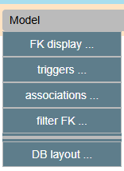
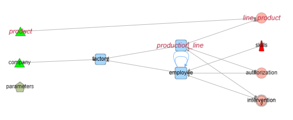

# Model Menu

  

This menu groups actions that more specific to DB model than common nodes & edges actions. 

## FK display 

- **raw FK** Default FK presentation : a FK<->1 edge. 
- **per column** :FK are splitted as one edge per matching columns.

## triggers 

### generate impacts

New edges are added to the graph to materialize trigger-based relationships 

### remove impacts

delete generated triggers impacts ( which can change some aspect of search an navigation).
( Another way could be  : Model - filter FK - trigger_impact then Edges delete )

## associations 

### Simplify Associations

**Goal : reduce from the graph less significant informations** 

For **dry association tables** (2 foreign keys, no other links, no extra columns):  

- Removes the association node  
- Creates a **direct edge** between the linked tables (A → C)  
- Edge label records table names: ***source – (association) – destination***  
- Edge is visually **non-oriented** (two circles as endpoints, not arrows)  

⚠️ **Caution:** Random internal orientation still exists for compatibility with Cytograph. Do not rely on simplified associations for source/destination accuracy.  


In the upper image, *intervention*, is no longer a *dry association* because of the new generated edge for a trigger.  

### Restore Association

Restores the original association nodes between tables (for the edges in the current perimeter).  

💡 **Tip:** The restored node appears in the middle; previous positions are lost.  


## Filter FK 


menu option to select a FK category
- ***Nullable, On Delete Cascade*** are automatically calculated at FK load time.  
- ***Trigger_impact*** have results only when *Generate trigger impacts* has been applied.
- ***Simplified associations*** have results only when *Simplify associations* has been applied.  

#### Example

*Filter FK - on delete cascade , then Hide not selected*  


## DB Layout 

Specific layout based on FK . 

## by dependencies 

This organise the table against their dependencies from left to right. 
Stand alone tables ( orphan, leaves ) on the left. 
Successive levels of dependencies from left to right 
Up to *roots* on right.

This layout organize nodes by layers of dependencies:  



### Use in export/import

This give the order of a controlled import of bulk data. 

The list of tables per level is automatically copied to clipboard, ready to paste (like below)

``` json
[
  {
    "level": 0,
    "nodes": [
      "company",
      "parameters",
      "product"
    ]
  },
  {
    "level": 1,
    "nodes": [
      "factory"
    ]
  },
  {
    "level": 2,
    "nodes": [
      "employee",
      "production_line"
    ]
  },
  {
    "level": 3,
    "nodes": [
      "authorization",
      "intervention",
      "line_product",
      "skills"
    ]
  }
]
```

## by custom categories 

This layout split the graph in vertical lines, one per custom category. 
In a column, tables are sorted by dependencies from top (roots) to bottom


In the sample democytoDB, there is only one custom category "product" which is isolated on the left. 

Tip : remeber a layout, classic or DB, can be applied only on selected nodes. From the previous layout, after selecting the second line and applying a layout by dependencies on this part , we got two branches, each in dependency order of its context. 


---

⚪️ [Main](./main.md)  