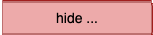
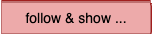
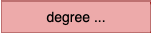
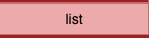
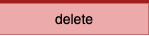

# Nodes Menu

---

## 🔍 Select

Selections can be made by:
- Clicking nodes individually
- Shift + click for multi-selection
- Drawing a rectangle over nodes

#### Selection via Menu

- **select... all** → also available with `Ctrl + A`
- **select... none** → no selection. Quicker way : click on an empty space in the graph
- **select...swap selected** → invert the current selection (selected become unselected, and vice versa)

- **select... from selected Edges**: It uses the selected **edges** as the source of selection and select nodes that are connected to them. 

💡 **Use case sample**:  
Filter edges by native category like `"triggers generated"`, then use **From Selected Edges** to highlight all impacted nodes.

---

### 

- **none** → show all nodes 
- **not Selected** → Hide everything else
- **selected** → Hide selected nodes
- **swap** → Swap visible and hidden nodes

---

### 

*(These actions search into visible and hidden nodes when following a path)*

Starts from currently selected nodes and follows the edges in choosen directions to reveal and select target nodes.   
- **outgoing**
- **incoming**
- **both**   
- **association** :  When a selected node is an association, reveal and select the other side nodes involved in this association.
- **long paths** : From a selected node (mainly *leaf nodes*) find path that involve at least three tables in successive **output direction**.
- **pk <- fk chains** : This walk follows successive incoming edges from a root node and checks that the referencing table’s foreign key fully covers all columns of the referenced table’s primary key.It continues on next nodes as long as this pattern is correct.

See details at [quicktour *walk the model* ](quickTour.md#walk-the-model) 

---

### 

Select nodes based on their connectivity:

- **None**
- **Looping** → Node has a self-referencing edge (hierarchical)
- **Outgoing** → Apply condition to nodes with outbound links
- **Incoming** → Same logic, for inbound links

💡 **Tip**: Combine with **AND/OR** selection to find specific structures.  
Example: *Select nodes with 2 outgoing AND no incoming edges* (useful to detect association tables).

---

### 
- **filter by ...Name** → Regex-based filter on node labels (e.g., table names)
 

- **filter by ...native category** 
These categories are calculated at load time and are availble to filter nodes : 

  - **orphan** : isolated table, no outgoing, no incoming edge.
  - **root** : table without outgoing edge, one or more incoming edges (zero are *orphan*).
  - **leaf** : table without incoming edge. 
  - **dry association** : association tables with two links and no private column.
  - **all associations**: association tables with only output edges.
  - **has triggers** : tables with triggers.

- **filter by ... custom category** → Categories added via custom logic   
Within `democytodb.js` code creates a ***product*** category and add a specific layout (label is larger) for this category. 
Filter adapts automatically the list as one can see in the demo:
.  

Native and custom categories are displayed while hovering the node with hover option : 
.  

### .  

- **show** : default display 
- **hide** : anonymous label as a single point. Size of node reduced to the label size. 

As other actions, label actions are applied to current perimeter : all graph if no selected, selected only if any. 

Below, *associations* were selected before using *label hide*

  

---

- **font +/-**

Increase or decrease font size of nodes labels in the current perimeter (all or selected)
Useful to enhance some parts, before a PNG snapshot for example. 

---

### 

Generates an HTML file listing all node's labels, sorted alphabetically.
As other actions, this list applies to current perimeter (selected nodes or all nodes if no selected) 
**All headers are sortable** by clic on the label. 

  

---

### 

Permanently removes *selected nodes* from the graph.   
Same action is performed by *backspace*

- if only one node selected, delete is immediate 
  - this is to allow quick visual cleaning of a graph using backspace
- if several nodes selected a confirmation is necessary      
   
    

❗ Remember **Undo** is available for these actions as well

---

- ⚪️ [Main](./main.md)
- 🟩 [Quick Tour](./quickTour.md)  
- 🟨 [Main Menu Bar](./menuBar.md)  
- 🟦 [*Node Menu*](./menuNodesSelectHide.md)  
- 🟥 [Edge Menu](./menuEdgesSelectHide.md)  