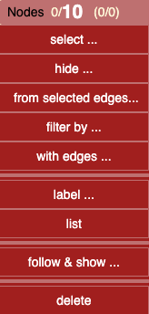
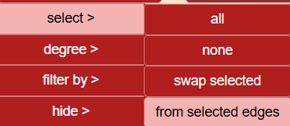

# Node Menu

### Node Label Summary

Display format: **Selected / Visible (Selected / Hidden)**  
Example: `0/9 (0/0)` → 0 selected, 9 visible, 0 selected in hidden nodes.

---

## 🔍 Select

Selections can be made by:
- Clicking nodes individually
- Shift + click for multi-selection
- Drawing a rectangle over nodes

### Selection via Menu

- **Select All** → also available with `Ctrl + A`
- **Select None** → click on an empty space in the graph
- **Swap** → invert the current selection (selected become unselected, and vice versa)

---

### 🎯 From Selected Edges

Select nodes connected by the currently selected edges.

💡 **Use case**:  
Filter edges by native category `"triggers generated"`, then use **From Selected Edges** to highlight all impacted nodes.

---

## 📊 By Degree

Select nodes based on their connectivity:

- **None**
- **Looping** → Node has a self-referencing edge (hierarchical)
- **Outgoing** → Apply condition to nodes with outbound links
- **Incoming** → Same logic, for inbound links

💡 **Tip**: Combine with **AND/OR** selection to find specific structures.  
Example: *Select nodes with 2 outgoing AND no incoming edges* (useful to detect association tables).

---

## 🔎 Filter By

- **Name** → Regex-based filter on node labels (e.g., table names)
- **Native Category** → Predefined categories (e.g., `has triggers`)
- **Custom Category** → Categories added via custom logic (e.g., `root table` from `democytodb.js`)

---

## 🙈 Hide Nodes

- **None** → Do not hide anything
- **Selected** → Hide selected nodes
- **Not Selected** → Hide everything else
- **Swap** → Swap visible and hidden nodes

---

## 🔗 Follow & Show
Starts from currently selected nodes and follows the edges in choosen directions to reveal and select target nodes.   
- **Outgoing**
- **Incoming**
- **Both**   
- **association** :  When a selected node is an association, reveal and select other nodes involved in this association;   

- **long paths -> ->** :  select long out paths (>2) with corresponding nodes   

### Scope Awareness

- Operates on the **visible scope** by default
- When toggled to **All**, also traverses through hidden nodes  
  → If linked nodes are found, they are restored to the visible area

💡 This is especially useful to uncover dependencies from a partially isolated table.

---

## 🏷️ Label Name

Applies label style to current scope:

- **Dot** → Show node as a small dot (minimalist view)
- **Full Name** → Restore default label

---

## 🔠 Label Font Size

Increase or decrease font size of node labels in the current scope.

💡 Use this to visually emphasize selected or key nodes.

---

## 📋 List Nodes

Generates an HTML file listing all node labels, sorted alphabetically.

---

## 🗑️ Delete Selected

Permanently removes selected nodes from the graph.

- Prompts for confirmation if multiple nodes are selected
- ❗ **Undo** is available for this action as well

---
