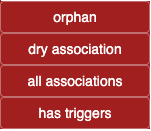
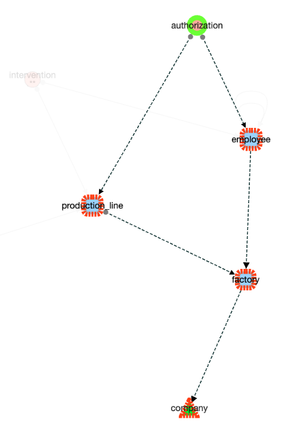
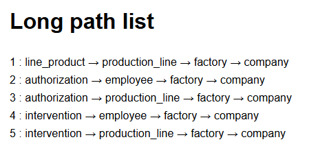
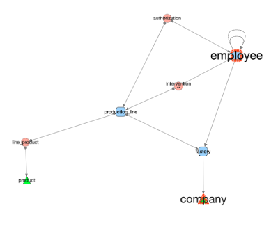

# Node Menu

### Node Label Summary

Display format: **Selected / Visible (Selected / Hidden)**  
Example: `0/9 (0/0)` → 0 selected, 9 visible, 0 selected in 0 hidden nodes.

---

## 🔍 Select

Selections can be made by:
- Clicking nodes individually
- Shift + click for multi-selection
- Drawing a rectangle over nodes

### Selection via Menu

- **Select All** → also available with `Ctrl + A`
- **Select None** → click on an empty space in the graph
- **Swap** → invert the current selection (selected become unselected, and vice versa)

---

### 🎯 From Selected Edges

Select nodes connected by the currently selected edges.

💡 **Use case sample**:  
Filter edges by native category `"triggers generated"`, then use **From Selected Edges** to highlight all impacted nodes.

---

### 📊 By Degree

Select nodes based on their connectivity:

- **None**
- **Looping** → Node has a self-referencing edge (hierarchical)
- **Outgoing** → Apply condition to nodes with outbound links
- **Incoming** → Same logic, for inbound links

💡 **Tip**: Combine with **AND/OR** selection to find specific structures.  
Example: *Select nodes with 2 outgoing AND no incoming edges* (useful to detect association tables).

---

## 🙈 Hide Nodes

- **None** → Do not hide anything
- **Selected** → Hide selected nodes
- **Not Selected** → Hide everything else
- **Swap** → Swap visible and hidden nodes

---

## 🔎 Filter By

- **Name** → Regex-based filter on node labels (e.g., table names)
  - successive select by name will append new nodes to selected ones if OR is the operator.
- **Native Category** → Predefined categories 
.  
  - orphan : isolated table
  - dry association : association table with two links and no private column
  - all associatiosn: association table with only output edges.
  - has triggers : tables with triggers

- **Custom Category** → Categories added via custom logic   

(see `democytodb.js` code that create ***root*** categaory)
.  

---

## 🔗 Follow & Show

**These actions search into visible and hidden nodes when following a path**

Starts from currently selected nodes and follows the edges in choosen directions to reveal and select target nodes.   
- **Outgoing**
- **Incoming**
- **Both**   
- **association** :  When a selected node is an association, reveal and select other nodes involved in this association;   

see [quicktour.md](quickTour) for a sample

#### Follow long paths

From a selected node, find path that involve at least three tables in successive output directions. 

Below a sample started from the selected *authorisation* 

  

The list is displayed in a new page ( after confirmation ) 
    

---

## 🏷️ Label Name

Applies label style to current perimeter :

- **Dot** → Show node as a small dot (minimalist view)
- **Full Name** → Restore default label

Below, *associations* and *orphans* were selected before using *label hide*

  

---

## 🔠 Label Font Size

Increase or decrease font size of node labels in the current perimeter.

💡 Use this to visually emphasize selected or key nodes.

  

---

## 📋 List Nodes

Generates an HTML file listing all node labels, sorted alphabetically.
  

---

## 🗑️ Delete Selected

Permanently removes selected nodes from the graph.

- Prompts for confirmation if multiple nodes are selected
    

- Direct deletion when a unique node is selected. 
❗ **Undo** is available for this action as well

---

- ⚪️ [Main](./main.md)
- 🟩 [Quick Tour](./quickTour.md)  
- 🟨 [Main Menu Bar](./menuBar.md)  
- 🟦 [Node Menu](./menuNodesSelectHide.md)  
- 🟥 [Edge Menu](./menuEdgesSelectHide.md)  