# Menu Tables

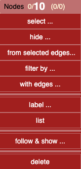

---

## Status Bar

Displays selected nodes on visible and hidden layers:

**0 selected / 10 available** in visible layer
(0 selected / 0 available) in hidden layer

The **perimeter of actions** applies to:
- Selected nodes (if any)
- **All nodes** if no selection exists

---

## 🔍 Selection

### Selection on Screen

Selections can be made by:
- Click a node to select it
  - Click **outside any element** to clear the selection
- **Shift+Click**: Toggle selection for a node
- **Drag a rectangle**: Select multiple nodes

---

### Select

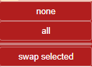

- **None**: Clear **all selections** (also: click on the graph background)
- **All**: Select **all visible nodes** (shortcut: **Ctrl+A**)
- **Swap Selected**: **Invert** the current selection

---

### Change Visibility

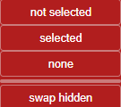

- **Hide Selected**: Hide selected nodes
- **Hide Unselected**: Hide **unselected** nodes
- **Swap** (animated image): **Toggle** visible and hidden nodes
- **Show All**: Make **all nodes visible**

💡 **Quick Select/Hide Menu** (right-click on background):

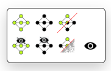

| Unselect All | Select All | Swap Selection |
|--------------|-------------|-----------------|
| Hide Selected | Hide Unselected | Swap Hidden | Show All |

---

## Filter By

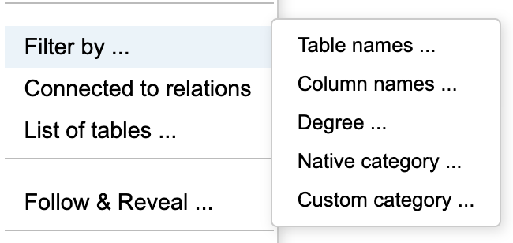

---

### Filter by Table Name

**Search and select tables** by name using a **regex**.

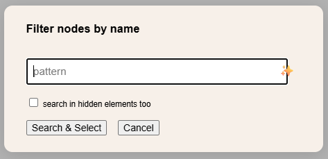

A **regex-based filter** is applied to table labels.

The **⭐ icon** on the right opens a **regex quick reference**:

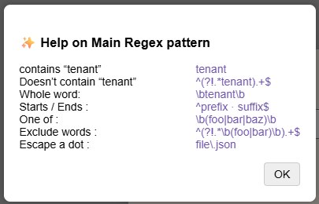

⚠️ **Caution:** Browser **autofill may not pass** text to the regex.
**Solution:** Enter manually or copy/paste your filter.

---

### Filter by Column Name

**Search for column names** across all tables using a regex.
Useful to find tables **that contain (or lack) specific columns**.
Matching tables are **selected**, and their columns are listed in **clipReport**.

#### clipReport

In the main menu bar, the **clipReport icon** is **highlighted** if a report is available:
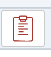

Click the icon to open a tab with the current content. In the column filter example, the list of tables with columns that matched the regex *prod*:
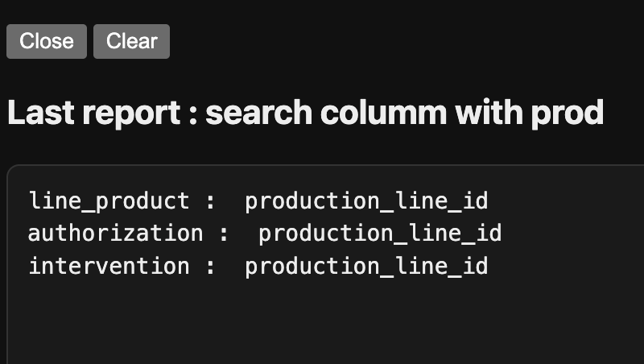

---

### Filter by Degree

**Degree** is the number of **edges connected to a node**.

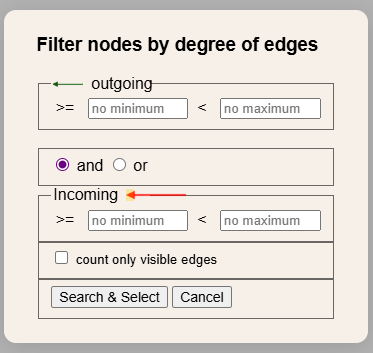

By default, the count **reflects the actual node structure**, **even if some edges are hidden** on screen.

**Count only visible edges**: Restricts the count to **visible edges only**.
This helps find **temporary orphans, leaves, or roots** — but **only on the current screen**.

---

### Filter by Native Category

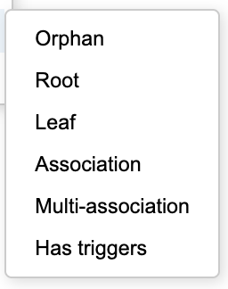

**Native categories** are **calculated at load time** and **available for filtering** on any database.

- **Orphan**: Isolated table (no incoming **or** outgoing edges)
- **Root**: Table **with no outgoing edges** (no FKs) but **one or more incoming edges**
- **Leaf**: Table **with no incoming edges** (never referenced)
- **Dry Association**: Association table **with two links and no private columns** (M:N relationship)
- **All Associations**: Association tables **with only outgoing edges**
- **Has Triggers**: Tables **with triggers**

---

### Filter by Custom Category

**Custom categories** are added **via custom logic** and **depend on the database** under analysis (see [Customization Options](./customization.md)).

The filter automatically adapts to the list of custom categories. In **democytodb**, there is only one: **product**


This custom **product** category was created for demo by the `public/custom/democytodb.js` code:

```js
if (node.data("label").includes("product")) node.addClass("product");
```

A specific visual layout `selector: "node.product"` has also been defined in the custom extensions that enlarge labels for tables with this category.

#### How to See Categories

**Native and custom categories** are displayed **on hover** (when the **hover option** is enabled):
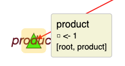

---

### Connected to Relations

Nodes are **selected based on the currently selected relations**.

For each **selected relation (edge)**, select nodes in **any direction**:

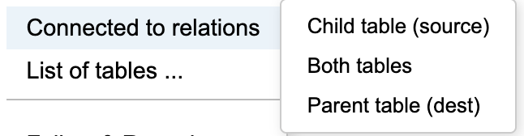

- **Select Source**: Select nodes that are the **origin** of a selected edge (**FK owner**)
- **Both Sides**: Select **all nodes** connected to a selected edge
- **Select Target**: Select nodes that are the **destination** of a selected edge

💡 **Use Case Example**:
Filter edges by **native category** (e.g., `"trigger_impact"`).
Then apply **From Selected Edges → Both Sides** to **highlight** a subgraph of **source and impacted tables** by triggers.

---

### List of Tables

- **Visible**
- **Selected**

Generates an **HTML file** with:
- All visible tables **or**
- Only **selected** visible tables
(sorted alphabetically).

**All headers are sortable** (click to sort).

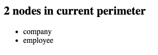

#### Chaining to Table Details

Click a **table name** to open its **details**:
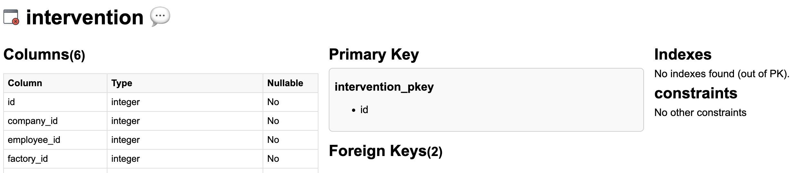

Click a **trigger count** to open its **trigger definition**:
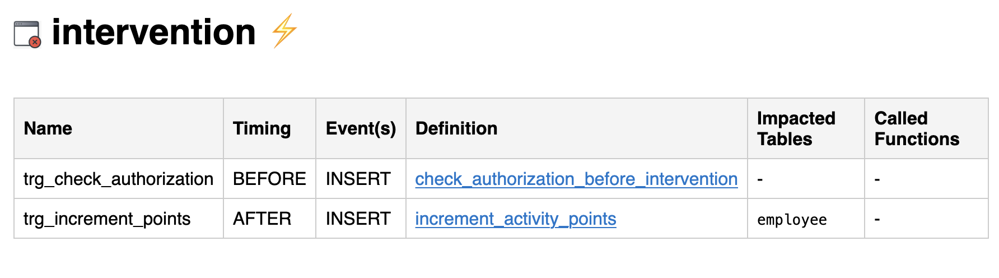

#### Close Button

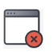

**Closes** the current browser tab and **returns to the main graph**.
**If selections were modified** in the list, **changes will apply to the graph**.

💡 **Tip: Remember to close the tab**
If you don't, a later call to the same tab **will update it** (it blinks), **but it won't come to the front** (due to browser security).
**Check your tab list** before assuming the action failed.

---

## Follow and Reveal

**Reveal** means that when following a node in the hidden space, this node will be **brought back to visible**.

### 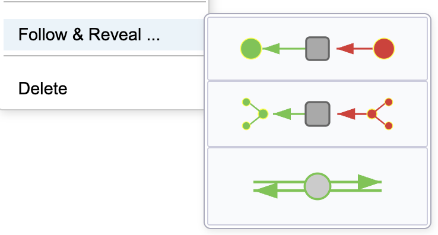

These actions **follow paths** from the **current visible nodes** and can **restore hidden nodes** if they are linked.

- **Outgoing / Both / Incoming (One Step)**:
  Start from selected nodes and follow relations in the chosen direction(s).
  **Linked nodes are selected**.
  The operation can be **repeated** to reveal **successive dependencies**.

- **Outgoing / Both / Incoming (Automatic Tree Propagation)**:
  Start from selected nodes and **automatically follow** relations in the chosen direction(s).
  **All reachable nodes are selected**.

- **Cross Association**:
  If a selected node is an **association**, **reveal and select** the nodes on the **other side** of the association (regardless of direction).
  This **allows crossing the association boundary**.

**Follow & Reveal**: If neighbors are **hidden**, they are **automatically restored** to visible.

---

### Delete

**Permanently removes** selected nodes from the graph.

- If **only one node** is selected, it is **deleted immediately** (useful for quick cleanup with **Backspace** or **Delete**)
- If **multiple nodes** are selected, a **confirmation dialog** appears:

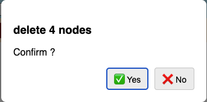

💡 **Tip:** Use **Backspace** or **Delete** for the same action.
💡 **Tip:** Use  **Undo (Ctrl+Z)** to restore accidental deletions.

---

- ⚪️ [Main](./main.md)
