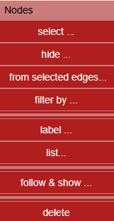
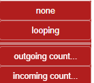

# Nodes Menu



---

## 🔍 Selection on screen

Selections can be made by :
- Clicking nodes individually
  - Clicking outside any element remove current selection
- Shift + click for multi-selection
- Drawing a rectangle over nodes

### select ...


**all** : select all visible nodes (also available with `Ctrl + A`)
**none** : remove any selection
**swap selected** : invert the current selection (selected become unselected, and vice versa)

### hide ...


**none** : show all nodes 
**not Selected** : Hide everything else
**selected** : Hide selected nodes
**swap** : Swap visible and hidden nodes

### from selected edges ...


**both sides** : select all nodes connected to a selected edge in any manner
**source nodes** : select nodes that are at the origin of a selected edge
**destination nodes** : select nodes that are a destination of a selected edge.

💡 **use case sample**:  
Filter edges by native category like `"triggers generated"`, then use **From Selected Edges ... both sides** to highlight a subgraph of source tables and impacted tables.

### filter by ...


#### by name
 

**Regex-based filter** on node labels (e.g., table names). Match nodes are selected. 

⚠️ caution : with some navigator automatic fill-in can show the text but don't distribute it to regex. Enter manually or copy/paste. 


#### by native category 

.  
 Native categories are calculated at load time and are availble to filter nodes.   
  **orphan** : isolated table, no outgoing, no incoming edge.
  **root** : table without outgoing edge, one or more incoming edges (zero are *orphan*).
  **leaf** : table without incoming edge. 
  **dry association** : association tables with two links and no private column.(MxN relation)
  **all associations**: association tables with only output edges.
  **has triggers** : tables with triggers.

#### by custom category

Categories are added via custom logic.   
Within custom code `democytodb.js` a ***product*** category is defined by 
```js
if (node.data("label").includes("product")) node.addClass("product");
```
A specific layout is also defined for this category : label has a larger font. 

Filter adapts automatically the list of custom categories. 
In democytodb there is only one :
.  

#### checking categories

Native and custom categories are displayed while hovering the node (with hover option on): 
.  

---

### with edges 

Select nodes with their edges characteristics. 
. 


**None** : no edges on node (same as *filter by orphan*)
**Looping** : node has a self-referencing edge (hierarchical)
**Outgoing** : apply condition to nodes with outbound links
**Incoming** : same logic, for inbound links

. 


💡 **Tip**: Combine with **AND/OR** selection to find specific structures.     

  

Example: select *first nodes with 2 outgoing* - set AND - select *no incoming edges*  
(this detects the same as *dry association* category).

---  

### label 

 .  

- **show** : default display with table name on node
- **hide** : No label (a single point). Size of node is reduced to this point.

Below, *associations* were selected, then *label hide* reduce them visually as small circles.

  

if nothing is selected, action applies to whole visible nodes. 

- **font +/-**

Increase or decrease font size of nodes labels in the current perimeter (selected if any, all if none)
Useful to enhance some parts of graph, before a PNG snapshot for example.   

---  


### list 

Generates an HTML file listing all tables, sorted alphabetically.
As other actions, this applies to current perimeter (selected nodes if any, all nodes otherwise)

**All headers are sortable** by clicking on the label. 

  

#### chaining to table details 

- Clicking on a table name will chain to table definition. 
   .

- Clicking on a triggers number of a table will chain to triggers definition.

 .  
 
#### close button 

 

This close the current browser tab.   

💡 **Tip**:   
If you don't close a tab and recall later the same, the tab will be updated but don't come to front (for standard security reason).  You can see it blink when updated. => don't think your action is dead before a check.    


---

### 

*(These actions of following path search into visible and hidden nodes)*

- **outgoing**, **incoming**, **both**   
Starts from currently selected nodes and follows the edges in choosen directions to reveal and select new nodes.   


- **association** :  When a selected node is an association, reveal and select the nodes of the other side of this association.
  
- **long paths** : From a selected node (mainly *leaf nodes*) find path that involve at least three tables in successive **output direction**.
- **pk <- fk chains** : This walk follows successive incoming edges from a root node and checks that the referencing table’s foreign key fully covers all columns of the referenced table’s primary key.   
This continues on next nodes as long as this pattern is correct.

See more details at [quicktour *walk the model* ](quickTour.md#walk-the-model) 

---

### delete 

Permanently removes *selected nodes* from the graph.   
Same action is performed by *backspace* : 

- if only one node selected, delete is immediate 
  - this is to allow quick visual cleaning of a graph using backspace
- if several nodes are selected a confirmation is asked:      
   
    


❗ Remember **Undo** ( or ctrl z ) is available for these actions as well

---

- ⚪️ [Main](./main.md)
- 🟩 [Quick Tour](./quickTour.md)  
- 🟨 [Main Menu Bar](./menuBar.md)  
- 🟦 [*Node Menu*](./menuNodesSelectHide.md)  
- 🟥 [Edge Menu](./menuEdgesSelectHide.md)  