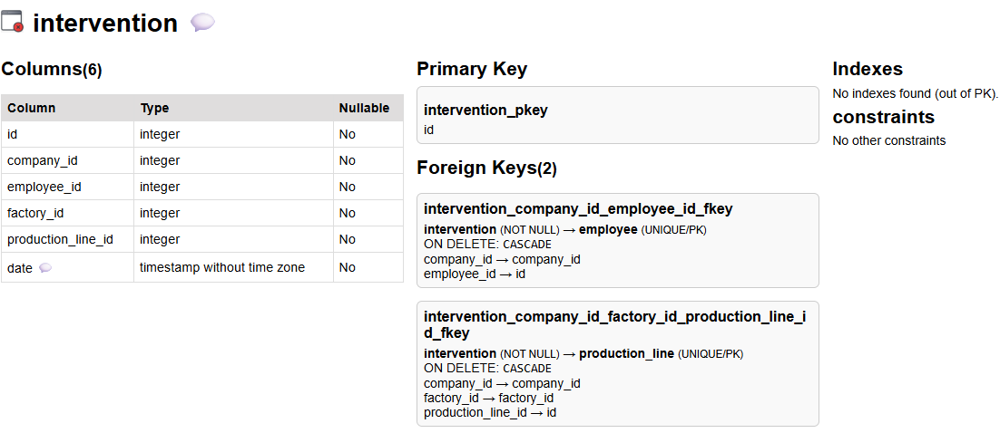

# Menu Tables


## Status Bar

Displays selected nodes on visible and hidden layers:  

**0 selected / 10 available** in visible layer  
(0 selected / 0 available) in hidden layer  

The perimeter of actions applies to selected nodes if any, or to all nodes if no selection.  

---

## 🔍 Selection 

### Selection on Screen

Selections can be made by:  
- Clicking nodes individually  
  - Clicking outside any element removes the current selection  
- **Shift + Click** for multi-selection  
- Drawing a rectangle over nodes  

###  Select 


- **None**: clear any selection (all black on image) (also any click on graph background)
- **All**: select all visible nodes (all highlighted on image) (also available with `Ctrl A`)  
- **Swap selected**: invert the current selection (selected become unselected, and vice versa)  

### Change visibility.  

  

- **Hide selected**: hide selected nodes, keep not selected
- **Hide Not selected**: keep selected, hide others
- **Swap** (animated image): swap visible and hidden nodes  
- **None**: show all nodes, selected or not.   


💡 **Quick menu Select/Hide** ( right click on background)

  

| unselect all nodes | select all nodes | swap selection |  
| hide selected | hide not selected | swap hidden | show all |

--- 
## Filter by
 

### Filter by Table name 

A common way to search and select tables by regex on their names.


A **regex-based filter** is applied to table labels.

The stars on the right opens a common regex reminder: 


⚠️ **Caution:** Some browsers may show text with autofill but not pass it to the regex.  
In case of trouble: Enter manually or copy/paste your filter.  

### Filter by Column name 

A way to search columns name in all tables that match the input regex. 
Useful to search tables that have or have not such columns.  
The matched tables are selected and the columns are listed in the clipReport

#### clipReport 

In main menu bar, the icon of clipReport is higher if there is a report inside :  


click on the icon opens a tab with current deposit. In our last case, the list of tables with columns that matched the regex *prod*


### Filter by degree 

Degree is the number of edges belonging to a node. 


By default, the count take care of the reality of a node structure, even if some edges are hidden on screen. 

*count only visible edges* modify this behavior by restricting search to visible edges.    
This helps to find temporary orphans, leaf, root but only on current screen 


### Filter by Native Category 

  

Native categories are calculated at load time and are available to filter nodes with any database.  

- **Orphan**: isolated table, no outgoing or incoming edge  
- **Root**: table without outgoing edge (no FK), one or more incoming edges  
- **Leaf**: table without incoming edge (never referenced)  
- **Dry association**: association table with two links and no private column (MxN relation)  
- **All associations**: association tables with only outgoing edges  
- **Has triggers**: tables with triggers  

### Filter by Custom Category

Custom categories are added via custom logic and depends of the DB in study (@see [Customization Options](./customization.md))  

The filter automatically adapts to the list of custom categories. In `democytodb` there is only one: **product**  
  

This custom ***product*** category was created for demo by the `public/custom/democytodb.js` code:  

```js
if (node.data("label").includes("product")) node.addClass("product");
```

A specific visual layout `selector: "node.product"`has also been defined in the custom extensions that enlarge label for table with this category.


#### How to See Categories

Native and custom categories are displayed while hovering over the node (with *hover* option on):  
  

---


### Connected to relations 

New nodes are selected depending of current selected relations.

For each currently selected relation (edge) choose nodes in any direction:


- **select source**: select nodes that are the origin of a selected directed edge (FK owner)  
- **both sides**: select all nodes connected in any manner to a selected edge  
- **select target**: select nodes that are the destination of a selected directed edge  

💡 **use case example** 
- filter edges by *native category* such as `"trigger impact"`.  
- apply **From Selected Edges → Both Sides** this highlight a subgraph of source and impacted tables by triggers.  


### List of tables 

- Visible 
- Selected


Generates an HTML file with *all visible or only visible and selected* tables, sorted alphabetically.  

**All headers are sortable** by clicking on the header.  

  

#### Chaining to Table Details 

click on a table name opens details :  
     

click on a trigger number opens its trigger definition :  
   

#### Close Button 


Closes the current browser tab : that will return to main graph. 
**If selected option had been changed in the list, changes will apply to graph  **

💡 **Tip: don't forget to close tab**  
>If you don’t, a later call to the same named tab will update it as expected, it blinks **BUT** it will not come to front (standard security reasons).  
Don’t assume your action failed — check your tab list first. 

---

## Follow and Reveal 

Reveal means that when following a node in the hidden space, this node will be brought back to visible. 

### 

These actions follow paths from current nodes visible perimeter and can bring hidden nodes back into view if they are linked.  

- **outgoing**,  **both**, **incoming** ***one step*** :   
  Start from selected nodes and follow relations in the chosen direction(s). Linked nodes are selected.  
  The operation can be repeated to show successive dependencies.  

- **outgoing**,  **both**, **incoming** ***Automatic tree propagation***    
  Start from selected nodes and follow relations in the chosen direction(s). Linked nodes are selected.  
  The operation can be repeated to show successive dependencies.  


- **cross association**:  
  When a selected node is an association, reveal and select the nodes on the other side of the association regardless of direction.This allows to cross this frontier.

---

### Delete 

Permanently removes *selected nodes* from the graph.   

- If only one node is selected, deletion is immediate . 
  - This allows quick visual cleaning of a graph using keyboard **Backspace**  or **delete**
- If several nodes are selected, a confirmation is shown:      

   

💡 **Tip:** The same action can be performed using **Backspace**.  
💡 **Tip:** Use  **Undo** to restore an accidental deletion.  

---

⚪️ [Main](./main.md)  
