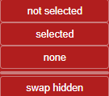
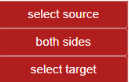
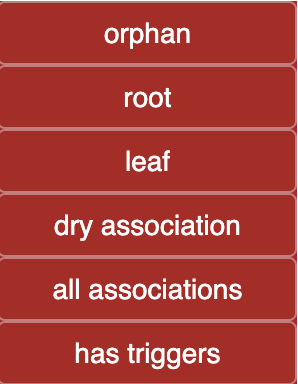
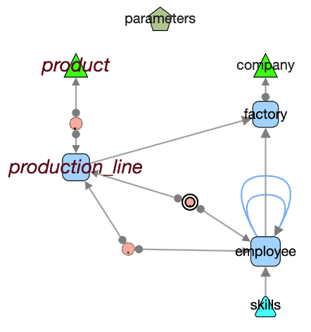

# Nodes Menu


## Status Bar

Displays selected nodes on visible and hidden layers:  
  

**0 selected / 10 available** in visible layer  
(0 selected / 0 available) in hidden layer  

The perimeter of actions applies to selected nodes if any, or to all nodes if no selection.  

---

## 🔍 Selection 

### on Screen

Selections can be made by:  
- Clicking nodes individually  
  - Clicking outside any element removes the current selection  
- **Shift + Click** for multi-selection  
- Drawing a rectangle over nodes  

### menu Select 


- **None**: clear any selection  (also any click on graph background)
- **All**: select all visible nodes (also available with `Ctrl A`)  
- **Swap selected**: invert the current selection (selected become unselected, and vice versa)  

### menu Hide 

  


- **Not selected**: hide everything except selected nodes  (most used option)
- **Selected**: hide selected nodes  
- **None**: show all nodes  
- **Swap**: swap visible and hidden nodes  

💡 **Quick menu Select/Hide** ( right click on background)

  

| unselect all nodes | select all nodes | swap selection |  
| hide selected | hide not selected | swap hidden | show all |

--- 

### From Selected Edges ...

If edges were directly selected, may be the associated nodes are not.  



This menu works only with previously selected edges.  

- **select source**: select nodes that are the origin of a selected directed edge (FK owner)  
- **both sides**: select all nodes connected in any manner to a selected edge  

- **select target**: select nodes that are the destination of a selected directed edge  

💡 **use case example** 
- filter edges by *native category* such as `"triggers generated"`.  
- apply **From Selected Edges → Both Sides** this highlight a subgraph of source and impacted tables by triggers.  

---

### Filter By ...


#### By Name


Applies a **regex-based filter** on node labels (e.g., table names). Matching nodes are selected.  

⚠️ **Caution:** Some browsers may show text with autofill but not pass it to the regex.  
Enter manually or copy/paste your filter.  

#### By degree 

Degree is the number of edges belonging to a node. 


By default, the count take care of the reality of a node structure, even if some edges are hidden on screen. 

*count only visible edges* modify this behavior by restricting search to visible edges.    
This helps to find temporary orphans, leaf, root but only on current screen 


#### By Native Category 

  

Native categories are calculated at load time and are available to filter nodes with any database.  

- **Orphan**: isolated table, no outgoing or incoming edge  
- **Root**: table without outgoing edge (no FK), one or more incoming edges  
- **Leaf**: table without incoming edge (never referenced)  
- **Dry association**: association table with two links and no private column (MxN relation)  
- **All associations**: association tables with only outgoing edges  
- **Has triggers**: tables with triggers  

#### By Custom Category

Custom categories are added via custom logic. (@see [Customization Options](./customization.md))  

The filter automatically adapts to the list of custom categories. In `democytodb` there is only one:  
  

This custom ***product*** category is created for demo by the `public/custom/democytodb.js` code:  

```js
if (node.data("label").includes("product")) node.addClass("product");
```

A specific layout `  selector: "node.product"`has also been defined in the custom extensions  


#### How to See Categories

Native and custom categories are displayed while hovering over the node (with *hover* option on):  
  

---


### Label 

  

- **Show**: default display with table name on node  
- **Hide**: no label (a single point). Node size is reduced to this point  

#### label hide 
Below, only *associations* were selected (*Filter by native category → All association*).  
***Label → Hide*** reduces them visually as small circles.  

  

*(If no nodes are selected, the action applies to all visible nodes).*  

- **Font +/-**: increase or decrease the font size of node labels in the current perimeter

💡 **Tip:** Useful to emphasize certain parts of the graph.  

---

### List 


Generates an HTML file with *all or selected* tables, sorted alphabetically.  

**All headers are sortable** by clicking on the header.  

  

#### Chaining to Table Details 

Clic on a table name to open details :  
     

Clicking on a trigger number opens its trigger definition.  
   

#### Close Button 


Closes the current browser tab : that will return to main graph. 
**If selected option had been changed in the list, changes will apply to graph  **

💡 **Tip: don't forget to close tab**  
>If you don’t, a later call to the same named tab will update it as expected, it blinks **BUT** it will not come to front (standard security reasons).  
Don’t assume your action failed — check your tab list first. 

---

## Follow and Show

### 

These actions follow paths from current nodes visible perimeter and can bring hidden nodes back into view if they are linked.  

- **outgoing**,  **both**, **incoming**:  
  Start from selected nodes and follow edges in the chosen direction(s). Linked nodes are selected.  
  The operation can be repeated to show successive dependencies.  

- **Association**:  
  When a selected node is an association, reveal and select the nodes on the other side of the association regardless of direction.  

- **Long paths**:  
  From a selected node (mainly *leaf nodes*), find paths that involve three or more tables in successive **output direction**.  
  All paths are calculated and displayed.  

- **PK ← FK chains**:  
  Follows successive incoming edges from a root node **and** checks that the referencing table’s foreign key **fully covers** all columns of the referenced table’s primary key.  
  The walk continues as long as this pattern is correct.  

 [more details : *Quick Tour* → *Walk the model*](quickTour.md#walk-the-model).  

---

### Delete 

Permanently removes *selected nodes* from the graph.   

- If only one node is selected, deletion is immediate  
  - This allows quick visual cleaning of a graph using keyboard **Backspace**  or **delete**
- If several nodes are selected, a confirmation is shown:      

   

💡 **Tip:** The same action can be performed using **Backspace**.  
💡 **Tip:** Use  **Undo** to restore an accidental deletion.  

---

- ⚪️ [Main](./main.md)  
- 🟩 [Quick Tour](./quickTour.md)  
- 🟨 [Main Menu Bar](./menuBar.md)  
- 🟦 [*Node Menu*](./menuNodesSelectHide.md)  
- 🟥 [Edge Menu](./menuEdgesSelectHide.md)  
