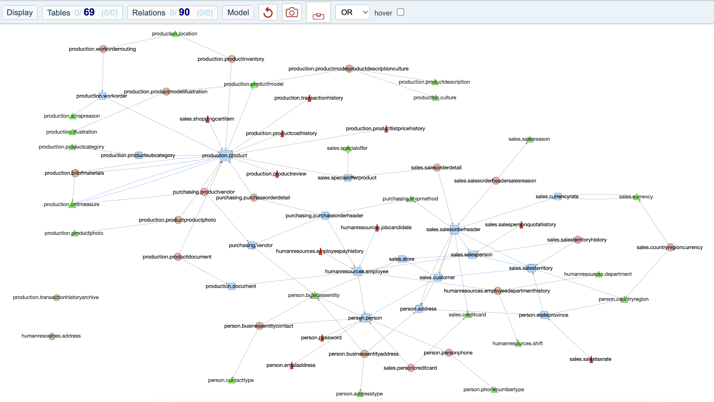
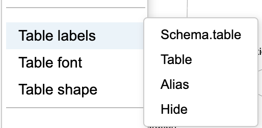
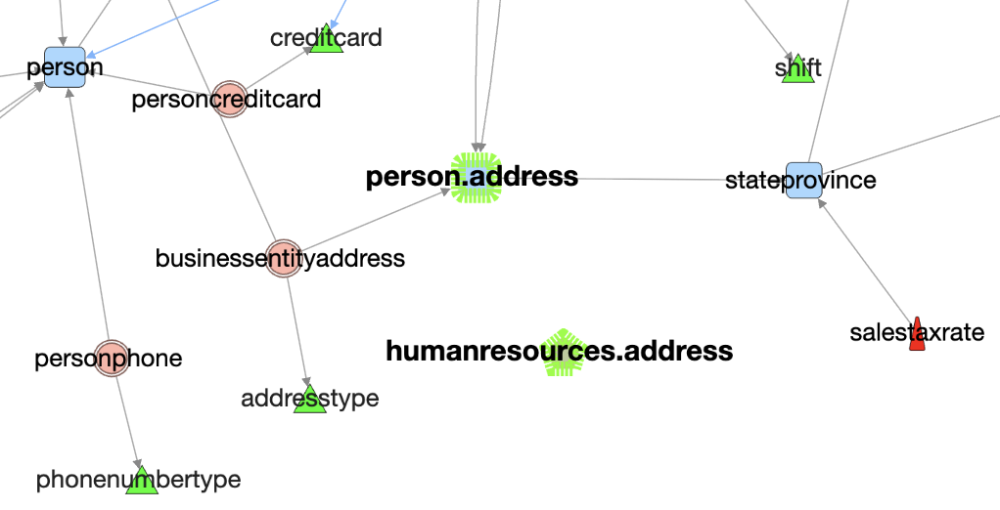
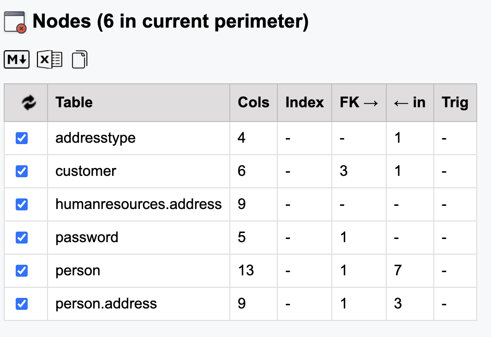
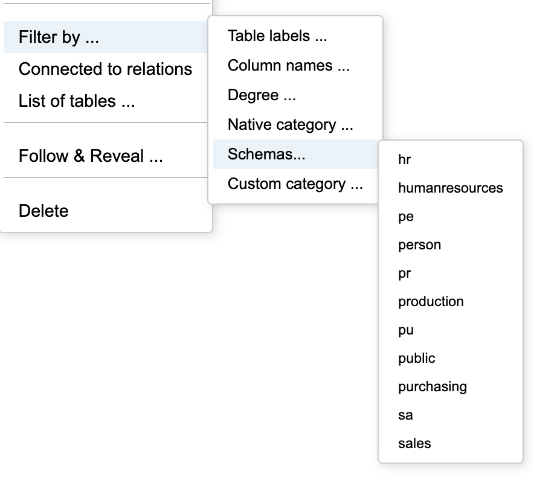
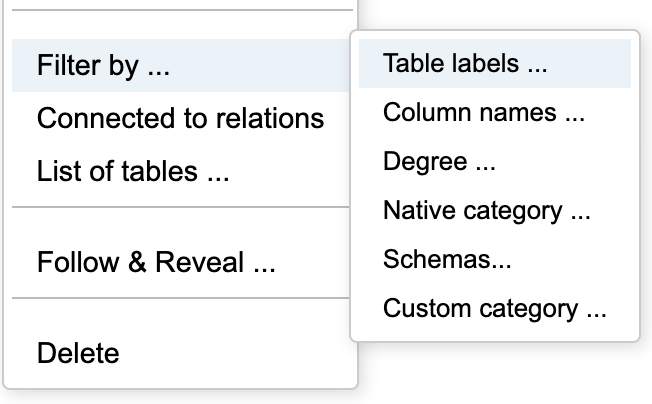
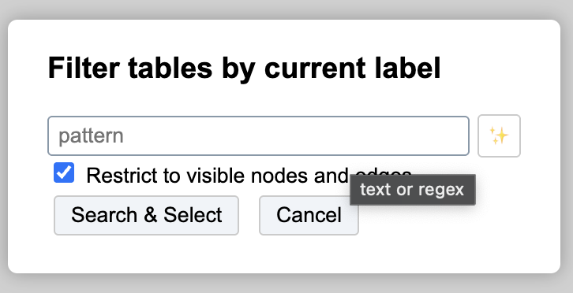
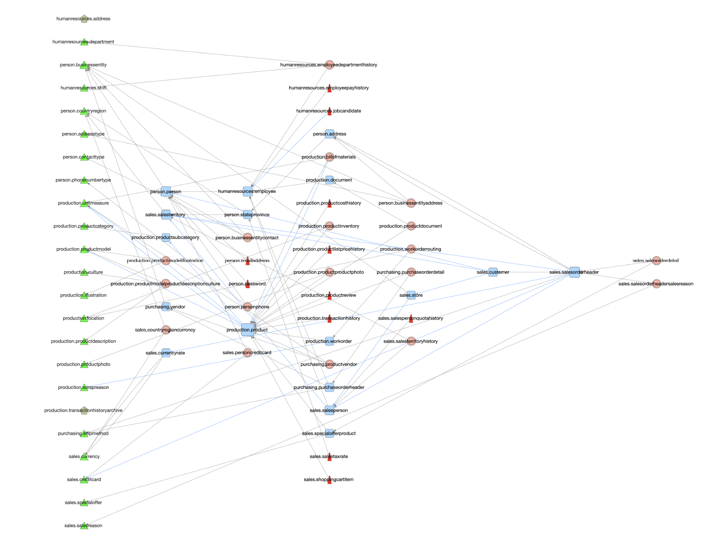
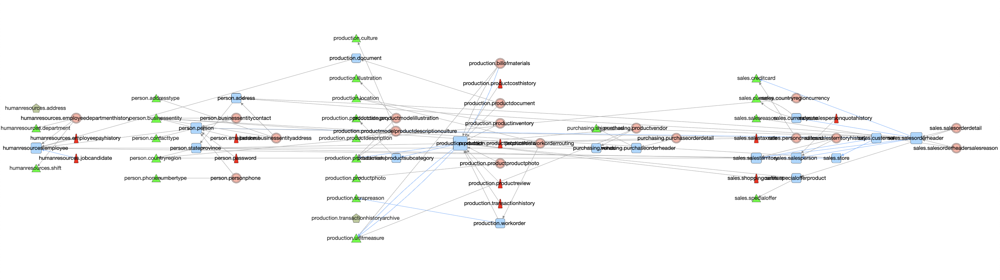

# Multi-schemas extension 

Starting with cytoscape 4.0 DB analysis takes care of multi-schemas if any. 

## Adventureworks as sandbox 

For this documentation, we use the DB Adventureworks from Microsoft, after a migration to Postgresql. 
Thanks to [Lorint job](https://github.com/lorint/AdventureWorks-for-Postgres)

### main graph adventurework 

### Label options 

All nodes have by default a full qualified name ***schema.table*** as label.

Labels can be changed with new entries in displaymenu: 

### *Table* only as label 

Changing to *table* remove the schema from the label.

#### Exceptions for duplicate names 

CytographDB check duplicate names between distinct schemas.  
As an example for this demo, we added an address table in **humanresources** schema while there was already one in **person** schema.

In these case, the qualified name is kept even if all other labels are set to ***table***

#### Duplicate names in list 

Remember that duplicate names keep their qualified names and are in alphabetic place at the schema prefix.   
Example ith duplicate ***address*** 

## Filtering on Schemas

A new entry in menu allow to filter on schemas: 

Note : Remember that any selection is added to the previous one. To select several categories, repeat action. 

## Select by name applies to the current *labels* 

Filter in now on table labels : 

-->

Be aware of possible changes against label options: schema.table table alias 
Ex: *sales.specialOffer* *specialOffer* *Offre* 

## Case simple schema *public*

If there is only one schema, cytographDB uses *table* as default, not *schema.table*  
There is only one option in filter by schema : *public* 

## Dependencies by schema. 

The menu model has new entries : 

### Differences between dependencies organization 

#### with all tables 

Labels are in mode *schema.table* for convenience of comparison. 

#### splitted by schemas 

Note : Remember that actions are applied to current perimeter = all nodes if none selected, only selected nodes if any. 