# Quick Tour with *democytodb* model

## democytodb 

This very simple DB model was designed for documentation purpose.   
To create *democytodb* in your Postgres instance, see the [Installation Guide](./install.md)

## Initial load of democytodb 

(after some ui alignments).

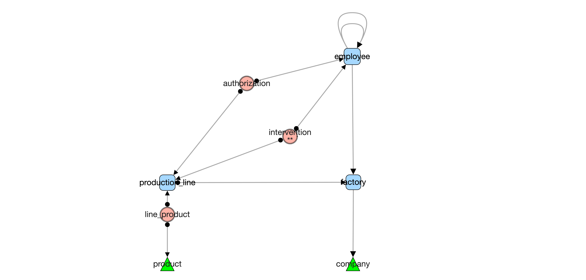

# General UI 

## Node = table representation

( all UI choices can be customized later by yourself & per database )

### table shapes

-
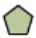 **orphan** : no links
  -  pentagon ( *parameters* )
- 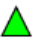 **leaf** : no outgoing link. 
  - triangle (*product, company*).
- 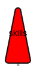 **root** : no incoming, one outgoing 
  - high rounded triangle (*skills*)
-  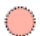**(dry) association** :  no incomings, 2 outgoings, strict list of columns from FK in table   
     - ellipse (*authorization*) 
-  **multi-association** : no incomings, >2 outgoings, or: 2 outgoings with extra column in table
  - ellipse with double border (*intervention*)
-  **other tables** 
  - round rectangle (*production line, factory, employee*)
  
#### tag trigger detected 

   This symbol appears under the label when a table **has triggers** (*replacing previously used stars\** )

### hover on node

When mouse cursor is over a node, direct neighbours are highlighted:
- **outgoings edges** (foreign keys) are green 
- **incomings edges** (referenced by other tables) are red 
- ***More***: with hover "on" in main menu bar, a detail popup is added on the node:  

With number of edges **<-out & <-in** :
  
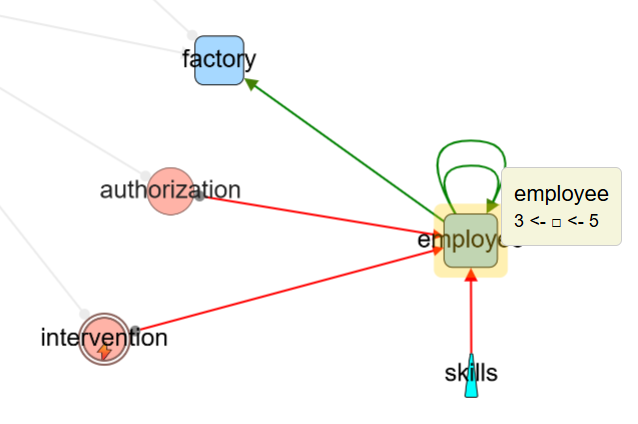

With number of triggers and other categories if any :
    
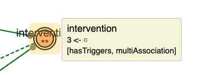   

💡 at any time 'ctrl g' or *photo icon clic* create a png snapshot of current screen

--- 

## Edge = FK representation

- FK    
  - straight line with destination arrow as triangle      
 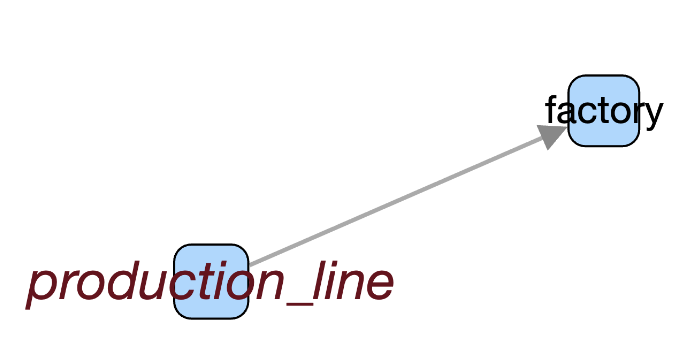.  

- FK '**on delete cascade**' 
  - standard FK but a circle as source-arrow   
 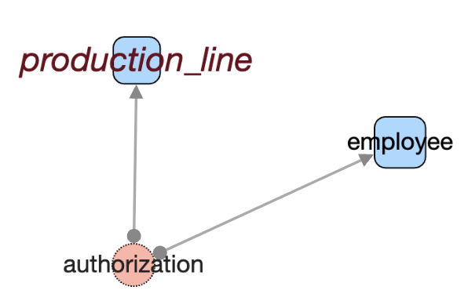.  

- FK '**nullable**'
  - special line color ( default blue sky )   
 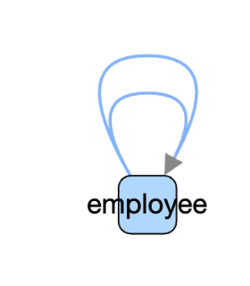. 

### hover on edges  

with hover "on" in main menu bar, a popup is added when mouse is over an edge.   

-**source table -> destination table** 
-**FK name** 
-***[standard and custom categories]*** if any

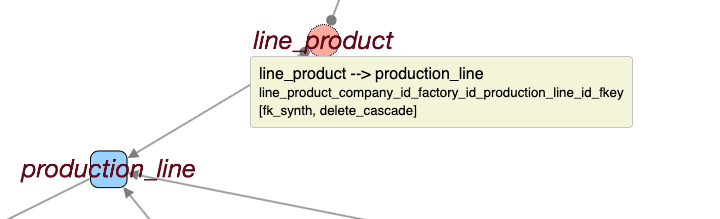

 *1/FK (or 1/Col)* designate current display of edge (global or detailed). See Edge menu.  

---

# more on nodes

### list of nodes (i.e. tables)

**list** generates a window with nodes of ***current perimeter***   
*Current perimeter* : all nodes if none selected (like below), only selected nodes otherwise.

   

**All columns are sortable by headers**  
**Left check columns reflects selection and returns with selection if changed**
**Tables'name are linked to their detailed definition**
**Trigger numbers are linked to triggers'code**

 Download and copy the current table **as markdown text**. 

--- 

### access to a table definition 

- clic on a displayed table name in a list (nodes or edges list)
- right-click to open then contextual menu on a node and choose table definition.
 

 
#### display of a table definition 

a new tab is open in navigator and show detailed schema informations. 
- if any comment in schema, a tip is available.
- indexes doesn't include PK as it has its own place.
- constraints list (if any) doesn't include Pk nor indexes. 
  -  *Unique* or *Exclude* constraints are listed if any.

***Total constraints in DB: PK + Indexes + constraints***
  
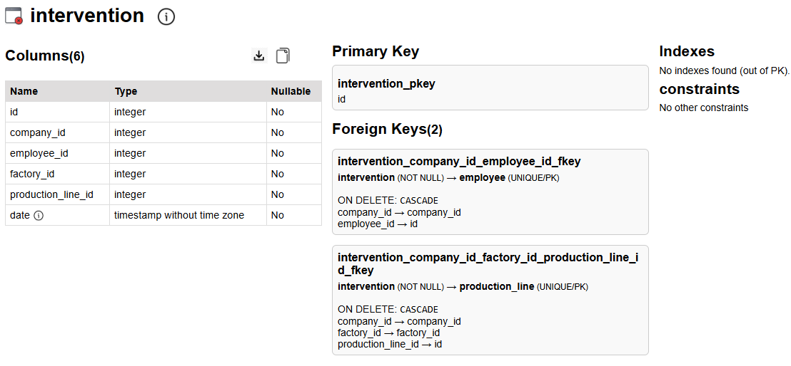

 Download and copy to get markdown exports.
 Indicates a comment (from DB) is available (visible at mouse hover). 

#### table triggers 

A new tab open with triggers'list,  allowing to browse the SQL code.  

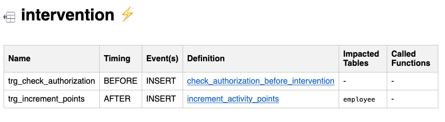

<small>*[some docs on FK constraints in SQL ](./moreSQL.md)*</small> 

#### impacted Tables

An automatic code analysis search for `UPDATE`, `DELETE`, or `CREATE` operations in triggers and functions.

In the upper sample, the `employee` table appears in *Impacted Tables* because an *UPDATE employee* has been found in the triggers code.
Note : to get visually new edges that link source table to impacted tables, you must generate them through ***'edges - data model - generate - triggers impact'***

### recursive analysis 

If a trigger code calls a function, the code of this function is also parsed.    
If a function calls another function, the code of this called function is also parsed. 
If a function has already been analysed previously, it is not parsed again.   
The deep of nested calls is limited to 16 to avoid infinite loops in case of recursive code.

#### Warnings in analysis 

Some named function can be missing. 
If a sql source uses a interpreted operation with 'EXECUTE someString' it is not analyzed as the content is not sure. 

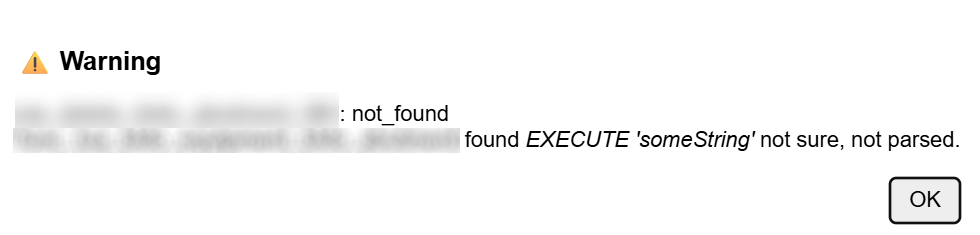

#### sample of code details

CytographDB uses syntaxic color for SQL from a third part. 

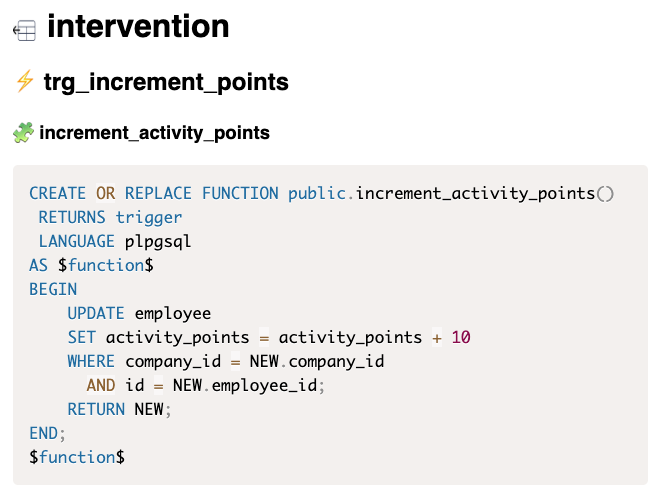

---

# more on Edges

## list of edges ( foreign key / trigers impacts)

list generates a window with edges of current perimeter.
Current perimeter : all edges if none selected, only selected edges otherwise.

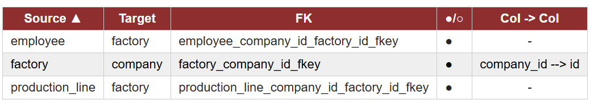

**FK name**  : in case of a generated edge for trigger impact, the name is the name of the trigger. 
**col -> col** : depends of the foreign key details which can be set or not on a individual edges basis. If not detailed, the column is empty ( - ).

###  foreign keys details:   

### 1 edge per FK 

This is the default FK presentation in the graph when loaded. 

### 1 edge per column 

A FK edge is splitted as one or several edges : one edge per matching columns. 
Below labels were displayed for some selected edges. Hover also allows to see details.  

  clic on Menu ***Edges-details - 1 per FK/ 1 per column***  to change **all** edges at once .
  clic on Menu ***Edges-label-show***  to see **all** labels at once.

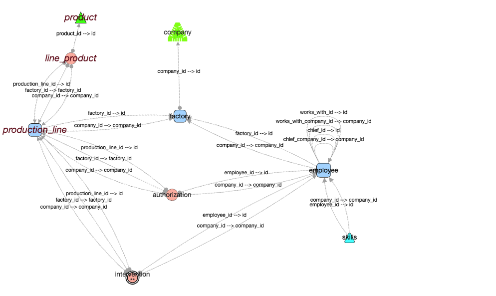   

💡You can also flip/flob FK mode and label view on an individual edge **with right click submenu**:    
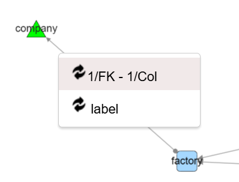

--- 

### add trigger impacts to graph

menu: **Edges → Data Model → Triggers  → generate  impacts**

New generated edges represent trigger-based relationships (violet below)

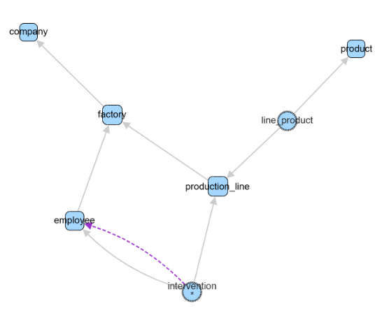

Labels of new *trigger_impact* edge is the trigger's name.

These edges can be easily selected later through  
**edges - filter by... native category -  trigger_impact**   
Or removed directly by : 
**Edges → Data Model → Triggers  → remove  impacts**

--- 

# Walk through the model 

This kind of directed graph allows to walk through ***table dependencies***.  

## follow & show in any direction  *outgoing / incoming / both*

From some selected nodes, you can navigate in any directions to select neighbours. 
If the neighbours are hidden, they are autatically brought back to visible. 

### sample 

Starting with *production_line* as the only visible node :
- a first outgoing clic bring back *factory* 
- a thirs outgoing clic bring back company

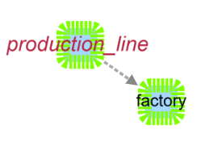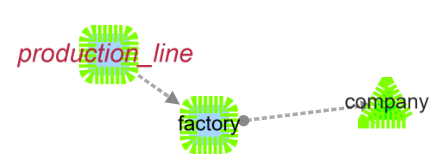

### exploring chains backward

#### starting from *leaf* 

By aplying successive **Nodes - Follow & show - Incoming** starting with *company* you got the backward dependencies ( after applying a Dagre layout) : 

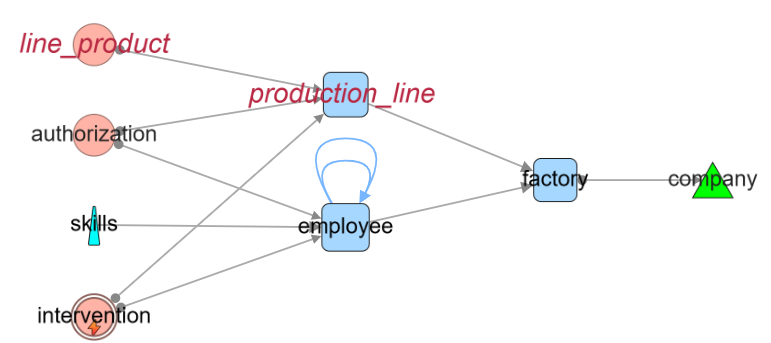

One can observe that the *product* table is not in the graph as no directed edge linked it as an incoming edge. 

### the  *association* barriers 

An association has two output links and no incoming.   
Directed backward walks on a graph allways stop encountering an association.

#### follow & show ... association 

This menu option allows the walk to cross associations by applying a ***follow & show - both*** directions only on associations. 

#### Individual follow actions on a chosen node 

The direction arrows allow to follow edges only for the current node :   
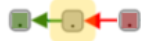   
**outgoing(green) |  both |  incoming(red)** 

--- 
### exploring chains forward

#### starting from **leaf** 

***follow & shows ... outgoing*** will stop growing after three calls: 

 - 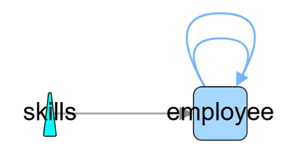 - 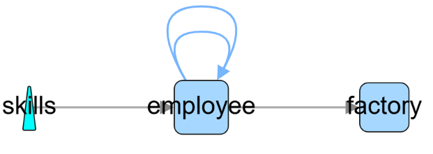 - 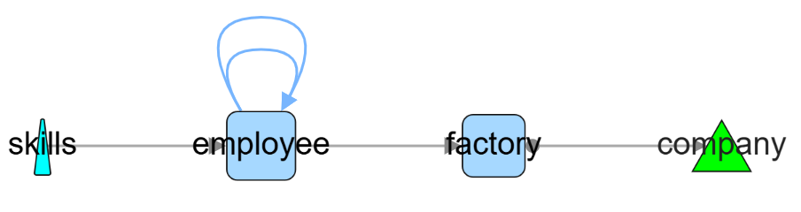

### follow  *long path dependencies*

 This walk follows outgoing edges from table to table to find all the outgoing long paths forward avoiding loops.   
 💡 start with few nodes, mainly from ***root node***.

 If no start nodes are defined, algorithm will try every node which could be expensive for large graph.  
 With the tiny democytoDB we get all paths ( more than two jumps) : 

 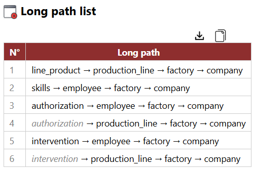   

 <small>( To facilitate reading, repeated path parts are greyed italic)</small>
 
 Returning to main graph, all the nodes of all path will be selected. 
 No interest here, but if you start with only *skills* as selected nodes, you will get the following long path : 
  
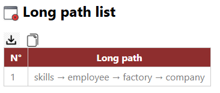.  
    
And the selected nodes reflect the path : 
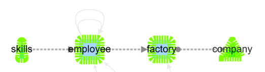
 
This retrieves automatically what was done step by step starting from *skills* with follow outgoing.

---  

## Exploring chains backward 

## follow incoming and check PK/FK 

This walk follows incoming. It must start from a ***leaf***.   
It search backward for FK that use exactly all the columns of the PK's source. 

In democytodb, starting from the root *company* : 

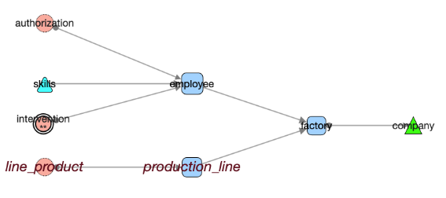.  
And the associated list :   
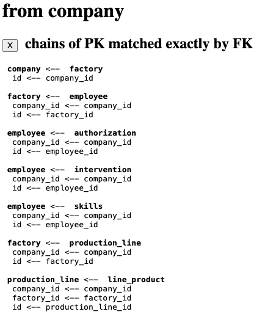
---

This ends the quick tour.
See detailed menus for more options. 

---

- ⚪️ [Main](./main.md)
- 🟩 [*Quick Tour*](./quickTour.md)  
- 🟨 [Main Menu Bar](./menuBar.md)  
- 🟦 [Node Menu](./menuNodesSelectHide.md)  
- 🟥 [Edge Menu](./menuEdgesSelectHide.md)   

