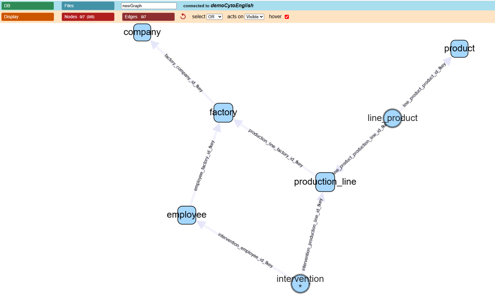
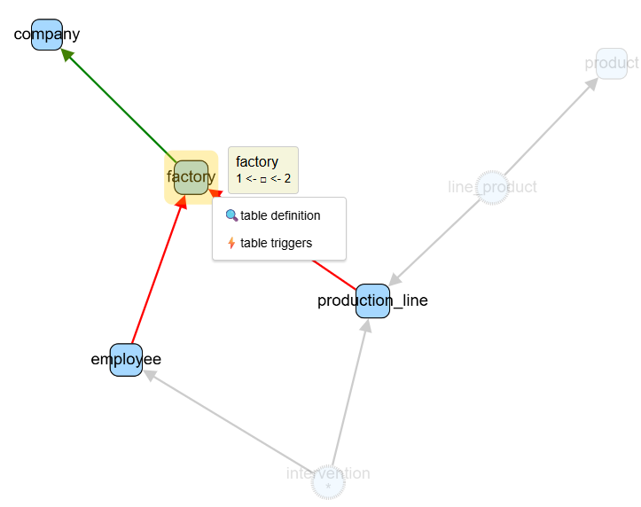
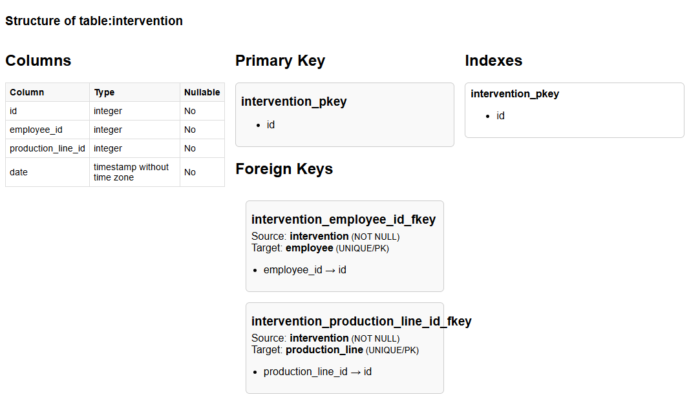
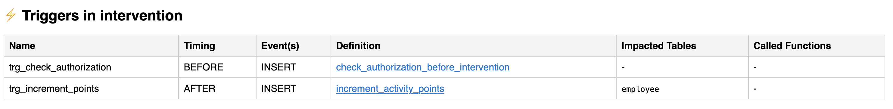
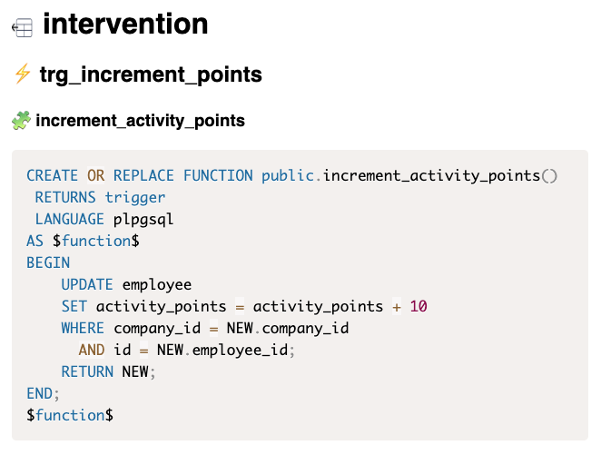
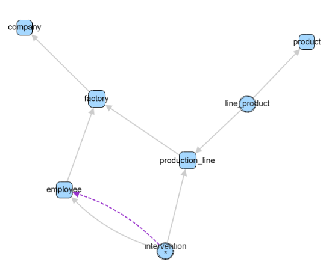
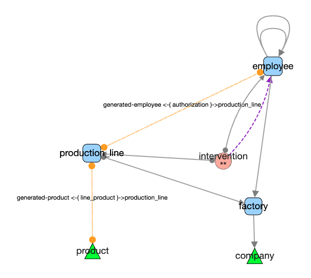

# Quick tour around demo  model 

## main screen with loaded demo graph

### create graph from a DB

Menu ***DB -create graph from DB*** 
it show available DBs in your PostgreSQL. 
Choose one to create graph.
*democytoscapedb* is the fake DB used in documentation. To create by yourself, see files in *docs/sql*
 
- Default layout is a *Cose-bilkent*. 
    To change: ***Display ->Layout ->*** some other
- nodes have for label the table name 
    To change: ***Nodes->aspect->label***
- under the label ***stars represent trigger*** if any (look at *intervention table* )
- pure ***association tables*** have a round shape , others a rounded rectangle. 
- Size is proportional to degree ( number of edges) 
    To change: ***Nodes->aspect->shape->*** 

### basic informations 

When ***hover*** is on ,the cursor show info on node:  name, number of ***outgoing edges (FK)***, number of ***incoming edges*** (referenced by a FK). 
Edges are colored against their orientations and non implied elements are faded while hovering.

A right mouse click on a node display a menu for browsing: 
- the ***table definition***
- the ***triggers with their codes***

----
### Table definition sample

----
### trigger definition sample

#### impacted tables

The column show the result of a syntaxic analysis of code looking for operation *Update,Delete,Create* in source code. 
In this sample ***employee*** was found in the detailed code below under an *update* clause. 

----   

### details of code 

--- 
## adding triggers impacts to network 

Use of impacted tables of a source table : 

Menus: ***Edges ->datamodel->generate triggers impact***  add new edges with specific color and line-style. 

These special edges can be retrieved and selected by : 
**Edges->filter->by category -> trigger_generated**  (think about clicking on each step) 

--- 

## Reduce associations 

To lighten a graph, simple associations can be shrinked into a new edge category (simplified) and a new visual style. 
Moving cursor over a edge show the details with in the middle the name of the shrinked association table.

menus : 
 - ***Edges - data model -> reduce associations -> collapse node***
 - ***Edges - data model -> reduce associations -> restore node***
 - ***Edges - filter - by category - collapsed_association***

notes: 
- a ***simple association*** table that can be collapsed is defined as 
    - only two outgoing edges
    - no proprietary column, only those involved in FKs
- be aware that orientation (in/out) has been arbitrarily choosen and is no more significant. 

---
 