# Quick Tour

**Using the *democytodb* Model**

---

## democytodb

This **simple database model** was designed **for documentation purposes**.
To create **democytodb** in your PostgreSQL instance, see the [Installation Guide](./install.md)

---

## Initial Load of Sample *democytodb*

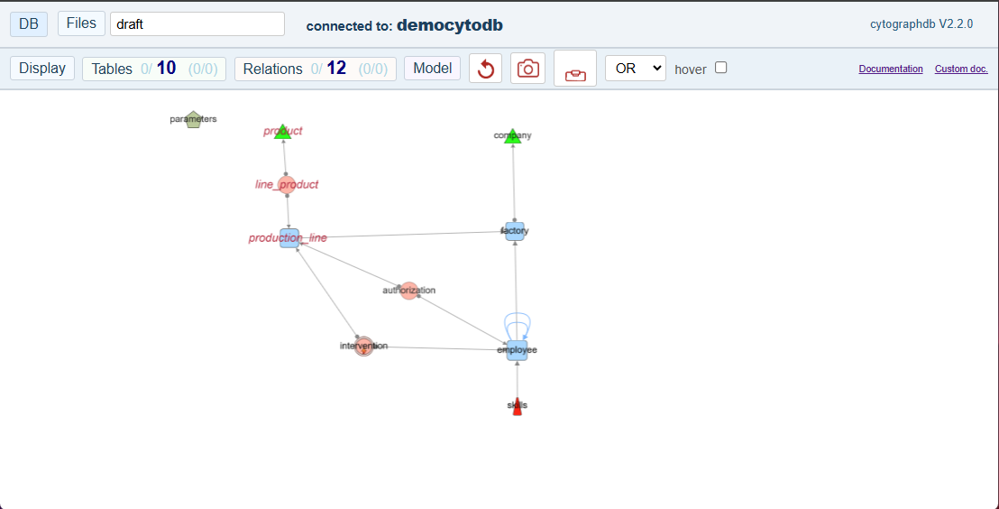

---

# General UI

## Main Menu Entries

- **Display**: All **visual customization** options
- **Tables**: Browse, select, and **manage table visibility**
- **Relations**: Browse, select, and **manage relationship visibility**
- **Model**: Other **global analysis** actions using the metamodel

---

## Basic Selections

- Click an **element** (node or edge) to select it
- **Shift+Click** an element to **toggle its selection**
- **Shift+Click** to **add/remove elements** from the current selection

---

# Node = Table Representation

*(All UI choices can be **customized later per database*)*

### Table Shapes

| Shape | Icon | Description | Example |
|-------|------|-------------|---------|
| **Orphan** | 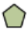 | No links | *parameters* |
| **Leaf** | 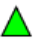 | No outgoing links | *product, company* |
| **Root** | 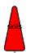 | No incoming edges (but not an association) | *skills* |
| **Dry Association** | 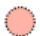 | No incomings, 2 outgoings, FK columns = table columns | *authorization* |
| **Multi-Association** |  | No incomings, >2 outgoings **or** 2 outgoings with extra columns | *intervention* |
| **Default** |  | Standard shape | *production_line, factory, employee* |

---

### Trigger Detected Icon

This symbol appears **under a node's label** when its table **has triggers** *(replaces previously used stars)*

---

# Hover on a Table

When the mouse cursor **hovers over a node**, its **direct neighbors** are highlighted:
- **Outgoing edges** (FKs) turn **green**
- **Incoming edges** (references) turn **red**

**Additionally**: With **hover enabled** in the main menu bar, a **detail popup** appears near the node:

With:
- **Number of outgoing edges (←out)**
- **Number of incoming edges (←in)**

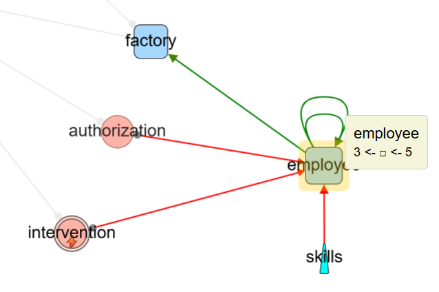

With:
- **Number of triggers** (if any)
- **Other categories** (if any)

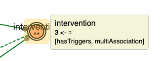

💡 **Tip**: At any time, **Ctrl+G** or the **photo icon** captures the current screen as a **PNG snapshot**.

---

# Graphical Oriented Edge Lines

**Foreign Keys (FKs)**: Directed from **owner (child table)** to **referenced table (parent table)**

| Type | Description | Appearance |
|------|-------------|------------|
| **Standard FK** | Straight line with a **triangle arrowhead** at the destination | 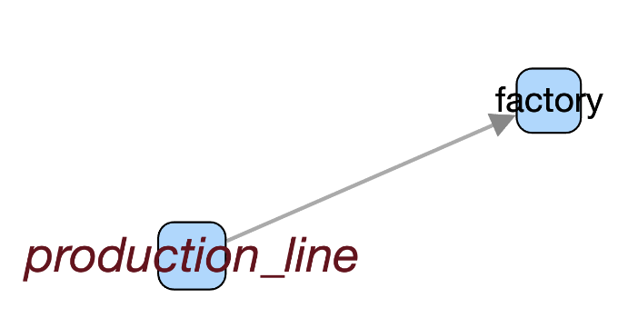 |
| **FK with ON DELETE CASCADE** | Standard FK **with a circle at the source** | 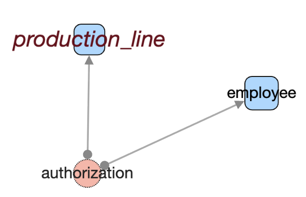 |
| **Nullable FK** | **Special line color** (default: light blue) | 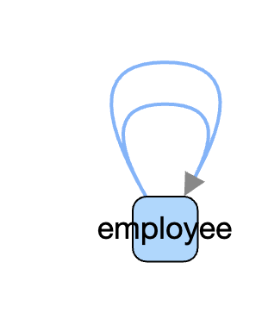 |

---

### Hover on Relations

With **hover enabled** in the main menu bar, a **popup appears** when the mouse hovers over an edge:

- **Source table → Destination table**
- **FK name**
- **[Standard and custom categories]** (if any)

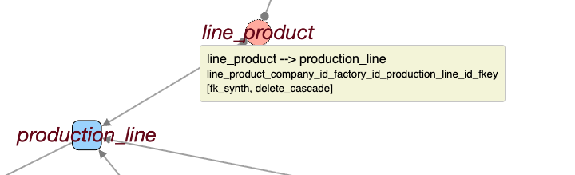

**`1/FK` or `1/Col`** indicates the **current edge display mode** (global or detailed). See **Edge Menu**.

---

### ⚠️ Warning About Root & Leaf in Directed Graphs

In a **directed graph**:
- **Root**: Node **without incoming edges**
- **Leaf**: Node **without outgoing edges**

For FKs, **least dependent tables** have **no FKs** (i.e., **leaves** in the graph).
⚠️ **For exports, start from leaves** (which are **roots** in export terms).

---

# More on Tables

---

## List of Tables

**List** generates a window with nodes from the **current perimeter** (*all visible nodes if none selected, otherwise only selected nodes*).

- **All columns are sortable** (click headers)
- **Checkboxes reflect and update selection**
- **Table names link to their detailed definitions**
- **Trigger counts link to trigger definitions**

 **These actions are available for all tables**:

- **Download** as Markdown
- **Download** as Excel
- **Copy** to clipboard as Markdown

---

## Accessing Table Definitions

- Click a **table name** in any list (nodes or edges)
- **Right-click** a node and select **Table Definition** from the context menu

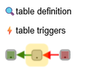

The icons are **propagation commands** for the selected node.
They are **detailed in *Walk Through the Model*** when applied to collections.

---

### Definition: Display Details of the Selected Table

A new tab opens in the browser, showing **detailed schema information**:
- If any comment exists in the schema, a tooltip is available
- Indexes **exclude the Primary Key (PK)**
- The list of constraints (if any) **excludes PKs and indexes**
  - *Unique* or *Exclude* constraints are listed if any

**Total constraints in DB = PK + Indexes + Constraints**

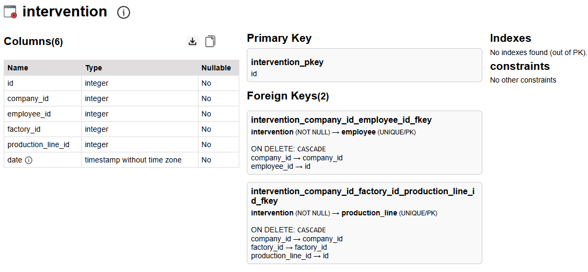

**● Not nullable / ○ Nullable**: Short representation (used for columns and FKs)

 **DB Comment Icon**
Indicates a **database comment** (visible on hover).

 **Preview Icon**
Displays the **first 10 records** in a new page.

---

### Triggers Entry

A new tab opens with the **trigger list**, allowing you to **browse the SQL code**.

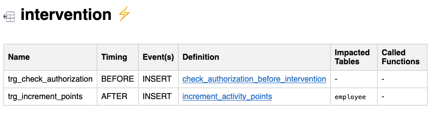

---

### Impacted Tables

**Automatic code analysis** searches for `UPDATE`, `DELETE`, or `CREATE` operations in **triggers and functions**.

In the example above, the `employee` table appears in **Impacted Tables** because an `UPDATE employee` was found in the trigger code.

⚠️ **Note**: To **visually link** source tables to impacted tables, generate edges via:
**Edges > Data Model > Generate > Trigger Impacts**

---

### Recursive Analysis

- If a trigger calls a function, **its code is also parsed**
- If a function calls another function, **that code is parsed too**
- **Already-analyzed functions are skipped** to avoid duplicates
- **Recursion limit**: 16 levels (prevents infinite loops)

---

### ⚠️ Limitations

- **Missing functions**: Some named functions may not be found
- **Dynamic SQL**: `EXECUTE someString` is **not analyzed** (content is uncertain)

---

### Warnings in Analysis

If you work with a **model subset** and impacted tables involve **missing parts**, you may see many warnings.
The warning window **truncates the list**, but **the full list is always copied to clipboard**, ready to paste:

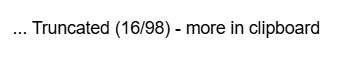

---

### Sample of Code View

CytographDB uses **SQL syntax highlighting** (via a third-party library).

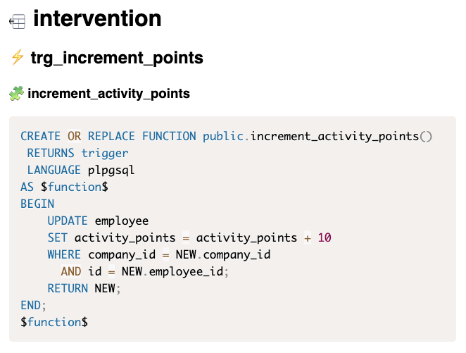

---

# More on Relations (Edges)

## List of Edges (Foreign Keys / Trigger Impacts)

**List** generates a window with edges from the **current perimeter** (*all edges if none selected, otherwise only selected edges*).

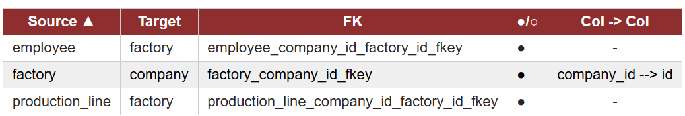

- **FK Name**: For **trigger impact edges**, this is the **trigger name**
- **Details**: In **detailed mode**, shows **column-to-column matching**
  In **non-detailed mode**, this column is **empty** (`-`)

---

## Menu Relations and Foreign Key Details

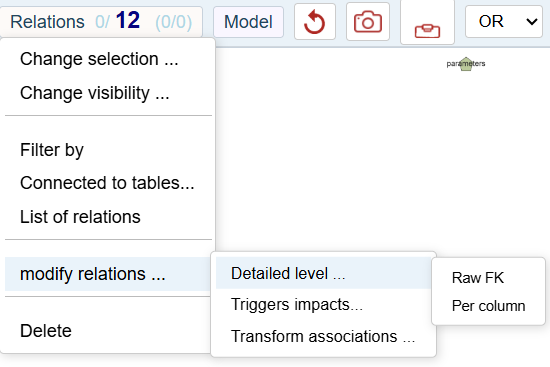

- **Raw FK** (Default): One edge **per FK** (one FK = one edge)
- **Per Column**: One edge **per matching column pair**

The labels below were displayed after selecting some relations and applying:
**Display > Relations Labels > Relation Name**.

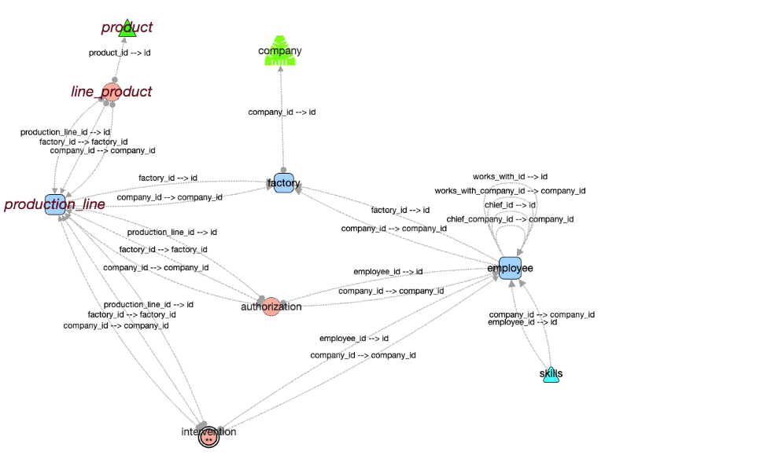

💡 **Tip**: You can also **toggle FK mode** (or label view) **per edge** via the **right-click context menu**:

---

## Triggers... Generate Impacts

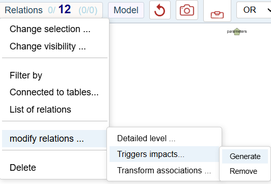

**New edges** represent **trigger-based relationships** (violet in the example below):

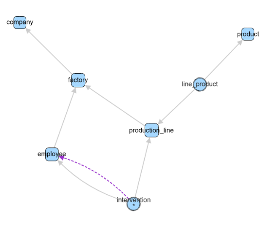

- **Trigger impact edge labels** use the **trigger's name**
- You can **remove them** from the graph **the same way** as regular edges

---

# Walk Through the Model

This **directed graph** allows you to **traverse table dependencies**.

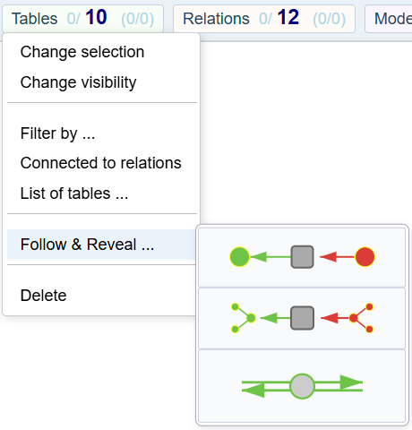

From **selected nodes**, you can **navigate in any direction** to **select neighbors**.

| Icon | Action | Description |
|------|--------|-------------|
| 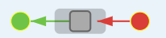 | **Step-by-Step** | Navigate **one hop at a time** in any direction (*Outgoing / Both / Incoming*) |
| 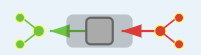 | **Automatic Tree Propagation** | **Recursively** follows relations in the chosen direction (*Outgoing / Both / Incoming*) |
|  | **Cross Association** | If a selected node is an **association**, **selects both sides** (regardless of direction). **Allows crossing the association boundary** |

**Follow & Reveal**: If neighbors are **hidden**, they are **automatically restored** to visible.

---

### Example

Starting with **production_line** as the only visible node:
- A **first Outgoing click** restores **factory**
- A **third Outgoing click** restores **company**

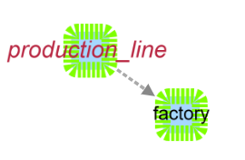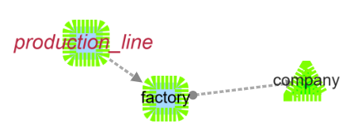

---

### Exploring Chains Backward

**Starting from *company* (selected)**:
- **Step-by-step**: Apply **Nodes > Follow & Show > Incoming** repeatedly
- **All at once**: Use **Incoming Tree Propagation**

You can see **backward dependencies** as selected nodes (example below uses **Dagre layout**):

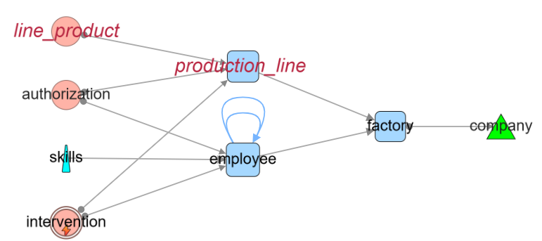

**Note**: The *product* table is **not in the graph** because **no directed edge links to it as incoming**.
The *line_product* **association acts as a barrier** (use **Cross Association** to jump over it).

---

### Other Propagations in Model Menu

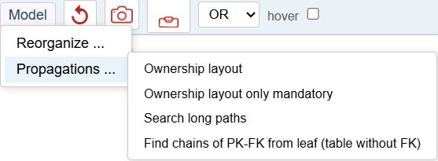

These options are **detailed in the [Model Menu](./menuModelDoc.md)**.

---

- ⚪️ [Main](./main.md)
