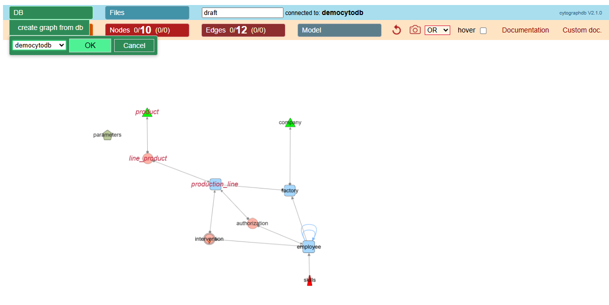
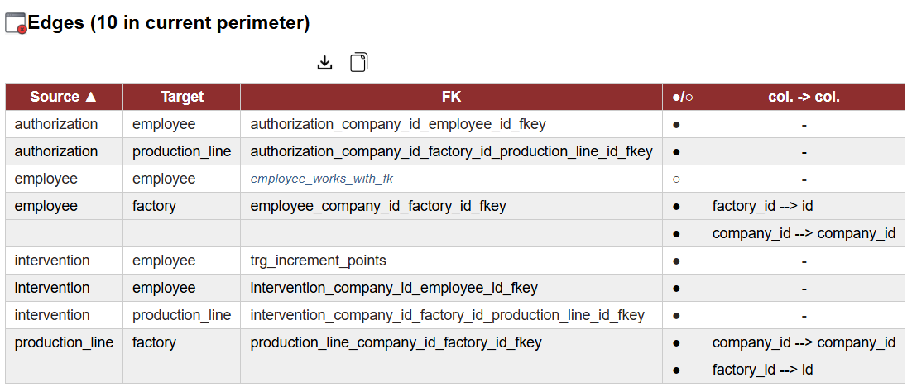

# Quick Tour 

**with *democytodb* model**

## democytodb 

This very simple DB model was designed for documentation purpose.   
To create *democytodb* in your Postgres instance, see the [Installation Guide](./install.md)

## Initial load of sample *democytodb* 

# General UI 

## Main menu entries

- Display : all options that will change visual aspects 
- Tables  : browse, select and manage visibility of tables
- Relations: browse, select and manage visibility of relations
- Model : other global actions using the metamodel.  

## Node = table representation

( all UI choices can be customized later by yourself & per database )

### Table shapes

-  **orphan** : no links
  -  pentagon ( *parameters* )
-  **leaf** : no outgoing link. 
  - triangle (*product, company*).
-  **root** : no incoming,  but not an association
  - high rounded triangle (*skills*)
-  **(dry) association** :  no incomings, 2 outgoings, list of columns from FK is list of columns in  table   
     - ellipse (*authorization*) 
-  **multi-association** : no incomings, >2 outgoings, or: 2 outgoings with extra column in table
  - ellipse with double border (*intervention*)
-  **default** 
  - round rectangle (*production line, factory, employee*)
  
#### Icon 'trigger detected' 

   This symbol appears under the label of a node when a table **has triggers** (*replacing previously used stars\** )

### Hover on a table 

When mouse cursor is over a node, direct neighbours are highlighted:
- **outgoings edges** (foreign keys) are green 
- **incomings edges** (referenced by other tables) are red 
- ***More***: with hover "on" in main menu bar, a detail popup is added close to the node:  

With number of edges **<-out & <-in** :
  

With number of triggers and other categories if any :
    
   

💡 at any time 'ctrl g' or *photo icon clic* create a png snapshot of current screen

--- 

## Graphical oriented edge line 

**FK from owner (relational child) to referenced table(relational parent)**

- FK    
  - straight line with destination arrow as triangle      
 .  

- FK '**on delete cascade**' 
  - standard FK but a circle as source-arrow   
 .  

- FK '**nullable**'
  - special line color ( default blue sky )   
 . 

### Hover on relations  

with hover "on" in main menu bar, a popup is added when mouse is over an edge.   

-**source table -> destination table** 
-**FK name** 
-***[standard and custom categories]*** if any

 *1/FK (or 1/Col)* designate current display of edge (global or detailed). See Edge menu.  

### Warning about root & Leaf  

In an oriented graph a *root* is a node without incoming edge and a *leaf* a node without outgoing edge.
For FK the less dependant tables are those who have no FK , ie leaves on graph.  
***For an export, you must start from leaves*** (which are in fact the *roots* of the export)

---

# More on tables

### List of tables

**list** generates a window with nodes of ***current perimeter***   
*Current perimeter* : all nodes if none selected (like below), only selected nodes otherwise.

   

- **All columns are sortable by headers**  
- **Left check columns reflects selection and returns with selection if changed**
- **Tables'name are linked to their detailed definition**
- **Trig*ger* numbers are linked to triggers'code**

 These actions are common to all tables :  

  
- Download table in markdown.   
- Dowload the table as an excel sheet.    
- Copy the table into clipboard as a markdown text.  

--- 

### Access to a table definition 

- clic on a displayed table name in a list (nodes or edges list)
- right-click to open then contextual menu on a node and choose table definition.
 

 
 Icons are propagation's command to apply to the selected node. 
 They are detailed further in *Walk through the model* when they apply to a collection. 

#### Definition: display details of the selected table 

A new tab is open in navigator and show detailed schema informations. 
- if any comment in schema, a tip is available.
- indexes doesn't include PK as it has its own place.
- constraints list (if any) doesn't include Pk nor indexes. 
  -  *Unique* or *Exclude* constraints are listed if any.

***Total constraints in DB: PK + Indexes + constraints***
  
   

 ***●  Not nullable   /  ○ nullable*** : short representation (used for columns and foreign keys)    

 (when available) Indicates a DB comment visible when staying on at mouse over. 

 display the 10 first records in a new page.

#### Triggers entry

A new tab opens with triggers'list,  allowing to browse further the SQL code.  

#### Impacted Tables

An automatic code analysis search for `UPDATE`, `DELETE`, or `CREATE` operations in triggers and functions.

In the upper sample, the `employee` table appears in *Impacted Tables* because an *UPDATE employee* has been found in the triggers code.
Note : to get visually new edges that link source table to impacted tables, you must generate them through ***'edges - data model - generate - triggers impact'***

### Recursive analysis 

If a trigger code calls a function, the code of this function is also parsed.    
If a function calls another function, the code of this called function is also parsed. 
If a function has already been analysed previously, it is not parsed again.   
The deep of nested calls is limited to 16 to avoid infinite loops in case of recursive code.

#### Warnings in analysis 

Some named function can be missing. 
If a sql source uses a interpreted operation with 'EXECUTE someString' it is not analyzed as the content is not sure. 

##### Too much warnings case

If you work with a subset of model and ask for impacted tables that involve missing parts, you can get a lot of warnings.   
The warning window will truncate the list, but **in any case you will find full list into the clipboard**, ready to paste.
 

#### Sample of code view

CytographDB uses syntaxic color for SQL from a third part. 

---

# More on relations (edges)

## List of edges ( foreign key / trigers impacts)

list generates a window with edges of current perimeter.
Current perimeter : all edges if none selected, only selected edges otherwise.

**FK name**  : in case of a generated edge for trigger impact, the name is the name of the trigger. 
**details** : when relations are in detailed mode (see below), column to column matching will be displayed.
If not detailed, the column is empty ( - ).

### Menu Relations and foreign keys details   

- **raw FK** Default FK presentation : a FK<->1 edge. 
- **per column** :FK is splitted as one edge per matching columns.

Below labels were displayed after selecting some relations and using ***Display/Relations labels/Relation name***.  

   

💡You can also flip/flop FK mode  (also flip/flop label view) on an individual edge **with right click submenu**:    

--- 

### Triggers ... generate impacts

New edges materialize trigger-based relationships (violet below)

Labels of new *trigger_impact* edge is the trigger's name.  
You can remove them from the graph the same way.

--- 

## Walk through the model 

This kind of directed graph allows to walk through ***table dependencies***.  

From some selected nodes, you can navigate in any directions to select neighbours. 

 : Step by step in any direction  *outgoing  / both  / Incoming*

 : Automatic propagation in chains selecting *outgoing tree  / both  / Incoming tree*

 An association (two outgoing links) blocks propagation forward and backward. This command will selecting both sides of an already selected association. This allows to pursuit the chains. 

*Follow & Reveal* : If the neighbours are hidden, they are automatically brought back to visible. 

### Sample 

Starting with *production_line* as the only visible node :
- a first outgoing clic bring back *factory* 
- a thirs outgoing clic bring back company

### Exploring chains backward

#### starting from *company* selected :

- By applying successive **Nodes - Follow & show - Incoming** starting with *company*    
- in one shot by using the **incoming tree propagation**    

 you can see the backward dependencies as selected nodes ( here after applying a Dagre layout) : 

One can observe that the *product* table is not in the graph as no directed edge linked it as an incoming edge : the line_product association acts as a barrier ( you can jump using cross association)

### Other propagations in menu Model

Options will be detailed in corresponding menu. 

---

- ⚪️ [Main](./main.md)

