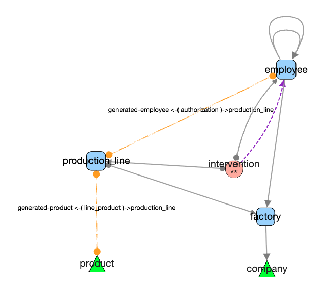

# Quick Tour of the Demo Model

## Main Screen: Loaded `democytodb` Graph

---

### Create a Graph from a Database

From the menu: **DB → Create graph from DB**

- Displays available PostgreSQL databases
- Select one to generate its graph  
- The demo database used here is `democytoscapedb` (empty by default). To generate it yourself, see the [Installation Guide](./install.md)

**Default graph layout**: `Cose-Bilkent`  
**Node labels**: table names  
- ⭐ Stars beneath labels indicate triggers (e.g., in the *intervention* table)  
- 🔵 **Association tables**: round shape  
- 🟦 Other tables: rounded rectangles  
- 🔠 Node size is proportional to degree (number of edges)

---

### Node Hover: Basic Information

When hovering over a node:
- Name of the table
- **Outgoing edges** (foreign keys)
- **Incoming edges** (referenced by other tables)

Edges are color-coded by orientation. Unrelated elements are faded for clarity.

---

### Right-Click Node Menu

Right-click on a node to access its contextual menu:

---

### Sample: Table Definition

---

### Sample: Trigger Definition

---

### Impacted Tables

This view shows the result of code analysis identifying `UPDATE`, `DELETE`, or `CREATE` operations.

In the example below, the `employee` table was referenced via an `UPDATE` clause:

---

### Trigger Code Details

---

## Visualizing Trigger Impacts in the Network

To visualize tables impacted by triggers:

From the menu:  
**Edges → Data Model → Generate Trigger Impact**

This adds new, specially styled edges to represent trigger-based relationships:

To filter and highlight these edges:  
**Edges → Filter → `trigger_impact`**  
*(Make sure to click through each step.)*

---

## Reducing Association Tables

To simplify the graph, basic association tables can be collapsed into stylized edges.

Hovering over such an edge reveals the name of the collapsed association table:

This approach brings the graph closer to a conceptual model (MCD).

A table is eligible for **collapse** if:
- It has exactly **two outgoing foreign keys**
- It contains **no proprietary columns** (only foreign keys)

⚠️ The edge direction becomes arbitrary after collapsing and may no longer carry semantic meaning.

---
