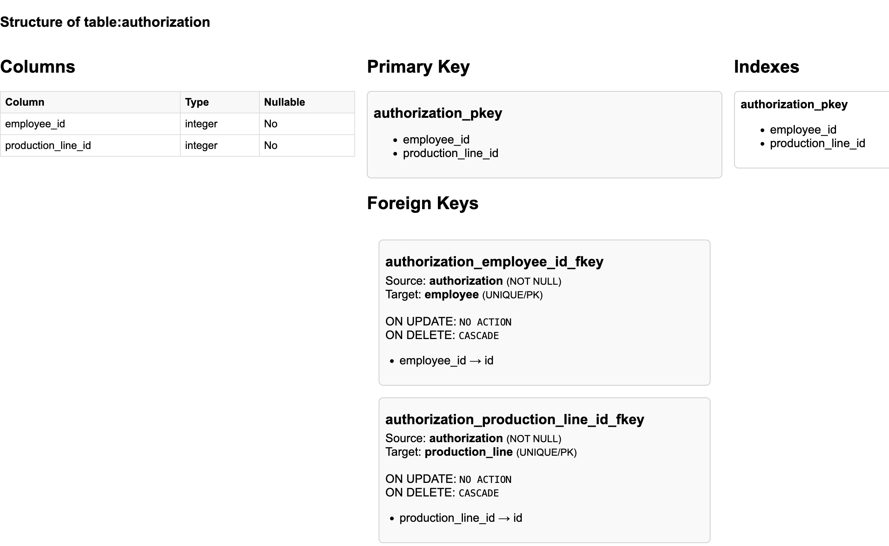

# Quick Tour of the Demo Model

## Main Screen: Loaded `democytodb` Graph

A fake DB to work with several cases

---

### How to obtain 

- The demo database is `democytoscapedb` (empty by default). 
- To generate it by yourself, see the [Installation Guide](./install.md)
 
### Run : DB → Create graph from DB**

- Show available PostgreSQL databases to work with.
- Choose *democytoscapedb*

---

### Direct Informations

When cursor is over a node-table : 
- **Outgoing edges** (foreign keys) are green 
- **Incoming edges** (referenced by other tables) are red 
- if ***hover*** in upper menu bar is checked, a pop up show the number of edges **<-out & <-in**
- Unrelated elements are faded for clarity.

#### Aspect

- main tables (*Employee*, *Factory*) are rounded rectangles while association tables are circles.
  - A table with triggers shows one star per trigger. *Intervention '**'* have two.
- edges are oriented from owner of a FK to the referenced table. 
  - the destination arrow is a triangle. 
- if a FK is a strong link with ON CASCADE DELETE option, le source arrow is a round circle. 
  - generally the case on ***association*** table between two main tables.
    - see *authorization* and *intervention* in the sample. 

---

### Right-Click Node Menu

Right-click on a node shows a contextual menu that link to separate pages:

---

### Sample: Table Definition

for ON UPDATE ON DELETE see [FK constraints explained](./moreSQL.md) 

---

### Table triggers 

This open a new page with triggers definitions and access to their codes :

#### Impacted Tables

A code analysis of triggers and functions search for `UPDATE`, `DELETE`, or `CREATE` operations.
In the example below, the `employee` table was referenced via an `UPDATE` clause:

#### Trigger Code Details

---

## Adding trigger Impacts in the Network

From the Edges menu:  
**Edges → Data Model → Generate Trigger Impact**

This adds new, specially styled edges to represent trigger-based relationships (violet below)
In this capture was added ***Edges-Label-Show*** for two selected edges 

In a large graph, select these particular edges:  
**Edges → Filter → `generated triggers`**  
*(click through each step for facility with menus.)*

---

### Perimeter of actions 

The common rule is : 
- if nothing selected, action apply to all **visible** 
- if some selection, action apply only on **selected** 

#### Visual help on perimeter

In upper bar : 
`      Nodes.  Selected/Visible ( selected/hidden)   Edges selected/visible.` 
- Perimeter : 7 nodes 12 edges 
 
- Perimeter : 3 nodes 12 edges 
.

## Common operations on a DB graph 

### Explore dependencies of a main table 

**Select** a table by any way ( by click, by name, by category, etc. ).  
to work in comfort, hide others : **nodes - hide - not selected** 

A single node is selected in sample below: ***production_line***

Walk the edges of this node : 
- **Follow & show** 
  - Outgoing to see the related tables this one is constraint by a FK 
  - Incoming to see which tables use this one 
  - Both to have eco-system around the table 
  
  ### **Follow *Both*** from production_line 

  

One can see that a depency through an association table give not enough information with a half part.

#### Follow & show ***Association*** 

  (association. nodes are already selected after *follow both* , otherwise select them )

  

### Document this exploration with a photo

At any time you can **make a *photo* of the graph** in a PNG format.

### Keep your work in its current status : download/upload

At any time you can save the graph with all elements you have kept through ***File - Download*** 

This is useful to work with ready to use subgraph, for example per domain. 

## Custom layout and category

A default layout apply on graph.  
A custom layout can be declared associated to one or more DB names.  
For *democytodb* example, tables with no FK like *product* or *company* , identified as **root table** are ***green triangle***. 

This custom category is directly available in a search by : 
***Nodes - Filter by***

  .  
In the demoDB only "root" was added. See customization.  

---

- ⚪️ [Main](./main.md)
- 🟩 [Quick Tour](./quickTour.md)  
- 🟨 [Main Menu Bar](./menuBar.md)  
- 🟦 [Node Menu](./menuNodesSelectHide.md)  
- 🟥 [Edge Menu](./menuEdgesSelectHide.md)   
