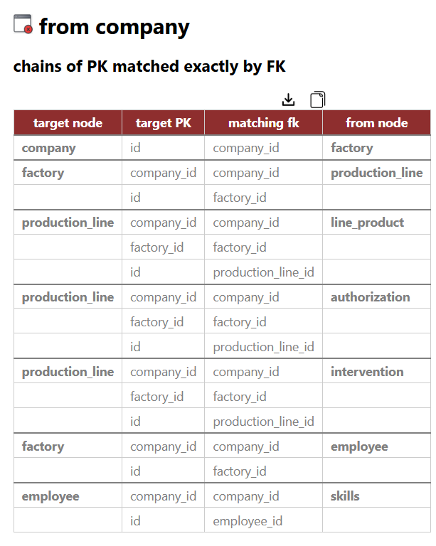

# Quick Tour with *democytodb* model

## democytodb 

This very simple DB model was designed for documentation purpose.   
To create *democytodb* in your Postgres instance, see the [Installation Guide](./install.md)

## Initial load of democytodb 

(after some ui alignments).

# General UI 

## Node = table representation

( all UI choices can be customized later by yourself per database )

### table shapes

-
 **orphan** : no links
  -  pentagon ( *parameters* )
-  **root** : no outgoing link. 
  - triangle (*product, company*).
-  **leaf** : no incoming, one outgoing 
  - high rounded triangle (*skills*)
-  **(dry) association** :  no incomings, 2 outgoings, strict list of columns from FK in table   
     - ellipse (*authorization*) 
-  **multi-association** : no incomings, >2 outgoings, or: 2 outgoings with extra column in table
  - ellipse with double border (*intervention*)
-  **other tables** 
  - round rectangle (*production line, factory, employee*)
  
#### tag trigger detected 

  

   this symbol appears under the label when a table **has triggers** (*replacing previously used stars\** )

### hover on node

When mouse cursor is over a node, direct neighbours are highlighted:
- **outgoings edges** (foreign keys) are green 
- **incomings edges** (referenced by other tables) are red 
- ***More***: with hover "on" in main menu bar, a detail popup is added on the node:  

With number of edges **<-out & <-in** :
  

With number of triggers and other categories if any :
    
   

💡 at any time 'ctrl g' or *photo icon clic* create a png snapshot of current screen

--- 

## Edge = FK representation

- FK    
  - straight line with destination arrow as triangle      
 .  

- FK '**on delete cascade**' 
  - standard FK but a circle as source-arrow   
 .  

- FK '**nullable**'
  - special line color ( default blue sky )   
 . 

### edge info popup 

with hover "on" in main menu bar, a popup is added when mouse is over an edge.   

-**source table -> destination table** 
-**FK name** 
-***[standard and custom categories]*** if any

 *1/FK (or 1/Col)* designate current display of edge (global or detailed). See Edge menu.  

---
# more informations

## nodes 

### list nodes (i.e. tables)

**list** generates a window with nodes of current ***perimeter***   
(all if no selected nodes like below, only selected otherwise)

   

**All headers are sortable**  
**Left check columns reflects selection and can return with changes**
**Clic on a table name goes directly to table's details**
**Clic on trigger number goes directly to triggers'code**

💡 **Download and copy symbols** refer to a **markdown export** of the current table. 

--- 

### table definition 

- clic on a table name in a list (nodes or edges list)
- clic on *table definition* in a right-click contextual menu on a node:
 

 
#### table display

a new tab show detailed schema information. 
- if any comment in schema, a tip is available.
- PK is not repeated in Indexes
- constraints list (if any) is out of pk and index. 
  - Can be *Unique* or *Exclude* constraints if any.

Total constraints : PK + Indexes + other constraints
  

 Download and copy allow markdown exports.
 Indicates a comment (from DB) is available. 

#### table triggers 

a new tab open with triggers'list,  allowing to browse the PSQL code.  

<small>*[some docs on FK constraints in SQL ](./moreSQL.md)*</small> 

#### impacted Tables

An automatic code analysis search for `UPDATE`, `DELETE`, or `CREATE` operations in triggers and functions.

In the upper sample, the `employee` table appears in *Impacted Tables* because an *UPDATE employee* has been found in the triggers code: 

#### code details

---

## Edges

### add trigger impacts to graph

menu: **Edges → Data Model → Triggers  → generate  impacts**

New generated edges represent trigger-based relationships (violet below)

Labels of new *trigger_impact* edge is the trigger's name.

These edges can be easily selected later through  
**edges - filter by... native category -  trigger_impact**   
Or removed directly by : 
**Edges → Data Model → Triggers  → remove  impacts**

## show detailed columns of foreign keys 

### 1 edge per FK 

This is the default FK presentation in the graph.   

### 1 edge per column 

A previous FK edge is splitted in an edge per matching columns.  
Clic on ***Edges-label-show***  to see **all** matching column names:
 
   

💡 You can switch FK mode and label on an **edge basis with right click submenu**:    

--- 

## Walk through the model 

This kind of directed graph allows to walk through ***table dependencies***.  

#### Actions perimeters 

 Actions apply to ***current perimeter*** :  **selected visibles** if any, **all visibles** if none.

### Menus follow & show... 

From some selected points, allow to 
- navigate in any directions
- select neighbours 
- **bring them back from hidden to visible if necessary**. 

#### follow *outgoing / incoming / both* 

Starting from *current nodes perimeter*, select next ones in the chosen direction.  

Below, with selected table, *production_line*:
a first *follow outgoing* has selected factory    
a second *follow outgoing* has selected company

With same starting point: *production-line* but with ***follow incoming***   

 

involved dry associations cannot be crossed by *incoming*. 
If we use *outgoing* to take the other sides, it will bring also *factory* which is not wanted 

#### follow  *association*

This continue the walk on the other side of (dry) associations: 

#### Individual follow actions on a chosen node 
The direction arrows allow to follow edges only for the current node :   
   
**outgoing |  both |  incoming** 

---

### follow  *long path dependencies*

 This walk follow outgoing edges from table to table to find all the outgoing long paths, avoiding loops.   
 💡 start with few nodes, mainly from ***leaf node***.

Below , *follow long path* was started from the leaf node *skills*  

.  
    

 
To facilitate reading, common path parts are greyed. Below we started with all nodes. 

. 

## follow *pk <- fk chains*

This walk follow inconming. It must start from a ***root***.   
If search backward where FK uses exactly all the columns of the PK's source and propagate the same search. 

In democytodb, starting from the root *company* : 

.  
And the associated list :   

---

This ends the quick tour.
See detailed menus for more options. 

---

- ⚪️ [Main](./main.md)
- 🟩 [*Quick Tour*](./quickTour.md)  
- 🟨 [Main Menu Bar](./menuBar.md)  
- 🟦 [Node Menu](./menuNodesSelectHide.md)  
- 🟥 [Edge Menu](./menuEdgesSelectHide.md)   

