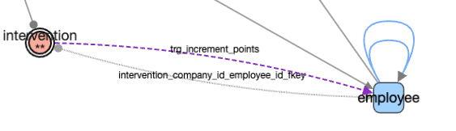
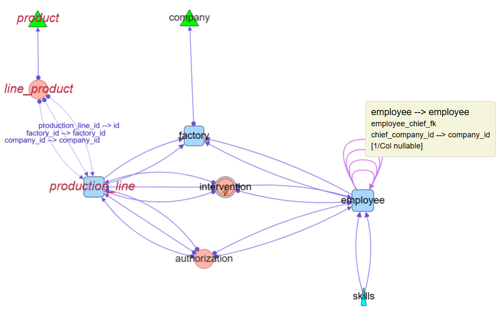

# Quick Tour with *democytodb* model

## democytodb 

This very simple DB model was designed for documentation purpose.   
To create *democytodb* in your Postgres instance, see the [Installation Guide](./install.md)

## Initial load of democytodb 

(after some ui alignments).

### default table representation ( see upper graph )

( all UI choices can be customized later by yourself per database )

#### table 
-  without special categories
  - round rectangle (*production line, factory, employee*)

#### tables with native categorie(s) :

- **orphan** : no links
  -  pentagon ( *parameters* )
- **root** : no outgoing link. 
  - triangle (*product, company*).
- **leaf** : no incoming, one outgoing 
  - rounded triangle (*skills*)
- **(dry) association** :  no incomings, 2 outgoings, strict list of columns from FK in table
  - ellipse (*authorization*) 
- **multi-association** : no incomings, >2 outgoings, or: 2 outgoings with extra column in table
  - ellipse with double border (*intervention*)
  
#### standard alteration 

- table  **'has triggers'**
  -  label of node is followed by ***stars \****, 1 per trigger (*intervention\*\**)

### FK edge representation:

- standard FK 
  - straight line with destination arrow as triangle     
 .  

- FK '**on delete cascade**' 
  - standard FK but a circle as source-arrow
 .  
- FK '**nullable**'
  - special line color ( default blue sky )
 . 

## hover for more informations

with hover "on" in main menu bar, details appear under cursor on **node** or **edge**

### node info

**outgoings edges** (foreign keys) are green 
**incomings edges** (referenced by other tables) are red 
The pop up show the number of edges **<-out & <-in**
*[standard and custom categories if any]* 

  
  *note: at any time 'ctrl g' or clic on photo icon create a png snapshot of current screen*

### edge info

source table -> destination table 
name of the FK constraint 
*[standard and custom categories if any]*

---
### list of nodes at a glance 

**list** in node menu generates an window with nodes of current perimeter (only selected if any, all otherwise)

  

**All headers are sortable** by a click . 
**Clic on a table name goes directly to table's details**
*Index count are indexes out of primary key* 

--- 

### browse table schema

you can browse details of a table 
- either from a table name in a list (node list or edge list)
- either from the contextual menu directly on a node in graph:
- 
#### contextual menu on node 

right-click on a node let appear a sub menu: 

  (second option only for tables with category '*hasTriggers*')

#### table definition 

  - chain to a new window with detailed schema information. 
    - if any comment in schema, a tip is available.
    - Indexes are out of primary key 
    - *Unique* or *Exclude* constraints are listed apart. 
      - total constraints number are : PK + Indexes + other constraints
  

#### table triggers  

  - chain to a new window with triggers'list allowing to browse the PSQL code.  

<small>*[click here for tutorial on FK constraints in SQL ](./moreSQL.md)*</small> 

#### Impacted Tables

A code analysis search for `UPDATE`, `DELETE`, or `CREATE` operations in triggers and functions.

In the upper sample, the `employee` table is in 'Impacted Tables' because an Update has been found in code: 

#### Trigger Code Details

---

## extend graph with trigger impacts 

From menu: **Edges → Data Model → Generate Trigger Impact**

New edges represent trigger-based relationships (violet below)

Labels of new *trigger_impact* edge is the trigger's name.

These edges can be easily selected later through **edges - filters...  trigger_impact**

## show detailed columns of foreign keys 

### 1 edge per FK 

This is the default FK presentation in the graph.   

### 1 edge per column 

A previous FK edge is splitted in an edge per matching columns.  
Clic on ***Edges-label-show***  to see all matching column names:
 

If the graph is too loaded with information:   
-You can select some edges before calling *1 edge per column*. 
-You are not obliged to ***show labels*** as you will have same information with ***hover***

## Walk through the model 

This kind of directed graph allows to walk through table dependencies.  

 Actions apply to ***current perimeter***: 
- **selected visibles** if any
- **all visibles** if none selected

### follow & show... *outgoing / incoming / both* 

Starting from nodes in *current perimeter*, this actionselect next nodes in the chosen direction.  

Below, graph starts with selection of one table, *production_line*, followed by two successive clic *follow outgoing*. 

The same start point *production-line* but with ***follow incoming***

One can see dependencies are stopped by dry associations ( *line_product, authorization* ), the following option help to cross the barrier:

### follow & show... association

This continue the walk on the other side of a (dry) association ( now *product* and *employee* are selected): 

### follow & show... long path

Starting from selected node(S), this walk follows outgoing edges from table to table and keep track of all the possible paths, avoiding loops.   
 
Start with few nodes is better, mainly from ***leaf node***.

Below , a *follow long path* is started from the leaf node *skills* 

If the long path search starts from all nodes, we got all practicable path : 

### follow & show... N->1 chains 

This walk must start from a ***root***.   
If search backward tables where a FK uses exactly all the columns of the PK' source and continue with new tables. 

In democytodb, starting from the root *company* we obtain : 

.  
And the associated list :   

---

This ends the tour.
See menu details for more. 

---

- ⚪️ [Main](./main.md)
- 🟩 [*Quick Tour*](./quickTour.md)  
- 🟨 [Main Menu Bar](./menuBar.md)  
- 🟦 [Node Menu](./menuNodesSelectHide.md)  
- 🟥 [Edge Menu](./menuEdgesSelectHide.md)   
