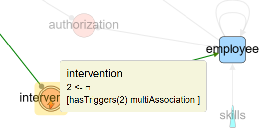
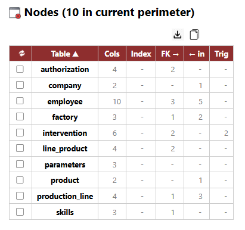
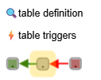

# Quick Tour with *democytodb* model

## democytodb 

This very simple DB model was designed for documentation purpose.   
To create *democytodb* in your Postgres instance, see the [Installation Guide](./install.md)

## Initial load of democytodb 

(after some ui alignments).

# General UI 

## Node = table representation

( all UI choices can be customized later by yourself per database )

### table shapes

- **orphan** : no links
  -  pentagon ( *parameters* )
- **root** : no outgoing link. 
  - triangle (*product, company*).
- **leaf** : no incoming, one outgoing 
  - rounded triangle (*skills*)
- **(dry) association** :  no incomings, 2 outgoings, strict list of columns from FK in table
  - ellipse (*authorization*) 
- **multi-association** : no incomings, >2 outgoings, or: 2 outgoings with extra column in table
  - ellipse with double border (*intervention*)
- default table 
  - round rectangle (*production line, factory, employee*)
  
#### standard alteration 

- table  **'has triggers'**
  -  label of node is followed by ***stars \****, 1 per trigger (*intervention\*\**)

### hover on node

When mouse cursor is over a node, direct neighbours are highlighted:
- **outgoings edges** (foreign keys) are green 
- **incomings edges** (referenced by other tables) are red 
- ***More***: with hover "on" in main menu bar, a detail popup is added:  
  

These pop up show :
- number of edges **<-out & <-in** 
- ***[standard & custom categories ]*** if any
  

💡 at any time 'ctrl g' or *photo icon clic* create a png snapshot of current screen

--- 

## Edge = FK representation

- FK    
  - straight line with destination arrow as triangle     
 .  

- FK '**on delete cascade**' 
  - standard FK but a circle as source-arrow
 .  
- FK '**nullable**'
  - special line color ( default blue sky )
 . 

### edge info popup 

with hover "on" in main menu bar, a popup is added when mouse is over an edge

-**source table -> destination table** 
-**FK name** 
-***[standard and custom categories]*** if any

note: *fk_synth* rely to*1 edge per FK* mode. See Edge menu.  

---
# more informations

## nodes 

### list nodes (i.e. tables)

**list** generates a window with nodes of current ***perimeter*** (only selected if any, all otherwise)

  
( Index count don't include primary key )   

**All headers are sortable**  
**Clic on a table name goes directly to table's details**

--- 

### table details

you can go to details 
- from the previous node list (also from an edge list)
- from a contextual menu in the graph
  - right-click on a node let appear a sub menu: 

  ( '*table triggers*' if any)

#### table definition  

a new tab show detailed schema information. 
- if any comment in schema, a tip is available.
- constraints list is out of pk and index. Can be *Unique* or *Exclude* constraints if any.

Calculation for total constraints : PK + Indexes + other constraints
  

#### table triggers 

a new tab open with triggers'list,  allowing to browse the PSQL code.  

<small>*[some docs on FK constraints in SQL ](./moreSQL.md)*</small> 

#### impacted Tables

An automatic code analysis search for `UPDATE`, `DELETE`, or `CREATE` operations in triggers and functions.

In the upper sample, the `employee` table appears in *Impacted Tables* because an *UPDATE employee* has been found in the triggers code: 

#### code details

---

## Edges

### add trigger impacts to fk graph

menu: **Edges → Data Model → Generate Trigger Impact**

New generated edges represent trigger-based relationships (violet below)

Labels of new *trigger_impact* edge is the trigger's name.

These edges can be easily selected later through  
**edges - filter by... native category -  trigger_impact**

## show detailed columns of foreign keys 

### 1 edge per FK 

This is the default FK presentation in the graph.   

### 1 edge per column 

A previous FK edge is splitted in an edge per matching columns.  
Clic on ***Edges-label-show***  to see all matching column names:
 

If the graph is too loaded with information:   
-select some edges before calling *1 edge per column*. 
-find direcly same information with ***hover***

## Walk through the model 

This kind of directed graph allows to walk through ***table dependencies***.  

 Actions apply to ***current perimeter***:  **selected visibles** if any, **all visibles** if none.

### follow & show... *outgoing / incoming / both* 

Starting from nodes in *current perimeter*, this action select next nodes in the chosen direction.  

Below, graph starts with selection of one table, *production_line*, followed by two successive clic *follow outgoing*. 

The same start point *production-line* but with ***follow incoming***

One can see dependencies are stopped by dry associations ( *line_product, authorization* ), the following option help to cross the barrier:

### follow & show... association

This continue the walk on the other side of a (dry) association ( now *product* and *employee* are selected): 

---

### follow & show... long path

Starting from selected node(s), this walk follow outgoing edges from table to table and keep track of all the possible long paths, avoiding loops.   
 
💡 start with few nodes, mainly from ***leaf node***.

Below , *follow long path* was started from the leaf node *skills*  

.  

    

If the long path search starts from all nodes, we got all practicable paths.  
To facilitate reading, common path parts are greyed:

. 

### follow & show... pk <- fk chains

This walk must start from a ***root***.   
If search backward tables where a FK uses exactly all the columns of the PK' source and continue with new tables. 

In democytodb, starting from the root *company* we obtain : 

.  
And the associated list :   

---

This ends the quick tour.
See other menus for more options. 

---

- ⚪️ [Main](./main.md)
- 🟩 [*Quick Tour*](./quickTour.md)  
- 🟨 [Main Menu Bar](./menuBar.md)  
- 🟦 [Node Menu](./menuNodesSelectHide.md)  
- 🟥 [Edge Menu](./menuEdgesSelectHide.md)   
